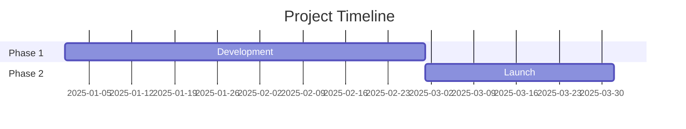
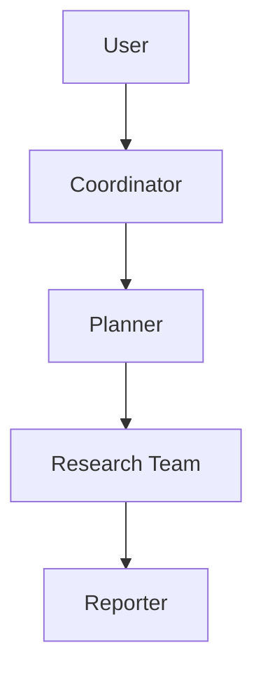
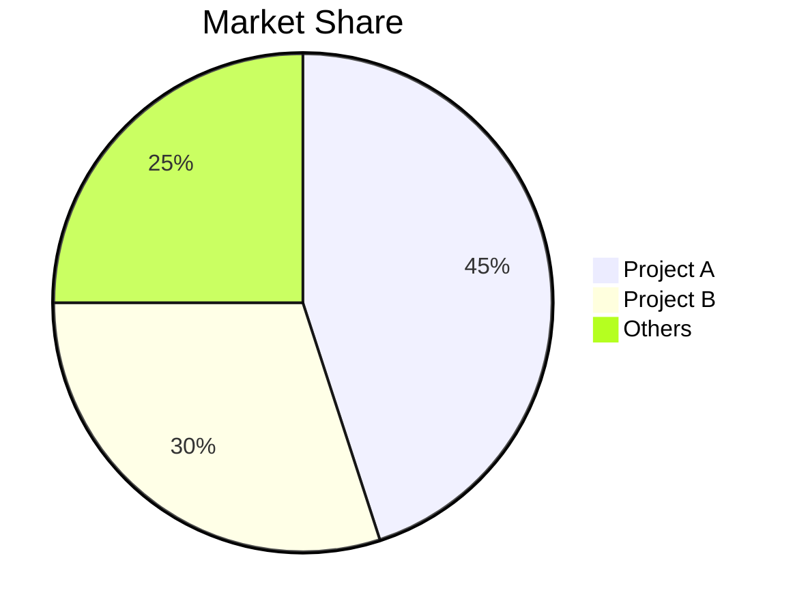

# GitHub Deep Research Skill

Multi-round research combining GitHub API, web_search, web_fetch to produce comprehensive markdown reports.

**核心价值**：不仅提供项目概览和对比分析，更深入源码层面揭示核心功能的实现细节，帮助开发者从优秀项目中学习可复用的设计模式和代码实现。

## Research Workflow

- Round 0: Tag Identification
- Round 1: Clone Repository + Local Code Analysis
- Round 2: Discovery (web_search)
- Round 3: Deep Investigation + Core Module Analysis
- Round 4: Report Generation

### Workflow Overview

```
Round 0: Identify project type and tags
    ↓
Round 1: Clone repo (depth=1) → Scan all code files
    ↓
Round 2: web_search for context and background
    ↓
Round 3: Deep analysis of core modules identified in Round 1
    ↓
Round 4: Synthesize findings into structured report
```

## Tag System (新增标签系统)

### Tag Categories (3 Levels)

**Level 1: Application Scenario (应用场景)** - 9 tags for comparison matching (FIXED)
- `RAG`, `Agent`, `Memory`, `Workflow`, `Data`, `Voice`, `Image`, `Code`, `Search`

**Level 2: Product Form (产品形态)** - 5 tags for analysis focus differentiation (FIXED)
- `Platform`, `Framework`, `SDK/Library`, `CLI`, `Service`

**Level 3: Technical Features (技术特性)** - Dynamic tags based on project's actual tech stack (DYNAMIC)
- Generated from: `pyproject.toml`/`package.json` dependencies, directory structure, import statements
- Examples: `FastAPI`, `PyTorch`, `Docker`, `Redis`, `PostgreSQL`, `Tailwind`, etc.
- Select 3-5 most representative technologies as tags

### Tag Identification Flow

```
Round 0: Analyze README + directory structure → Preliminary tags
  ↓
Round 1-2: Confirm tags via GitHub API data
  ↓
Round 3: Deep analysis based on tags (core modules)
  ↓
Round 4: Final tag confirmation + comparison data
```

### Dynamic Tag Generation (Level 3)

**Level 3 tags are dynamically generated per project:**

1. **Scan dependency files**: `pyproject.toml`, `package.json`, `requirements.txt`, `Cargo.toml`, `go.mod`
2. **Analyze directory structure**: `docker/`, `k8s/`, `frontend/`, `mobile/`
3. **Extract from import statements**: `import torch`, `from fastapi import`, `require('react')`
4. **Select top 3-5 representative technologies**

**Tag categories for Level 3:**
| Category | Example Tags |
|----------|-------------|
| Database/Storage | `PostgreSQL`, `Redis`, `MongoDB`, `Elasticsearch`, `SQLite`, `S3` |
| AI/ML Framework | `PyTorch`, `TensorFlow`, `Transformers`, `LangChain`, `LlamaIndex` |
| Deploy/Ops | `Docker`, `Kubernetes`, `Helm`, `Terraform`, `GitHub Actions` |
| Frontend | `React`, `Vue`, `Next.js`, `Tailwind`, `TypeScript` |
| Backend | `FastAPI`, `Django`, `Flask`, `Express`, `Spring Boot` |
| Message/Queue | `Kafka`, `RabbitMQ`, `Celery`, `Redis Stream` |
| Cloud | `AWS`, `GCP`, `Azure`, `Vercel`, `Supabase` |

### Tag-Based Analysis

After identifying tags, focus analysis on corresponding core modules:

| Tag | Core Modules to Analyze |
|-----|------------------------|
| **RAG** | `loaders/`, `chunking/`, `embeddings/`, `vector_store/`, `retrievers/` |
| **Agent** | `agent/loop.py`, `tools/`, `skills/`, `memory/`, `subagent/` |
| **Memory** | `memory/`, `storage/`, `indexes/`, `retrievers/`, `optimizers/` |
| **Workflow** | `workflow/`, `nodes/`, `engine/`, `scheduler/` |
| **Data** | `readers/`, `transformers/`, `pipelines/`, `validation/` |
| **Voice** | `stt/`, `tts/`, `audio_io/`, `processing/` |
| **Image** | `understanding/`, `generation/`, `editing/`, `models/` |
| **Code** | `parser/`, `generation/`, `analysis/`, `lsp/` |
| **Search** | `indexing/`, `search/`, `ranking/`, `recommendation/` |

See `assets/tag-dimensions.md` for detailed core module definitions and analysis priorities.
See `assets/source-code-analysis-guide.md` for detailed source code analysis methodology.

### Product Form Analysis Focus

| Form | Analysis Focus |
|------|---------------|
| **Platform** | UI/UX, user management, deployment, permissions |
| **Framework** | API design, extension points, abstraction quality |
| **SDK/Library** | API simplicity, documentation quality, package size |
| **CLI** | Command design, interaction experience, output format |
| **Service** | API design, SLA, pricing model |


## Core Methodology

### Query Strategy

**Broad to Narrow**: Start with GitHub API, then general queries, refine based on findings.

```
Round 1: GitHub API
Round 2: "{topic} overview"
Round 3: "{topic} architecture", "{topic} vs alternatives"
Round 4: "{topic} issues", "{topic} roadmap", "site:github.com {topic}"
```

**Source Prioritization**:
1. Official docs/repos (highest weight)
2. Technical blogs (Medium, Dev.to)
3. News articles (verified outlets)
4. Community discussions (Reddit, HN)
5. Social media (lowest weight, for sentiment)

### Research Rounds

**Round 0: Tag Identification**
- Analyze README to identify project type
- Determine preliminary tags (Application, Product Form, Technical Features)
- Plan core modules to analyze based on tags

**Round 1: Clone Repository + Local Code Analysis**

Clone the repository with shallow depth:
```bash
git clone --depth=1 https://github.com/{owner}/{repo}.git /tmp/research/{repo}
```

**Key Tasks**:
1. **Full code scan** - Enumerate all `.py`, `.ts`, `.js`, `.go`, `.rs`, `.java` files
2. **Directory structure analysis** - Map project structure
3. **Dependency analysis** - Scan `pyproject.toml`, `package.json`, `requirements.txt`, etc.
4. **Core module identification** - Based on tags, identify files to analyze deeply
5. **Line of code statistics** - Count LOC per module

**Commands**:
```bash
# Clone with depth=1
git clone --depth=1 https://github.com/{owner}/{repo}.git /tmp/research/{repo}

# Find all source files
find . -name "*.py" -o -name "*.ts" -o -name "*.js" | head -100

# Count lines of code
find . -name "*.py" -exec wc -l {} + | sort -n

# View directory structure
tree -L 3 -I '__pycache__|node_modules|.git'
```

**Round 2 - Discovery (3-5 web_search)**
- Get overview and identify key terms
- Find official website/repo
- Identify main players/competitors

**Round 3 - Deep Investigation + Source Code Analysis**

Based on core modules identified in Round 1:
1. **Read full source files** for each core module
2. **Analyze class/function definitions** - Extract signatures and docstrings
3. **Trace data flow** - Understand how data moves through the system
4. **Identify design patterns** - Recognize common patterns
5. **Extract code snippets** - 20-50 lines of core implementation

**For each core module**:
- Read the full file content
- Identify key classes and functions
- Analyze dependencies and imports
- Document design decisions

**Round 4 - Report Generation**

Synthesize all findings into structured report:
1. Executive summary with key metrics
2. Tag analysis (Application, Product Form, Technical)
3. Core module analysis with source code
4. Architecture diagrams
5. Key takeaways for developers
6. Clickable GitHub URLs for all code citations

## Report Structure

Follow template in `assets/report_template.md`:

1. **Metadata Block** - Date, confidence level, subject, tags
2. **Executive Summary** - 2-3 sentence overview with key metrics
3. **Tag Analysis** - Application scenario, product form, technical features
4. **Repository Information** - GitHub 项目基础信息
5. **Core Module Analysis** - Tag-based deep dive into core modules **(代码实现重点)**
6. **Key Implementation Details** - 关键功能实现源码分析 **(NEW)**
7. **Chronological Timeline** - Phased breakdown with dates
8. **Key Analysis Sections** - Topic-specific deep dives
9. **Metrics & Comparisons** - Tables, growth charts
10. **Strengths & Weaknesses** - Balanced assessment
11. **Sources** - Categorized references
12. **Confidence Assessment** - Claims by confidence level
13. **Methodology** - Research approach used

### Code Implementation Analysis Requirements (源码实现分析要求)

**对于每个核心模块，必须包含**：

1. **文件定位**：准确的 GitHub 文件路径和行号
2. **核心类/函数**：提取关键类和函数的完整实现
3. **数据流分析**：用流程图或文字描述数据如何在模块中流转
4. **设计模式识别**：识别并使用标准术语描述设计模式
5. **关键代码片段**：提供 20-50 行左右的核心实现代码
6. **依赖关系**：说明模块与其他模块的依赖关系

**代码分析深度要求**：

| 分析层级 | 内容 | 示例 |
|---------|------|------|
| **接口层** | API 设计、函数签名 | `def __init__(self, config: Dict)` |
| **数据结构层** | 核心类、数据模型 | `class AgentState:`, `dataclass` 定义 |
| **算法层** | 核心算法逻辑 | 规划算法、检索算法实现 |
| **集成层** | 模块间调用关系 | Agent Loop 如何调用 Tools |

**源码获取优先级**：
1. 核心功能实现的 `.py`/`.ts`/`.js` 源文件
2. 配置文件的实际使用示例
3. 测试文件中的使用示范
4. 文档中的代码示例

### Mermaid Diagrams

Include diagrams where helpful:

**Timeline (Gantt)**:


**Architecture (Flowchart)**:


**Comparison (Pie/Bar)**:


## Confidence Scoring

Assign confidence based on source quality:

| Confidence | Criteria |
|------------|----------|
| High (90%+) | Official docs, GitHub data, multiple corroborating sources |
| Medium (70-89%) | Single reliable source, recent articles |
| Low (50-69%) | Social media, unverified claims, outdated info |

## Output

Save report as: `research_{topic}_{YYYYMMDD}.md`

### Formatting Rules

- Chinese content: Use full-width punctuation（，。：；！？）
- Technical terms: Provide Wiki/doc URL on first mention
- Tables: Use for metrics, comparisons
- Code blocks: For technical examples
- Mermaid: For architecture, timelines, flows

### GitHub Source Code URL Format (IMPORTANT)

**All code citations MUST include clickable GitHub URL with line numbers:**

```markdown
**Source**: [`{file_path}`]({github_url})

```{language}
# {owner}/{repo}/{file_path}:L{start}-L{end}
# 🔗 {github_url}
{code}
```
```

**URL Format**:
- GitHub blob URL (for browser viewing): `https://github.com/{owner}/{repo}/blob/{branch}/{path}#L{start}-L{end}`
- Raw URL (for code content): `https://raw.githubusercontent.com/{owner}/{repo}/{branch}/{path}`

**Example**:
```markdown
**Source**: [`agent/loop.py`](https://github.com/owner/repo/blob/main/agent/loop.py#L45-L120)

```python
# owner/repo/agent/loop.py:L45-L120
# 🔗 https://github.com/owner/repo/blob/main/agent/loop.py#L45-L120
class AgentLoop:
    def run(self, task: str, max_iterations: int = 30) -> AgentState:
        state = AgentState(task=task)
        for iteration in range(max_iterations):
            context = self.build_context(state)
            response = self.llm.chat(context)
            action = self.parse_response(response)
            if action.type == "DONE":
                return state
            result = self.execute(action)
            state.update(result)
```
```

## Best Practices

1. **Start with official sources** - Repo, docs, company blog
2. **Verify dates from commits/PRs** - More reliable than articles
3. **Triangulate claims** - 2+ independent sources
4. **Note conflicting info** - Don't hide contradictions
5. **Distinguish fact vs opinion** - Label speculation clearly
6. **Reference sources** - Add source references near claims where applicable
7. **Update as you go** - Don't wait until end to synthesize

## Source Code Analysis Best Practices

### Step 1: Clone Repository

**Clone with shallow depth for efficiency:**
```bash
git clone --depth=1 https://github.com/{owner}/{repo}.git /tmp/research/{repo}
cd /tmp/research/{repo}
```

**Why depth=1?**
- Only need latest commit for code analysis
- Faster clone (minutes → seconds)
- Smaller disk usage
- Sufficient for understanding current implementation

### Step 2: Identify Project Type

Based on tags identified in Round 0, determine the project type and core modules:

| Application Tag | Core Modules to Analyze | Typical Files |
|-----------------|------------------------|---------------|
| **Agent** | Agent Loop, Tool System, Memory, Planning, State Management | `agent/loop.py`, `tools/`, `memory/`, `planner.py` |
| **RAG** | Data Loaders, Chunking, Vector Store, Retrievers, Query Engine | `loaders/`, `chunking/`, `vector_store.py`, `retrievers/` |
| **Memory** | Memory Model, Storage Engine, Indexing, Retrieval, Optimization | `memory/`, `storage/`, `indexes/`, `retrievers/` |
| **Workflow** | Workflow Definition, Node Library, Execution Engine, Scheduler | `workflow/`, `nodes/`, `engine/`, `scheduler.py` |
| **Data** | Data Readers, Transformers, Pipelines, Validation | `readers/`, `transformers/`, `pipelines/` |
| **Voice** | STT Engine, TTS Engine, Audio I/O, Processing | `stt/`, `tts/`, `audio_io/`, `processing/` |
| **Image** | Image Understanding, Generation, Editing, Models | `understanding/`, `generation/`, `editing/` |
| **Code** | Parser, Generation, Analysis, LSP Integration | `parser/`, `generation/`, `analysis/`, `lsp/` |
| **Search** | Indexing, Search Engine, Ranking, Recommendation | `indexing/`, `search/`, `ranking/` |

### Step 3: Full Code Scan

**Enumerate all source files:**
```bash
# Find all Python files
find . -name "*.py" | grep -v __pycache__ | grep -v test | head -50

# Find all TypeScript/JavaScript files
find . -name "*.ts" -o -name "*.js" | grep -v node_modules | grep -v test | head -50

# Count lines of code
find . -name "*.py" -exec wc -l {} + | sort -n | tail -20

# View directory structure
tree -L 3 -I '__pycache__|node_modules|.git|dist|build'
```

**Analyze directory structure:**
- Identify main package directories
- Locate configuration files
- Find test directories
- Identify documentation

**Scan dependencies:**
```bash
# Python projects
cat pyproject.toml | grep -A 20 "\[project\]"
cat requirements.txt

# Node.js projects
cat package.json | jq '.dependencies'
```

### Step 4: Locate Core Module Files

**Method 1: Directory Structure Analysis**
- Look for directories matching core module patterns (see table above)
- Identify main entry points (`main.py`, `app.py`, `__init__.py`, `index.ts`)

**Method 2: Dependency Analysis**
- Identify key dependencies that indicate core functionality
- Find files that import/use these dependencies

**Method 3: Import Analysis**
- Scan for main imports in `__init__.py` or main entry files
- Trace import chains to find core modules

### Step 5: Read and Analyze Source Code

**For each core module:**
1. **Read the full file** - Use `cat` or editor to read entire file
2. **Identify key classes/functions** - Look for main class definitions and exported functions
3. **Analyze dependencies** - Check import statements
4. **Trace data flow** - Follow how data enters, transforms, and exits

**Code Analysis (Four-Layer Model):**
1. **Interface Layer**: API design, function signatures, parameters
2. **Data Structure Layer**: Core classes, data models, type definitions
3. **Algorithm Layer**: Core logic, control flow, key algorithms
4. **Integration Layer**: Module dependencies, inter-module calls

### Step 6: Extract Reusable Patterns

1. **Identify Design Patterns**: Strategy, Factory, Observer, etc.
2. **Note Implementation Tricks**: Clever solutions to common problems
3. **Document Trade-offs**: Why certain approaches were chosen
4. **Extract Code Templates**: Reusable code patterns for your own projects

### Step 7: Generate GitHub URLs for Citations

**For each code citation, generate clickable URL:**
```python
# Format: https://github.com/{owner}/{repo}/blob/{branch}/{path}#L{start}-L{end}
url = f"https://github.com/{owner}/{repo}/blob/main/{path}#L{start}-L{end}"
```

### Code Citation Format

**EVERY code snippet MUST include**:
1. File path relative to repo root
2. Line numbers (start-end)
3. Clickable GitHub URL

**Format**:
```markdown
**Source**: [`{path}`]({url})

```{language}
# {owner}/{repo}/{path}:L{start}-L{end}
# 🔗 {url}
{code}
```
```

### Report Generation Checklist

Before generating the report, ensure:
- [ ] All core modules have been read and analyzed
- [ ] GitHub URLs with line numbers are ready for all code citations
- [ ] Key classes and functions have been identified
- [ ] Data flow has been traced for each core module
- [ ] Design patterns have been identified
- [ ] At least 3-5 reusable code patterns have been extracted
