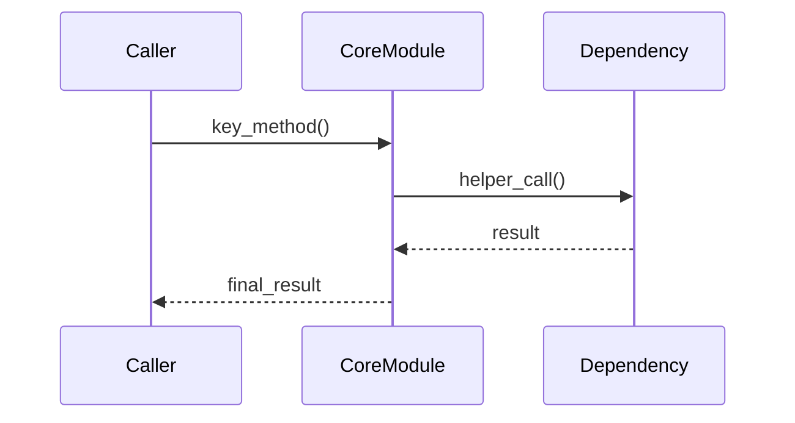
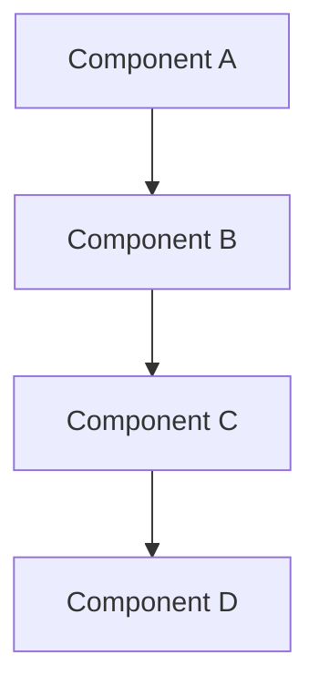

[!NOTE] Generate this report in user's own language.

# {TITLE}

- **Research Date:** {DATE}
- **Timestamp:** {TIMESTAMP}
- **Confidence Level:** {CONFIDENCE_LEVEL}
- **Subject:** {SUBJECT_DESCRIPTION}
- **Tags:** {APPLICATION_TAGS} | {PRODUCT_FORM_TAGS} | {TECHNICAL_TAGS}

---

## Repository Information

- **Name:** {REPOSITORY_NAME}
- **Description:** {REPOSITORY_DESCRIPTION}
- **URL:** {REPOSITORY_URL}
- **Stars:** {REPOSITORY_STARS}
- **Forks:** {REPOSITORY_FORKS}
- **Open Issues:** {REPOSITORY_OPEN_ISSUES}
- **Language(s):** {REPOSITORY_LANGUAGES}
- **License:** {REPOSITORY_LICENSE}
- **Created At:** {REPOSITORY_CREATED_AT}
- **Updated At:** {REPOSITORY_UPDATED_AT}
- **Pushed At:** {REPOSITORY_PUSHED_AT}
- **Topics:** {REPOSITORY_TOPICS}
- **Default Branch:** {DEFAULT_BRANCH}

---

## Executive Summary

{EXECUTIVE_SUMMARY}

---

## 🏷️ Tag Analysis

### Application Scenario Tags (一级标签)

| Tag | Confidence | Evidence |
|-----|------------|----------|
| {TAG_1} | {CONFIDENCE} | {EVIDENCE} |
| {TAG_2} | {CONFIDENCE} | {EVIDENCE} |

### Product Form Tags (二级标签)

| Tag | Confidence | Evidence |
|-----|------------|----------|
| {TAG_1} | {CONFIDENCE} | {EVIDENCE} |

### Technical Features Tags (三级标签)

| Tag | Confidence | Evidence |
|-----|------------|----------|
| {TAG_1} | {CONFIDENCE} | {EVIDENCE} |

---

## 🧩 Core Module Analysis (Based on Tags)

**Core modules identified based on project tags:** {LIST_CORE_MODULES}

### {核心模块 1 名称}

**🔗 Source**: [`{文件路径}`]({REPO_URL}/blob/{BRANCH}/{文件路径})

**文件路径**: `{文件路径}`
**代码行数**: ~{行数} 行
**职责**: {模块职责描述}

#### 接口层分析

**核心类/函数**:
```python
# {owner}/{repo}/{文件路径}
# 🔗 {REPO_URL}/blob/{BRANCH}/{文件路径}#L{start}-L{end}
class CoreClass:
    def __init__(self, ...):
        """初始化说明"""

    def key_method(self, ...) -> ReturnType:
        """关键方法说明"""
```

**参数说明**:
- `param1`: 说明
- `param2`: 说明

**返回值**: 说明

#### 数据结构层分析

**核心数据结构**:
```python
# {owner}/{repo}/{文件路径}
# 🔗 {REPO_URL}/blob/{BRANCH}/{文件路径}#L{start}-L{end}
@dataclass
class State:
    """状态类说明"""
    field1: str
    field2: List[Dict]
```

**数据流**:
```
输入 → [处理步骤 1] → [处理步骤 2] → 输出
```

#### 算法层分析

**核心实现**:
```python
# {owner}/{repo}/{文件路径}:L{起始行}-L{结束行}
# 🔗 {REPO_URL}/blob/{BRANCH}/{文件路径}#L{起始行}-L{结束行}
def key_algorithm(input_data):
    """
    算法说明

    Args:
        input_data: 输入说明

    Returns:
        返回说明
    """
    # 关键实现步骤
    step1_result = process_step1(input_data)
    final_result = process_step2(step1_result)
    return final_result
```

**算法流程**:


**设计亮点**:
- ✅ {亮点 1}
- ✅ {亮点 2}

**权衡分析**:
- ✅ 优势：{优势 1}, {优势 2}
- ⚠️ 劣势：{劣势 1}

#### 集成层分析

**依赖模块**:
- 模块 A: 说明
- 模块 B: 说明

**调用关系**:


### {核心模块 2 名称}

（同上格式）

---

## 💻 Key Implementation Details (关键实现细节)

### {功能点 1}: {功能名称}

**🔗 Source**: [`{文件路径}`]({REPO_URL}/blob/{BRANCH}/{文件路径}#L{start}-L{end})

**完整实现**:
```python
# {owner}/{repo}/{文件路径}:L{start}-L{end}
# 🔗 {REPO_URL}/blob/{BRANCH}/{文件路径}#L{start}-L{end}
{完整代码}
```

**实现要点**:
1. {要点 1}
2. {要点 2}
3. {要点 3}

**可复用模式**:
```python
# 提炼出的可复用代码模式
{代码模式}
```

### {功能点 2}: {功能名称}

（同上格式）

---

## 🔧 Design Patterns & Architecture (设计模式与架构)

### 使用的设计模式

| 模式 | 应用场景 | 实现方式 |
|------|---------|---------|
| {Pattern 1} | {场景} | {实现方式} |
| {Pattern 2} | {场景} | {实现方式} |

### 架构决策

| 决策 | 选项 | 选择理由 |
|------|------|---------|
| {决策 1} | 选项 A vs 选项 B | {选择理由} |
| {决策 2} | 选项 A vs 选项 B | {选择理由} |

### 代码质量评估

| 维度 | 评分 | 说明 |
|------|------|------|
| 可读性 | ⭐⭐⭐⭐⭐ | {说明} |
| 可维护性 | ⭐⭐⭐⭐ | {说明} |
| 可扩展性 | ⭐⭐⭐⭐⭐ | {说明} |
| 测试覆盖 | ⭐⭐⭐ | {说明} |

---

## 📚 Key Takeaways for Developers (开发者参考)

### 值得学习的实现技巧

1. **{技巧 1}**:
   ```python
   # {owner}/{repo}/{path}
   # 🔗 {REPO_URL}/blob/{BRANCH}/{path}
   {代码示例}
   ```

2. **{技巧 2}**:
   ```python
   # {owner}/{repo}/{path}
   # 🔗 {REPO_URL}/blob/{BRANCH}/{path}
   {代码示例}
   ```

### 可复用的代码片段

```python
# {用途说明}
# {owner}/{repo}/{path}
# 🔗 {REPO_URL}/blob/{BRANCH}/{path}
{可复用代码}
```

### 避免的陷阱

- ⚠️ {陷阱 1}: {说明}
- ⚠️ {陷阱 2}: {说明}

---

## Complete Chronological Timeline

### PHASE 1: {PHASE_1_NAME}

#### {PHASE_1_PERIOD}

{PHASE_1_CONTENT}

### PHASE 2: {PHASE_2_NAME}

#### {PHASE_2_PERIOD}

{PHASE_2_CONTENT}

### PHASE 3: {PHASE_3_NAME}

#### {PHASE_3_PERIOD}

{PHASE_3_CONTENT}

---

## Key Analysis

### {ANALYSIS_SECTION_1_TITLE}

{ANALYSIS_SECTION_1_CONTENT}

### {ANALYSIS_SECTION_2_TITLE}

{ANALYSIS_SECTION_2_CONTENT}

---

## Architecture / System Overview



{ARCHITECTURE_DESCRIPTION}

---

## Metrics & Impact Analysis

### Growth Trajectory

```
{METRICS_TIMELINE}
```

### Key Metrics

| Metric | Value | Assessment |
|--------|-------|------------|
| {METRIC_1} | {VALUE_1} | {ASSESSMENT_1} |
| {METRIC_2} | {VALUE_2} | {ASSESSMENT_2} |
| {METRIC_3} | {VALUE_3} | {ASSESSMENT_3} |

---

## Comparative Analysis

### Feature Comparison

| Feature | {SUBJECT} | {COMPETITOR_1} | {COMPETITOR_2} |
|---------|-----------|----------------|----------------|
| {FEATURE_1} | {SUBJ_F1} | {COMP1_F1} | {COMP2_F1} |
| {FEATURE_2} | {SUBJ_F2} | {COMP1_F2} | {COMP2_F2} |
| {FEATURE_3} | {SUBJ_F3} | {COMP1_F3} | {COMP2_F3} |

### Market Positioning

{MARKET_POSITIONING}

---

## Strengths & Weaknesses

### Strengths

{STRENGTHS}

### Areas for Improvement

{WEAKNESSES}

---

## Key Success Factors

{SUCCESS_FACTORS}

---

## Sources

### Primary Sources

{PRIMARY_SOURCES}

### Media Coverage

{MEDIA_SOURCES}

### Academic / Technical Sources

{ACADEMIC_SOURCES}

### Community Sources

{COMMUNITY_SOURCES}

---

## Confidence Assessment

**High Confidence (90%+) Claims:**
{HIGH_CONFIDENCE_CLAIMS}

**Medium Confidence (70-89%) Claims:**
{MEDIUM_CONFIDENCE_CLAIMS}

**Lower Confidence (50-69%) Claims:**
{LOW_CONFIDENCE_CLAIMS}

---

## Research Methodology

This report was compiled using:

1. **Multi-source web search** - Broad discovery and targeted queries
2. **GitHub repository analysis** - Commits, issues, PRs, activity metrics
3. **Content extraction** - Official docs, technical articles, media coverage
4. **Cross-referencing** - Verification across independent sources
5. **Chronological reconstruction** - Timeline from timestamped data
6. **Confidence scoring** - Claims weighted by source reliability

**Research Depth:** {RESEARCH_DEPTH}
**Time Scope:** {TIME_SCOPE}
**Geographic Scope:** {GEOGRAPHIC_SCOPE}

---

**Report Prepared By:** Github Deep Research by DeerFlow
**Date:** {REPORT_DATE}
**Report Version:** 1.0
**Status:** Complete
