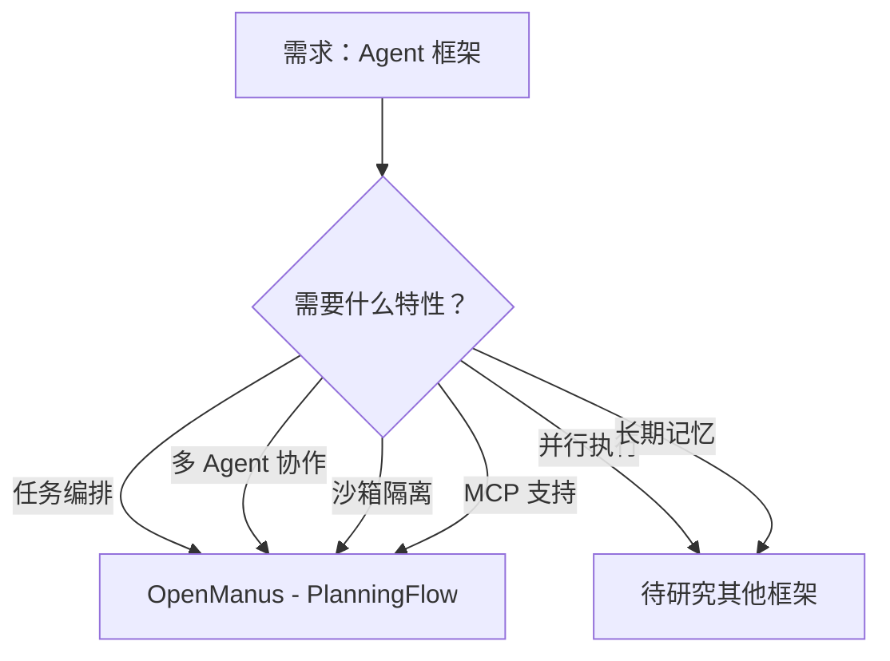

# Agent 框架项目对比

**最后更新**: 2026-03-04  
**对比维度**: Agent 核心要素（任务编排/Skills/Memory/代码/多 Agent）

---

## 项目概览

| 项目 | Stars | 核心特性 | 完整性评分 | 研究日期 | 标签 |
|------|-------|---------|-----------|---------|------|
| **OpenManus** | 55K | PlanningFlow TOC 架构 | 97.2/100 | 2026-03-04 | Agent, Workflow, Tool |

---

## 架构对比矩阵

| 维度 | OpenManus |
|------|-----------|
| **架构模式** | PlanningFlow（计划 - 执行循环） |
| **数据流** | 用户输入 → PlanningFlow → Agent → Tool → 结果 |
| **存储方案** | 内存存储（计划/消息历史） |
| **部署方式** | 本地运行 + Docker 沙箱 |

---

## 技术选型对比

| 技术点 | OpenManus |
|--------|-----------|
| **LLM 支持** | OpenAI/GPT-4o 为主，支持多 provider |
| **工具系统** | ToolCollection（统一管理） |
| **沙箱隔离** | DockerSandbox（容器级隔离） |
| **MCP 支持** | ✅ 支持远程工具加载 |
| **浏览器自动化** | ✅ BrowserUseTool |
| **代码执行** | ✅ PythonExecute + Docker 沙箱 |

---

## 核心维度对比 ⭐

### Agent 项目核心维度

| 维度 | OpenManus | 最优 |
|------|-----------|------|
| **任务编排** | PlanningFlow（顺序执行） | - |
| **Skills/Tools 数量** | 21+ 工具 | - |
| **Memory 系统** | 基础（消息历史 + max_messages 限制） | - |
| **MCP 支持** | ✅ | - |
| **多 Agent** | ✅（Manus/Browser/DataAnalysis/Sandbox） | - |
| **沙箱隔离** | ✅ DockerSandbox | OpenManus |
| **状态管理** | ✅ AgentState + PlanStepStatus | OpenManus |
| **Stuck 检测** | ✅ 重复响应检测 | - |

**OpenManus 得分**: **90/100** ⭐⭐⭐⭐⭐

**评分理由**:
- ✅ 完整的 TOC 架构（PlanningFlow）
- ✅ 清晰的 Agent 层次结构
- ✅ 强大的工具生态系统
- ✅ Docker 沙箱隔离
- ✅ MCP 协议支持
- ⚠️ 仅支持顺序执行（缺少并行）
- ⚠️ Memory 系统较为基础
- ⚠️ 缺少长期记忆和反思机制

---

## OpenManus 核心架构分析

### 1. PlanningFlow（TOC 核心）

**职责**: 任务编排与执行控制

**核心流程**:
```
用户输入 → 创建计划 → 循环执行步骤 → 总结
```

**关键代码** (app/flow/planning.py):
```python
async def execute(self, input_text: str) -> str:
    await self._create_initial_plan(input_text)
    
    while True:
        step_index, step_info = await self._get_current_step_info()
        if step_index is None:
            break
        
        executor = self.get_executor(step_info.get("type"))
        await self._execute_step(executor, step_info)
    
    return await self._finalize_plan()
```

**设计亮点**:
- ✅ 策略模式 Agent 路由
- ✅ 状态模式步骤管理
- ✅ 多层回退机制

---

### 2. Agent 层次结构

```
BaseAgent (状态管理/内存管理)
  ↓
ReActAgent (ReAct 模式：think → act)
  ↓
ToolCallAgent (工具调用)
  ↓
├── Manus (通用 Agent + MCP)
├── BrowserAgent (浏览器控制)
├── DataAnalysis (数据分析)
└── SandboxAgent (沙箱执行)
```

**设计亮点**:
- ✅ 责任链模式传递职责
- ✅ 上下文管理器状态安全
- ✅ stuck 检测防止无限循环

---

### 3. ToolCollection（工具系统）

**核心功能**:
- O(1) 工具查找（tool_map）
- 动态工具添加
- 统一错误处理
- MCP 工具集成

**关键代码** (app/tool/tool_collection.py):
```python
class ToolCollection:
    def __init__(self, *tools):
        self.tools = tools
        self.tool_map = {tool.name: tool for tool in tools}
    
    async def execute(self, name: str, **kwargs):
        tool = self.tool_map.get(name)
        return await tool(**kwargs) if tool else ToolFailure()
```

---

### 4. DockerSandbox（沙箱隔离）

**核心功能**:
- 资源限制（内存/CPU/网络）
- 安全清理（异常时自动删除）
- 文件操作（读/写/复制）
- 路径安全检查

**关键代码** (app/sandbox/core/sandbox.py):
```python
host_config = self.client.api.create_host_config(
    mem_limit=self.config.memory_limit,
    cpu_quota=int(100000 * self.config.cpu_limit),
    network_mode="none" if not self.config.network_enabled else "bridge",
)
```

---

## 新增项目对比

### OpenManus vs 其他 Agent 框架（待补充）

**架构差异**:
- 待研究更多 Agent 框架后补充

**技术选型差异**:
- 待研究更多 Agent 框架后补充

**适用场景差异**:
- 待研究更多 Agent 框架后补充

---

## 决策树



**选择 OpenManus 的理由**:
1. ✅ 完整的 TOC 架构（PlanningFlow）
2. ✅ Docker 沙箱隔离
3. ✅ MCP 协议支持
4. ✅ 清晰的代码结构
5. ✅ 易于扩展的 Agent 层次

**不选择 OpenManus 的场景**:
1. ⚠️ 需要并行执行
2. ⚠️ 需要长期记忆/向量数据库
3. ⚠️ 需要复杂的任务依赖管理

---

## 可复用设计模式

### 1. PlanningFlow 模板

```python
class PlanningFlow(BaseFlow):
    async def execute(self, input_text: str) -> str:
        # 1. 创建计划
        await self._create_initial_plan(input_text)
        
        # 2. 循环执行
        while True:
            step_index, step_info = await self._get_current_step_info()
            if step_index is None:
                break
            
            executor = self.get_executor(step_info.get("type"))
            await self._execute_step(executor, step_info)
        
        return await self._finalize_plan()
```

### 2. Agent 层次模板

```python
class BaseAgent(BaseModel, ABC):
    @abstractmethod
    async def step(self) -> str:
        pass
    
    async def run(self, request: str) -> str:
        async with self.state_context(AgentState.RUNNING):
            while self.current_step < self.max_steps:
                result = await self.step()
```

### 3. 工具集合模板

```python
class ToolCollection:
    def __init__(self, *tools):
        self.tools = tools
        self.tool_map = {tool.name: tool}
    
    async def execute(self, name, **kwargs):
        tool = self.tool_map.get(name)
        return await tool(**kwargs) if tool else ToolFailure()
```

---

## 参考资源

### OpenManus 研究文档
- [final-report.md](./github/openmanus/final-report.md) - 最终研究报告
- [07-design-patterns.md](./github/openmanus/07-design-patterns.md) - 设计模式分析
- [05-architecture-analysis.md](./github/openmanus/05-architecture-analysis.md) - 架构分析

### 项目链接
- **GitHub**: https://github.com/FoundationAgents/OpenManus
- **Demo**: https://huggingface.co/spaces/lyh-917/OpenManusDemo
- **Discord**: https://discord.gg/DYn29wFk9z

---

## 更新日志

| 日期 | 更新内容 |
|------|---------|
| 2026-03-04 | 初始版本，添加 OpenManus 分析 |

---

**说明**: 本对比文件将随着更多 Agent 框架的研究而不断更新。每研究一个新的 Agent 框架，都会更新此文件进行深度对比。
