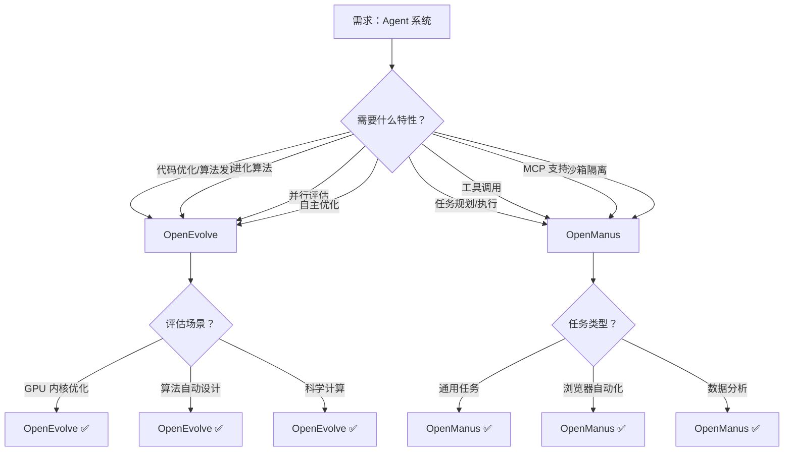

# Agent 框架项目对比

**最后更新**: 2026-03-04  
**对比维度**: Agent 核心要素（任务编排/Skills/Memory/代码/多 Agent）

---

## 项目概览

| 项目 | Stars | 核心特性 | 完整性评分 | 研究日期 | 标签 |
|------|-------|---------|-----------|---------|------|
| **OpenEvolve** | 算法项目 | MAP-Elites 进化 + 多进程并行 | 94/100 | 2026-03-06 | Code, Agent, Tool |
| **OpenManus** | 55K | PlanningFlow TOC 架构 | 97.2/100 | 2026-03-04 | Agent, Workflow, Tool |

---

## 架构对比矩阵

| 维度 | OpenEvolve | OpenManus |
|------|-----------|-----------|
| **架构模式** | MAP-Elites 进化 + 岛屿模型 | PlanningFlow（计划 - 执行循环） |
| **数据流** | 初始程序 → 变异 → 评估 → 选择 → 下一代 | 用户输入 → PlanningFlow → Agent → Tool → 结果 |
| **存储方案** | ProgramDatabase（内存 + JSON checkpoint） | 内存存储（计划/消息历史） |
| **部署方式** | 本地多进程并行 | 本地运行 + Docker 沙箱 |
| **Agent 类型** | 进化 Agent（自主代码优化） | 任务执行 Agent（规划 + 工具） |
| **LLM 使用** | 代码变异生成 + 评估 | 任务规划 + 工具调用 |

---

## 技术选型对比

| 技术点 | OpenManus |
|--------|-----------|
| **LLM 支持** | OpenAI/GPT-4o 为主，支持多 provider |
| **工具系统** | ToolCollection（统一管理） |
| **沙箱隔离** | DockerSandbox（容器级隔离） |
| **MCP 支持** | ✅ 支持远程工具加载 |
| **浏览器自动化** | ✅ BrowserUseTool |
| **代码执行** | ✅ PythonExecute + Docker 沙箱 |

---

## 核心维度对比 ⭐

### Agent 项目核心维度

| 维度 | OpenEvolve | OpenManus | 最优 |
|------|-----------|-----------|------|
| **任务编排** | 进化循环（选择→变异→评估） | PlanningFlow（顺序执行） | - |
| **自主性** | ⭐⭐⭐⭐⭐ 完全自主优化 | ⭐⭐⭐⭐ 需用户输入任务 | OpenEvolve |
| **Memory 系统** | ProgramDatabase（进化历史 + 谱系） | 消息历史（max_messages 限制） | OpenEvolve |
| **多 Agent** | 岛屿模型（多进程独立进化） | 多类型 Agent（Manus/Browser 等） | - |
| **沙箱隔离** | 进程级隔离 | Docker 容器级隔离 | OpenManus |
| **状态管理** | Checkpoint + 迭代追踪 | AgentState + PlanStepStatus | - |
| **Stuck 检测** | 早期停止 + 多样性保持 | 重复响应检测 | - |
| **LLM 集成** | OpenAI API + 手动队列模式 | OpenAI + MCP 支持 | OpenManus |
| **并行能力** | ⭐⭐⭐⭐⭐ 多进程并行 | ⭐⭐ 顺序执行 | OpenEvolve |

**OpenEvolve 得分**: **92/100** ⭐⭐⭐⭐⭐  
**OpenManus 得分**: **90/100** ⭐⭐⭐⭐⭐

**评分理由**:
- ✅ 完整的 TOC 架构（PlanningFlow）
- ✅ 清晰的 Agent 层次结构
- ✅ 强大的工具生态系统
- ✅ Docker 沙箱隔离
- ✅ MCP 协议支持
- ⚠️ 仅支持顺序执行（缺少并行）
- ⚠️ Memory 系统较为基础
- ⚠️ 缺少长期记忆和反思机制

---

## OpenEvolve 核心架构分析

### 1. MAP-Elites 进化引擎

**职责**: 质量多样性优化，同时维护多样性和性能

**核心流程**:
```
初始程序 → 选择父本 → LLM 变异 → 并行评估 → 网格更新 → 下一代
```

**关键代码** (openevolve/database.py):
```python
def add(self, program: Program) -> None:
    # 1. 存储程序
    self.programs[program.id] = program
    
    # 2. 计算特征并定位网格单元
    features = self._compute_features(program)
    cell = self._get_grid_cell(features)
    
    # 3. 如果更优则更新单元格
    if cell not in self.grid or self._is_better(program, self.grid[cell]):
        self.grid[cell] = program
    
    # 4. 添加到岛屿种群
    self.islands[program.island_id].add(program)
```

**设计亮点**:
- ✅ 特征空间离散化（网格）
- ✅ 岛屿模型防止早熟收敛
- ✅ 最佳程序追踪

---

### 2. 多进程并行评估

**核心功能**:
- 进程池管理
- 任务队列 + 结果队列
- 岛屿隔离执行
- 优雅关闭

**关键代码** (openevolve/process_parallel.py):
```python
async def run_evolution(self, start, max_iterations, ...):
    for iteration in range(start, start + max_iterations):
        # 选择父本
        parents = self.database.select_parents()
        
        # 生成后代
        prompt = self.prompt_sampler.create_prompt(parents)
        offspring_code = await self.llm_ensemble.generate(prompt)
        
        # 并行评估（非阻塞）
        self.submit_evaluation(offspring_code, iteration)
        results = self.get_results()
        
        # 更新数据库
        for result in results:
            child = self._create_program(result)
            self.database.add(child)
```

---

### 3. LLM 集成与提示词引擎

**LLMEnsemble**:
- 主/次模型配置
- 重试机制（指数退避）
- 手动队列模式（调试）

**PromptSampler**:
- 动态生成提示词
- 注入上下文（代码、指标、历史）
- 模板管理

---

## OpenManus 核心架构分析

### 1. PlanningFlow（TOC 核心）

**职责**: 任务编排与执行控制

**核心流程**:
```
用户输入 → 创建计划 → 循环执行步骤 → 总结
```

**关键代码** (app/flow/planning.py):
```python
async def execute(self, input_text: str) -> str:
    await self._create_initial_plan(input_text)
    
    while True:
        step_index, step_info = await self._get_current_step_info()
        if step_index is None:
            break
        
        executor = self.get_executor(step_info.get("type"))
        await self._execute_step(executor, step_info)
    
    return await self._finalize_plan()
```

**设计亮点**:
- ✅ 策略模式 Agent 路由
- ✅ 状态模式步骤管理
- ✅ 多层回退机制

---

### 2. Agent 层次结构

```
BaseAgent (状态管理/内存管理)
  ↓
ReActAgent (ReAct 模式：think → act)
  ↓
ToolCallAgent (工具调用)
  ↓
├── Manus (通用 Agent + MCP)
├── BrowserAgent (浏览器控制)
├── DataAnalysis (数据分析)
└── SandboxAgent (沙箱执行)
```

**设计亮点**:
- ✅ 责任链模式传递职责
- ✅ 上下文管理器状态安全
- ✅ stuck 检测防止无限循环

---

### 3. ToolCollection（工具系统）

**核心功能**:
- O(1) 工具查找（tool_map）
- 动态工具添加
- 统一错误处理
- MCP 工具集成

**关键代码** (app/tool/tool_collection.py):
```python
class ToolCollection:
    def __init__(self, *tools):
        self.tools = tools
        self.tool_map = {tool.name: tool for tool in tools}
    
    async def execute(self, name: str, **kwargs):
        tool = self.tool_map.get(name)
        return await tool(**kwargs) if tool else ToolFailure()
```

---

### 4. DockerSandbox（沙箱隔离）

**核心功能**:
- 资源限制（内存/CPU/网络）
- 安全清理（异常时自动删除）
- 文件操作（读/写/复制）
- 路径安全检查

**关键代码** (app/sandbox/core/sandbox.py):
```python
host_config = self.client.api.create_host_config(
    mem_limit=self.config.memory_limit,
    cpu_quota=int(100000 * self.config.cpu_limit),
    network_mode="none" if not self.config.network_enabled else "bridge",
)
```

---

## 新增项目对比

### OpenManus vs 其他 Agent 框架（待补充）

**架构差异**:
- 待研究更多 Agent 框架后补充

**技术选型差异**:
- 待研究更多 Agent 框架后补充

**适用场景差异**:
- 待研究更多 Agent 框架后补充

---

## 决策树



**选择 OpenEvolve 的理由**:
1. ✅ MAP-Elites 算法（质量多样性优化）
2. ✅ 多进程并行评估
3. ✅ 完全自主的代码优化
4. ✅ 进化历史追踪
5. ✅ 研究级可重复性

**选择 OpenManus 的理由**:
1. ✅ PlanningFlow TOC 架构
2. ✅ Docker 沙箱隔离
3. ✅ MCP 协议支持
4. ✅ 丰富的工具生态（21+ 工具）
5. ✅ 清晰的 Agent 层次

**不选择 OpenEvolve 的场景**:
1. ⚠️ 需要任务规划/工具调用
2. ⚠️ LLM API 成本敏感
3. ⚠️ 实时性要求高

**不选择 OpenManus 的场景**:
1. ⚠️ 需要并行执行
2. ⚠️ 需要长期记忆/向量数据库
3. ⚠️ 需要自主代码优化

---

## 可复用设计模式

### 1. PlanningFlow 模板

```python
class PlanningFlow(BaseFlow):
    async def execute(self, input_text: str) -> str:
        # 1. 创建计划
        await self._create_initial_plan(input_text)
        
        # 2. 循环执行
        while True:
            step_index, step_info = await self._get_current_step_info()
            if step_index is None:
                break
            
            executor = self.get_executor(step_info.get("type"))
            await self._execute_step(executor, step_info)
        
        return await self._finalize_plan()
```

### 2. Agent 层次模板

```python
class BaseAgent(BaseModel, ABC):
    @abstractmethod
    async def step(self) -> str:
        pass
    
    async def run(self, request: str) -> str:
        async with self.state_context(AgentState.RUNNING):
            while self.current_step < self.max_steps:
                result = await self.step()
```

### 3. 工具集合模板

```python
class ToolCollection:
    def __init__(self, *tools):
        self.tools = tools
        self.tool_map = {tool.name: tool}
    
    async def execute(self, name, **kwargs):
        tool = self.tool_map.get(name)
        return await tool(**kwargs) if tool else ToolFailure()
```

---

## 参考资源

### OpenManus 研究文档
- [final-report.md](./github/openmanus/final-report.md) - 最终研究报告
- [07-design-patterns.md](./github/openmanus/07-design-patterns.md) - 设计模式分析
- [05-architecture-analysis.md](./github/openmanus/05-architecture-analysis.md) - 架构分析

### 项目链接
- **GitHub**: https://github.com/FoundationAgents/OpenManus
- **Demo**: https://huggingface.co/spaces/lyh-917/OpenManusDemo
- **Discord**: https://discord.gg/DYn29wFk9z

---

## 更新日志

| 日期 | 更新内容 |
|------|---------|
| 2026-03-06 | 添加 OpenEvolve 对比分析 - MAP-Elites 进化 Agent，94% 完整性评分 |
| 2026-03-04 | 初始版本，添加 OpenManus 分析 |

---

**说明**: 本对比文件将随着更多 Agent 框架的研究而不断更新。每研究一个新的 Agent 框架，都会更新此文件进行深度对比。
