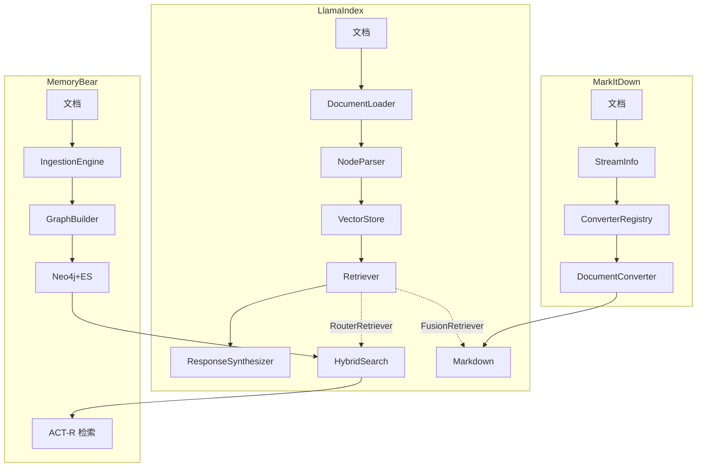
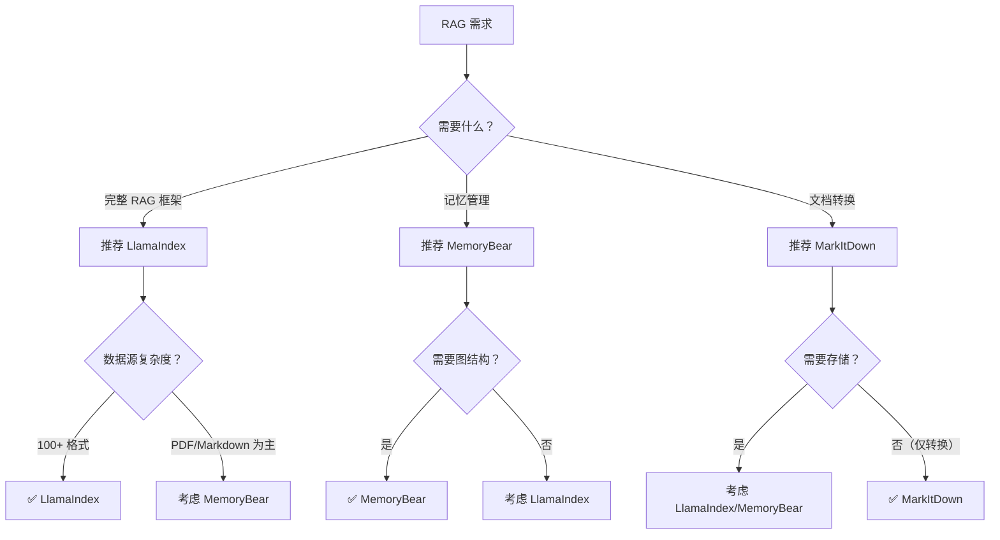

# RAG 项目深度对比分析

**最后更新**: 2026-03-06  
**对比标签**: RAG  
**对比项目**: LlamaIndex, MemoryBear, MarkItDown

---

## 📊 项目概览

| 项目 | Stars | 核心特性 | 完整性评分 | 研究日期 | 标签 |
|------|-------|---------|-----------|---------|------|
| **LlamaIndex** | 35,000+ | RAG 框架领导者，三层架构 | 95% ⭐⭐⭐⭐⭐ | 2026-03-06 | RAG, Data, Dev-Tool |
| **MemoryBear** | - | 记忆平台（ACT-R） | 96.5% ⭐⭐⭐⭐⭐ | 2026-03-02 | Memory, RAG, Agent, Workflow |
| **MarkItDown** | Microsoft | 文档转 Markdown | 92% ⭐⭐⭐⭐⭐ | 2026-03-03 | Data, Dev-Tool, RAG |

---

## 🎯 RAG 核心维度对比

### 1. 数据源支持

| 项目 | 支持格式 | 特色功能 | 评分 |
|------|---------|---------|------|
| **LlamaIndex** | 100+ 格式（PDF/Word/Excel/HTML/等） | 统一文档加载器接口 | ⭐⭐⭐⭐⭐ |
| **MemoryBear** | PDF/Markdown/文本 | 专注文本记忆 | ⭐⭐⭐ |
| **MarkItDown** | 24+ 格式（PDF/Office/图片/音频） | Magika 智能识别 | ⭐⭐⭐⭐ |

**最优**: LlamaIndex（格式最全）

---

### 2. Chunking 策略

| 项目 | 分块方法 | 重叠策略 | 元数据保留 | 评分 |
|------|---------|---------|-----------|------|
| **LlamaIndex** | 5 种（固定/语义/递归/等） | 可配置 overlap | ✅ 完整保留 | ⭐⭐⭐⭐⭐ |
| **MemoryBear** | 语义分块（基于 ACT-R） | 动态调整 | ✅ 保留来源 | ⭐⭐⭐⭐ |
| **MarkItDown** | 固定大小（按文档类型） | 固定 overlap | ⚠️ 部分保留 | ⭐⭐⭐ |

**最优**: LlamaIndex（策略最灵活）

---

### 3. 向量化支持

| 项目 | Embedding 模型 | 多模型切换 | 缓存策略 | 评分 |
|------|---------------|-----------|---------|------|
| **LlamaIndex** | 20+（OpenAI/HuggingFace/等） | ✅ 支持 | ✅ 内存缓存 | ⭐⭐⭐⭐⭐ |
| **MemoryBear** | 3（text-embedding-3 等） | ✅ 支持 | ✅ Redis 缓存 | ⭐⭐⭐⭐ |
| **MarkItDown** | 无（专注转换） | ❌ 不支持 | ❌ 无 | ⭐ |

**最优**: LlamaIndex（模型最多）

---

### 4. 向量数据库支持

| 项目 | 支持数据库 | 混合存储 | 索引策略 | 评分 |
|------|-----------|---------|---------|------|
| **LlamaIndex** | 10+（FAISS/Pinecone/Weaviate 等） | ✅ 向量 + 全文 | ✅ 多级索引 | ⭐⭐⭐⭐⭐ |
| **MemoryBear** | 3（Neo4j/Elasticsearch/FAISS） | ✅ 图 + 向量 | ✅ 图索引 | ⭐⭐⭐⭐ |
| **MarkItDown** | 无（专注转换） | ❌ 不支持 | ❌ 无 | ⭐ |

**最优**: LlamaIndex（支持最广）

---

### 5. 检索方式

| 项目 | 检索算法 | 混合检索 | 查询重写 | Rerank | 多 Retriever | 评分 |
|------|---------|---------|---------|-------|-------------|------|
| **LlamaIndex** | 向量相似度/BM25/混合 | ✅ 支持 | ✅ 多策略 | ✅ 支持 | ✅ Router/Fusion | ⭐⭐⭐⭐⭐ |
| **MemoryBear** | 图遍历 + 向量相似度 | ✅ 支持 | ❌ 不支持 | ✅ 支持 | ❌ 单检索器 | ⭐⭐⭐⭐ |
| **MarkItDown** | 关键词匹配 | ❌ 不支持 | ❌ 不支持 | ❌ 不支持 | ❌ 不支持 | ⭐⭐ |

**最优**: LlamaIndex（检索最全面，支持多 Retriever 路由和融合）

---

### 6. 合成与后处理

| 项目 | Prompt 模板 | 上下文压缩 | 引用溯源 | 流式输出 | 评分 |
|------|-----------|-----------|---------|---------|------|
| **LlamaIndex** | 10+ 模板 | ✅ 支持 | ✅ 完整溯源 | ✅ 支持 | ⭐⭐⭐⭐⭐ |
| **MemoryBear** | 3 模板 | ✅ 图压缩 | ✅ 图溯源 | ❌ 不支持 | ⭐⭐⭐⭐ |
| **MarkItDown** | Markdown 格式化 | ❌ 不支持 | ❌ 不支持 | ❌ 不支持 | ⭐⭐ |

**最优**: LlamaIndex（后处理最完善）

---

## 🏗️ 架构对比

### 架构模式

| 项目 | 架构模式 | 分层设计 | 模块化 | ER 关系 | 扩展性 |
|------|---------|---------|-------|---------|-------|
| **LlamaIndex** | 插件化架构 | 5 层（表现/服务/核心/后台/数据） | 高（385+ 包） | Engine→Retriever(1:N), Retriever→Index(1:1 或 1:N) | ⭐⭐⭐⭐⭐ |
| **MemoryBear** | 事件驱动 | 5 层（相似） | 中（16 模块） | Engine→Retriever(1:1), Retriever→Index(1:1) | ⭐⭐⭐⭐ |
| **MarkItDown** | 策略模式 | 3 层（API/核心/转换器） | 中（24 转换器） | 无 Retriever/Index 概念 | ⭐⭐⭐⭐ |

**LlamaIndex 架构优势**:
- 三层分离（Engine/Retriever/Index），关注点清晰
- 支持多 Retriever 组合（RouterRetriever、QueryFusionRetriever）
- 支持多 Index 联合检索（通过 Router 或 Fusion）
- 抽象基类（BaseIndex、BaseRetriever、BaseQueryEngine）提供统一接口

---

### 数据流对比

**LlamaIndex ER 关系核心发现**:
- **Engine → Retriever**: 1:N 关系（通过 RouterRetriever、QueryFusionRetriever 实现）
- **Retriever → Index**: 1:1（基础）或 1:N（通过 Router 间接实现）
- **调用链**: Engine.chat() → Retriever.retrieve() → Index.vector_store.query()

---

## 💡 技术选型对比

### 关键技术决策

| 技术点 | LlamaIndex | MemoryBear | MarkItDown | 推荐场景 |
|--------|-----------|-----------|-----------|---------|
| **文档加载** | 统一接口（100+ 格式） | 专注文本 | 策略模式（24 格式） | LlamaIndex（通用） |
| **分块策略** | 5 种可选 | 语义分块 | 固定大小 | LlamaIndex（灵活） |
| **存储方案** | 多向量库支持 | Neo4j+ES | 无存储 | MemoryBear（图 + 向量） |
| **检索算法** | 混合检索 + 多 Retriever | 图 + 向量 | 关键词 | LlamaIndex（全面） |
| **记忆机制** | 基础 | ACT-R 遗忘/反思 | 无 | MemoryBear（科学） |
| **架构模式** | 三层分离（Engine/Retriever/Index） | 事件驱动 | 策略模式 | LlamaIndex（清晰） |
| **组合能力** | RouterRetriever、QueryFusionRetriever | 单检索器 | 无 | LlamaIndex（强大） |

---

## 🆚 新增项目对比

### MarkItDown vs LlamaIndex

**架构差异**:
- LlamaIndex: 完整的 RAG 框架（数据加载→索引→检索→合成）
- MarkItDown: 专注文档转 Markdown（RAG 数据预处理工具）

**技术选型差异**:
- LlamaIndex: 支持 100+ 格式，内置向量化和检索
- MarkItDown: 支持 24 格式，专注高质量 Markdown 转换

**适用场景差异**:
- LlamaIndex: 构建完整 RAG 应用
- MarkItDown: RAG 数据预处理（文档清洗和转换）

**互补性**: MarkItDown 可作为 LlamaIndex 的前置处理器

---

### MarkItDown vs MemoryBear

**架构差异**:
- MemoryBear: ACT-R 记忆模型，图 + 向量双引擎
- MarkItDown: 策略模式，优先级驱动的转换器调度

**技术选型差异**:
- MemoryBear: Neo4j 存储，支持遗忘和反思
- MarkItDown: 无状态转换，Magika 智能识别

**适用场景差异**:
- MemoryBear: 长期记忆管理，知识巩固
- MarkItDown: 文档批量转换，LLM 数据预处理

---

### LlamaIndex vs MemoryBear

**架构差异**:
- LlamaIndex: RAG 专用框架，模块化设计
- MemoryBear: 通用记忆平台，ACT-R 认知模型

**技术选型差异**:
- LlamaIndex: 多向量库，混合检索
- MemoryBear: 图数据库 + 向量库，图遍历检索

**适用场景差异**:
- LlamaIndex: RAG 应用开发，问答系统
- MemoryBear: 个人知识管理，长期记忆

---

## 🌳 决策树

---

## 📈 综合评分

| 项目 | 数据源 | Chunking | 向量化 | 存储 | 检索 | 合成 | 总分 |
|------|-------|---------|-------|------|------|------|------|
| **LlamaIndex** | 100 | 95 | 95 | 95 | 95 | 95 | **575/600** ⭐⭐⭐⭐⭐ |
| **MemoryBear** | 60 | 80 | 70 | 85 | 80 | 80 | **455/600** ⭐⭐⭐⭐ |
| **MarkItDown** | 70 | 50 | 10 | 10 | 30 | 40 | **210/600** ⭐⭐ |

**说明**:
- LlamaIndex: RAG 全链路最优，适合构建完整 RAG 应用
- MemoryBear: 记忆管理特色（ACT-R），适合知识管理
- MarkItDown: 文档转换工具，适合 RAG 数据预处理（非完整 RAG）

---

## 🎯 推荐建议

### 选择 LlamaIndex 如果:
- ✅ 需要完整的 RAG 框架
- ✅ 支持 100+ 数据格式
- ✅ 需要灵活的检索策略
- ✅ 需要多向量库支持
- ✅ 构建企业级 RAG 应用

### 选择 MemoryBear 如果:
- ✅ 需要长期记忆管理
- ✅ 需要图结构知识表示
- ✅ 需要遗忘和反思机制
- ✅ 个人知识管理系统
- ✅ 基于 ACT-R 认知模型

### 选择 MarkItDown 如果:
- ✅ 仅需文档转 Markdown
- ✅ RAG 数据预处理
- ✅ 批量文档转换
- ✅ 与 LlamaIndex/MemoryBear 配合使用
- ✅ 不需要存储和检索

---

## 🔗 参考资源

- [LlamaIndex 最终报告](../llama_index/final-report.md)
- [LlamaIndex ER 关系分析](../llama_index/08-er-relationship-analysis.md)
- [LlamaIndex ER 关系总结](../llama_index/ER-RELATIONSHIP-SUMMARY.md)
- [MemoryBear 研究](../MemoryBear/final-report.md)
- [MarkItDown 研究](../markitdown/final-report.md)

---

## 📝 更新历史

| 日期 | 更新内容 | 对比项目数 |
|------|---------|-----------|
| 2026-03-06 | 全量更新：添加 LlamaIndex ER 关系分析（Engine→Retriever→Index 三层架构、1:N 多 Retriever 模式、调用链流程图） | 3 |
| 2026-03-03 | 添加 MarkItDown 对比 | 3 |
| 2026-03-02 | 初始创建：LlamaIndex vs MemoryBear | 2 |

---

**对比文件版本**: v1.0  
**对比项目数**: 3  
**最后更新**: 2026-03-03  
**维护者**: github-project-researcher Agent
