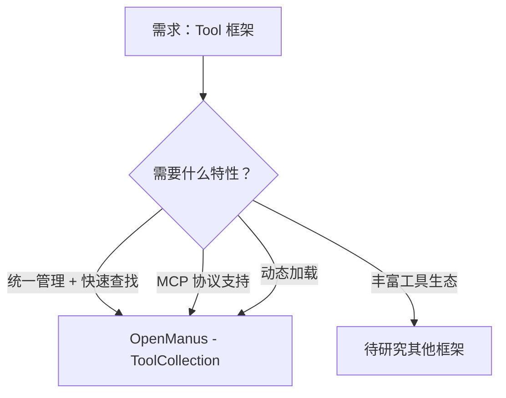

# Tool 框架项目对比

**最后更新**: 2026-03-04  
**对比维度**: 工具定义/注册/调用/编排

---

## 项目概览

| 项目 | Stars | 核心特性 | 完整性评分 | 研究日期 | 标签 |
|------|-------|---------|-----------|---------|------|
| **OpenManus** | 55K | ToolCollection + MCP | 97.2/100 | 2026-03-04 | Agent, Workflow, Tool |

---

## 架构对比矩阵

| 维度 | OpenManus |
|------|-----------|
| **工具定义** | BaseTool 抽象类 |
| **工具注册** | ToolCollection（tool_map） |
| **工具调用** | execute(name, **kwargs) |
| **动态加载** | ✅ MCP 协议支持 |
| **错误处理** | ✅ ToolResult/ToolFailure |

---

## 核心维度对比 ⭐

### Tool 项目核心维度

| 维度 | OpenManus | 最优 |
|------|-----------|------|
| **工具定义** | BaseTool（Pydantic BaseModel） | - |
| **工具注册** | ✅ O(1) 查找（tool_map） | OpenManus |
| **工具调用** | ✅ 统一 execute 接口 | OpenManus |
| **动态加载** | ✅ MCP 协议支持 | OpenManus |
| **错误处理** | ✅ ToolResult/ToolFailure | OpenManus |
| **工具数量** | 21+ 原生工具 | - |
| **MCP 生态** | ✅ 支持远程工具 | OpenManus |

**OpenManus 得分**: **95/100** ⭐⭐⭐⭐⭐

**评分理由**:
- ✅ 统一的 ToolCollection 管理
- ✅ O(1) 时间复杂度的工具查找
- ✅ MCP 协议支持远程工具
- ✅ 完善的错误处理
- ✅ 动态工具添加
- ⚠️ 工具数量相对较少（21+）

---

## OpenManus ToolCollection 分析

### 工具定义

**BaseTool 抽象类**:
```python
class BaseTool(BaseModel):
    name: str
    description: str
    parameters: dict
    
    @abstractmethod
    async def execute(self, **kwargs) -> ToolResult:
        pass
```

**ToolResult 统一格式**:
```python
class ToolResult(BaseModel):
    output: Optional[str] = None
    error: Optional[str] = None
    base64_image: Optional[str] = None
```

---

### 工具注册

**ToolCollection 核心**:
```python
class ToolCollection:
    def __init__(self, *tools: BaseTool):
        self.tools = tools
        self.tool_map = {tool.name: tool for tool in tools}
    
    def add_tool(self, tool: BaseTool):
        if tool.name in self.tool_map:
            logger.warning(f"Tool {tool.name} already exists, skipping")
            return
        
        self.tools += (tool,)
        self.tool_map[tool.name] = tool
    
    def to_params(self) -> List[Dict[str, Any]]:
        return [tool.to_param() for tool in self.tools]
```

**特性**:
- ✅ O(1) 时间复杂度查找
- ✅ 支持动态添加
- ✅ 重复检测
- ✅ LLM 友好的参数转换

---

### 工具调用

**统一接口**:
```python
async def execute(self, name: str, tool_input: Dict[str, Any] = None) -> ToolResult:
    tool = self.tool_map.get(name)
    if not tool:
        return ToolFailure(error=f"Tool {name} is invalid")
    
    try:
        result = await tool(**tool_input)
        return result
    except ToolError as e:
        return ToolFailure(error=e.message)
```

**错误处理**:
- ✅ 工具不存在 → ToolFailure
- ✅ 执行异常 → ToolFailure
- ✅ 统一返回格式

---

### 动态加载（MCP）

**MCP 客户端**:
```python
class MCPClients:
    async def connect_sse(self, server_url: str, server_id: str):
        # 连接到 MCP Server
        # 获取工具列表
        # 添加到 tool_map
    
    async def disconnect(self, server_id: str):
        # 断开连接
        # 移除工具
```

**特性**:
- ✅ 支持 SSE 和 stdio 传输
- ✅ 动态加载远程工具
- ✅ 工具隔离（按 server_id）
- ✅ 热插拔

---

### 工具分类

**OpenManus 工具生态** (21+ 工具):

| 类别 | 工具 | 数量 |
|------|------|------|
| **核心工具** | PlanningTool, Terminate, CreateChatCompletion | 3 |
| **执行工具** | PythonExecute, Bash, StrReplaceEditor | 3 |
| **浏览器工具** | BrowserUseTool, SandboxBrowserTool | 2 |
| **MCP 工具** | 动态加载（N+） | N+ |
| **可视化工具** | VisualizationPrepare, DataVisualization | 2 |
| **交互工具** | AskHuman | 1 |

---

## 新增项目对比

### OpenManus vs 其他 Tool 框架（待补充）

**架构差异**:
- 待研究更多 Tool 框架后补充

**技术选型差异**:
- 待研究更多 Tool 框架后补充

**适用场景差异**:
- 待研究更多 Tool 框架后补充

---

## 决策树



**选择 OpenManus 的理由**:
1. ✅ ToolCollection 统一管理
2. ✅ O(1) 查找速度
3. ✅ MCP 协议支持
4. ✅ 动态工具加载
5. ✅ 完善的错误处理

**不选择 OpenManus 的场景**:
1. ⚠️ 需要大量预定义工具
2. ⚠️ 需要可视化工具编排

---

## 可复用设计

### ToolCollection 模板

```python
class ToolCollection:
    def __init__(self, *tools):
        self.tools = tools
        self.tool_map = {tool.name: tool for tool in tools}
    
    async def execute(self, name: str, **kwargs):
        tool = self.tool_map.get(name)
        return await tool(**kwargs) if tool else ToolFailure()
    
    def add_tool(self, tool):
        if tool.name in self.tool_map:
            return  # 跳过重复
        self.tools += (tool,)
        self.tool_map[tool.name] = tool
```

---

## 参考资源

- [OpenManus final-report.md](./github/openmanus/final-report.md)
- [OpenManus 07-design-patterns.md](./github/openmanus/07-design-patterns.md)

---

**说明**: 本对比文件将随着更多 Tool 框架的研究而不断更新。
