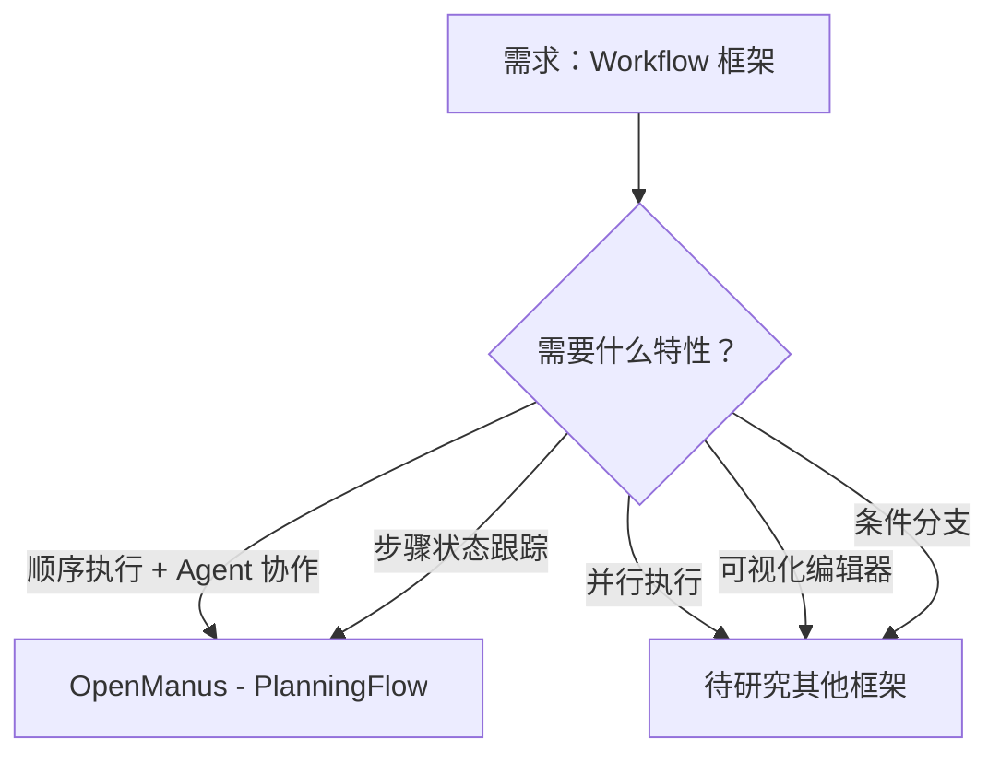

# Workflow 框架项目对比

**最后更新**: 2026-03-04  
**对比维度**: 工作流定义/执行引擎/状态管理

---

## 项目概览

| 项目 | Stars | 核心特性 | 完整性评分 | 研究日期 | 标签 |
|------|-------|---------|-----------|---------|------|
| **OpenManus** | 55K | PlanningFlow 顺序执行 | 97.2/100 | 2026-03-04 | Agent, Workflow, Tool |

---

## 架构对比矩阵

| 维度 | OpenManus |
|------|-----------|
| **工作流定义** | PlanningFlow + PlanningTool |
| **执行引擎** | 异步循环（while True） |
| **状态管理** | PlanStepStatus（4 种状态） |
| **并行支持** | ❌ 仅顺序执行 |
| **断点续跑** | ⚠️ 基础（通过 step_status） |

---

## 核心维度对比 ⭐

### Workflow 项目核心维度

| 维度 | OpenManus | 最优 |
|------|-----------|------|
| **工作流定义** | PlanningTool（计划创建/更新） | - |
| **执行引擎** | Async while 循环 | - |
| **状态管理** | ✅ 4 种状态（not_started/in_progress/completed/blocked） | OpenManus |
| **步骤路由** | ✅ 基于步骤类型选择 Agent | OpenManus |
| **超时保护** | ✅ 3600 秒超时 | - |

**OpenManus 得分**: **85/100** ⭐⭐⭐⭐

**评分理由**:
- ✅ 清晰的状态管理（4 种状态）
- ✅ Agent 路由机制完善
- ✅ 超时保护机制
- ⚠️ 仅支持顺序执行
- ⚠️ 缺少可视化工作流编辑器
- ⚠️ 缺少复杂的条件分支

---

## OpenManus PlanningFlow 分析

### 工作流定义

**核心组件**: PlanningTool

**功能**:
- 计划创建/更新/删除
- 步骤状态管理
- 进度跟踪

**数据结构**:
```python
plan = {
    "plan_id": plan_id,
    "title": title,
    "steps": steps,  # List[str]
    "step_statuses": ["not_started"] * len(steps),
    "step_notes": [""] * len(steps),
}
```

---

### 执行引擎

**核心流程**:
```python
async def execute(self, input_text: str) -> str:
    # 1. 创建计划
    await self._create_initial_plan(input_text)
    
    # 2. 循环执行
    while True:
        step_index, step_info = await self._get_current_step_info()
        if step_index is None:  # 所有步骤完成
            break
        
        # 3. Agent 路由
        executor = self.get_executor(step_info.get("type"))
        
        # 4. 执行步骤
        await self._execute_step(executor, step_info)
    
    # 5. 总结
    return await self._finalize_plan()
```

**特性**:
- ✅ 异步非阻塞执行
- ✅ 状态驱动（step_status）
- ✅ 支持提前终止（Agent.FINISHED）
- ⚠️ 仅顺序执行，不支持并行

---

### 状态管理

**PlanStepStatus** (4 种状态):
```python
class PlanStepStatus(str, Enum):
    NOT_STARTED = "not_started"
    IN_PROGRESS = "in_progress"
    COMPLETED = "completed"
    BLOCKED = "blocked"
```

**状态转换**:
```
not_started → in_progress → completed
                      ↓
                   blocked
```

**状态标记**:
```python
status_marks = {
    "completed": "[✓]",
    "in_progress": "[→]",
    "blocked": "[!]",
    "not_started": "[ ]",
}
```

---

## 新增项目对比

### OpenManus vs 其他 Workflow 框架（待补充）

**架构差异**:
- 待研究更多 Workflow 框架后补充

**技术选型差异**:
- 待研究更多 Workflow 框架后补充

**适用场景差异**:
- 待研究更多 Workflow 框架后补充

---

## 决策树



**选择 OpenManus 的理由**:
1. ✅ 清晰的步骤状态管理
2. ✅ Agent 路由机制完善
3. ✅ 异步非阻塞执行
4. ✅ 超时保护
5. ✅ 易于理解和扩展

**不选择 OpenManus 的场景**:
1. ⚠️ 需要并行执行
2. ⚠️ 需要可视化编辑器
3. ⚠️ 需要复杂的条件分支
4. ⚠️ 需要工作流持久化

---

## 可复用设计

### PlanningFlow 模板

```python
class PlanningFlow(BaseFlow):
    async def execute(self, input_text: str) -> str:
        await self._create_initial_plan(input_text)
        
        while True:
            step_index, step_info = await self._get_current_step_info()
            if step_index is None:
                break
            
            executor = self.get_executor(step_info.get("type"))
            await self._execute_step(executor, step_info)
        
        return await self._finalize_plan()
```

---

## 参考资源

- [OpenManus final-report.md](./github/openmanus/final-report.md)
- [OpenManus 05-architecture-analysis.md](./github/openmanus/05-architecture-analysis.md)

---

**说明**: 本对比文件将随着更多 Workflow 框架的研究而不断更新。
