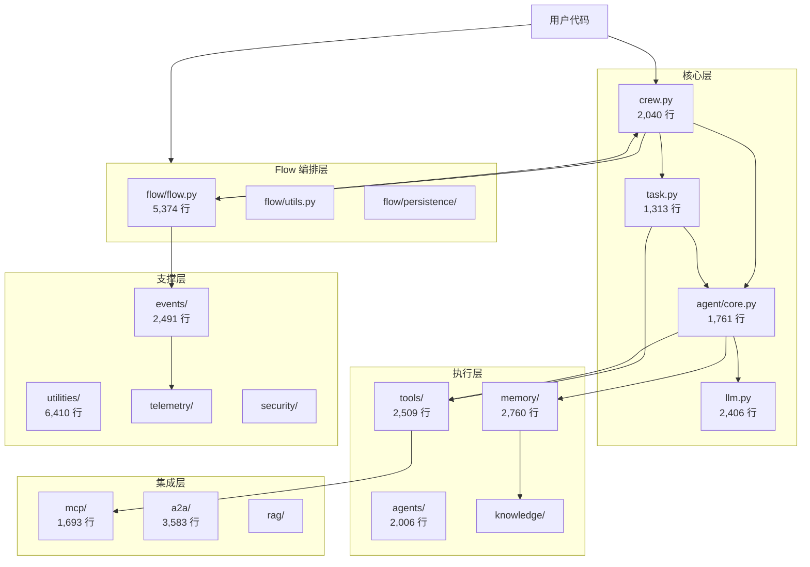

# CrewAI 模块化分析报告

**研究阶段**: 阶段 2  
**执行日期**: 2026-03-04  
**分析范围**: lib/crewai/src/crewai/

---

## 📊 模块概览

### 模块统计

| 模块名 | 文件数 | 代码行数 | 职责 | 核心度 |
|--------|--------|---------|------|--------|
| **crew.py** | 1 | 2,040 | Crew 编排核心 | ⭐⭐⭐⭐⭐ |
| **task.py** | 1 | 1,313 | Task 定义与执行 | ⭐⭐⭐⭐⭐ |
| **agent/core.py** | 1 | 1,761 | Agent 核心逻辑 | ⭐⭐⭐⭐⭐ |
| **flow/flow.py** | 25 | 5,374 | Flow 状态机编排 | ⭐⭐⭐⭐⭐ |
| **llm.py** | 20 | 2,406 | LLM 抽象层 | ⭐⭐⭐⭐ |
| **utilities/** | 43 | 6,410 | 工具函数集合 | ⭐⭐⭐⭐ |
| **tools/** | 18 | 2,509 | 工具系统 | ⭐⭐⭐⭐ |
| **events/** | 35 | 2,491 | 事件总线系统 | ⭐⭐⭐ |
| **memory/** | 11 | 2,760 | 记忆系统 | ⭐⭐⭐ |
| **knowledge/** | 20 | 134 | 知识库系统 | ⭐⭐⭐ |
| **cli/** | 64 | 4,706 | 命令行接口 | ⭐⭐ |
| **a2a/** | 38 | 3,583 | Agent-to-Agent 协议 | ⭐⭐ |
| **mcp/** | 10 | 1,693 | MCP 集成 | ⭐⭐⭐ |
| **rag/** | 95 | 157 | RAG 检索增强 | ⭐⭐ |
| **agents/** | 27 | 2,006 | Agent 构建器 | ⭐⭐⭐ |
| **tasks/** | 6 | 394 | Task 扩展 | ⭐⭐ |
| **crews/** | 3 | 512 | Crew 扩展 | ⭐⭐ |
| **hooks/** | 6 | 1,361 | Hook 系统 | ⭐⭐ |
| **project/** | 5 | 1,651 | 项目管理 | ⭐⭐ |
| **telemetry/** | 4 | 1,149 | 遥测追踪 | ⭐⭐ |
| **security/** | 4 | 280 | 安全配置 | ⭐⭐ |
| **types/** | 5 | 482 | 类型定义 | ⭐⭐ |
| **llms/** | 20 | 1,449 | LLM 扩展 | ⭐⭐ |
| **experimental/** | 18 | 1,638 | 实验性功能 | ⭐⭐ |

**总计**: 475 个 Python 文件，约 45,000+ 行代码

---

## 🗺️ 模块依赖关系图



---

## 📦 核心模块详细分析

### 1. Crew 模块 (crew.py) - 2,040 行

**职责**: 多 Agent 协作编排核心

**核心类**:
```python
class Crew(FlowTrackable, BaseModel):
    """多 Agent 协作编排器"""
    
    # 核心属性
    tasks: list[Task]
    agents: list[BaseAgent]
    process: Process  # sequential, hierarchical
    memory: bool | Memory
    cache: bool
    
    # 核心方法
    kickoff()           # 启动执行
    kickoff_async()     # 异步启动
    train()            # 训练模式
    test()             # 测试模式
```

**依赖模块**:
- utilities (17 个导入) - 工具函数
- events (5 个导入) - 事件系统
- tools (3 个导入) - 工具集成
- knowledge - 知识库
- memory - 记忆系统

**关键特性**:
- ✅ 支持顺序/层次化执行流程
- ✅ 集成统一记忆系统
- ✅ 支持流式输出
- ✅ 内置遥测追踪
- ✅ 支持训练和测试模式

---

### 2. Task 模块 (task.py) - 1,313 行

**职责**: 任务定义和执行单元

**核心类**:
```python
class Task(BaseModel):
    """任务执行单元"""
    
    # 核心属性
    description: str              # 任务描述
    expected_output: str          # 期望输出
    agent: BaseAgent | None       # 负责 Agent
    tools: list[BaseTool]         # 可用工具
    context: list[Task]           # 上下文任务
    output_json: type[BaseModel]  # JSON 输出模式
    output_pydantic: type[BaseModel]  # Pydantic 输出
    guardrail: GuardrailType      # 护栏函数
```

**依赖模块**:
- utilities (9 个导入)
- tasks (2 个导入)
- events (2 个导入)
- tools - 工具系统
- security - 安全配置

**关键特性**:
- ✅ 支持结构化输出（JSON/Pydantic）
- ✅ 支持任务依赖和上下文
- ✅ 支持输出护栏验证
- ✅ 支持异步执行
- ✅ 支持文件输出

---

### 3. Agent 模块 (agent/core.py) - 1,761 行

**职责**: Agent 核心执行逻辑

**核心类**:
```python
class Agent(BaseAgent):
    """AI Agent 实现"""
    
    # 核心属性
    role: str                    # 角色
    goal: str                    # 目标
    backstory: str              # 背景
    llm: BaseLLM                # 语言模型
    tools: list[BaseTool]       # 工具集
    memory: Memory | None       # 记忆
    knowledge: Knowledge | None # 知识库
    mcps: list[MCPServerConfig] # MCP 服务器
    
    # 执行控制
    max_iter: int               # 最大迭代次数
    max_rpm: int                # 最大请求/分钟
    allow_delegation: bool      # 允许委托
    reasoning: bool             # 启用推理
```

**依赖模块**:
- utilities (11 个导入)
- events (4 个导入)
- agents (3 个导入)
- mcp (2 个导入)
- knowledge (2 个导入)

**关键特性**:
- ✅ 支持工具调用和委托
- ✅ 集成 MCP 工具系统
- ✅ 支持知识库检索
- ✅ 支持推理模式（reasoning）
- ✅ 支持代码执行（safe/unsafe）
- ✅ 支持多模态输入

---

### 4. Flow 模块 (flow/flow.py) - 5,374 行

**职责**: 事件驱动的工作流编排系统

**核心装饰器**:
```python
@start()              # 定义 Flow 起点
@listen(method_name)  # 监听其他方法
@router(condition)    # 条件路由
```

**核心类**:
```python
class Flow(BaseModel):
    """事件驱动工作流"""
    
    # 状态管理
    state: dict
    persistence: PersistenceLayer
    
    # 执行控制
    async_execute: bool
    max_concurrent: int
```

**依赖模块**:
- flow (7 个内部导入) -  Flow 内部模块
- events (6 个导入) - 事件系统

**关键特性**:
- ✅ 声明式 Flow 定义
- ✅ 条件分支和并行执行
- ✅ 持久化状态管理
- ✅ 支持人工审核（human-in-the-loop）
- ✅ 支持异步执行
- ✅ 可视化 Flow 图

---

### 5. LLM 模块 (llm.py) - 2,406 行

**职责**: LLM 抽象和调用层

**核心类**:
```python
class LLM(BaseLLM):
    """语言模型抽象"""
    
    # 模型配置
    model: str
    temperature: float
    max_tokens: int
    top_p: float
    
    # 提供商支持
    # - OpenAI
    # - Anthropic
    # - Azure
    # - Ollama
    # - 100+ 通过 LiteLLM
```

**关键特性**:
- ✅ 支持 100+ LLM 提供商（通过 LiteLLM）
- ✅ 统一的调用接口
- ✅ 支持流式输出
- ✅ 支持 token 计数和回调
- ✅ 支持缓存和重试

---

## 🔗 模块间依赖分析

### 核心依赖链

```
用户代码
    ↓
Crew (编排层)
    ↓
Task (任务层)
    ↓
Agent (执行层)
    ↓
LLM + Tools (能力层)
    ↓
Memory + Knowledge (支撑层)
```

### 依赖统计

**Crew 模块依赖**:
- 最依赖：utilities (17 次), events (5 次)
- 核心依赖：Task, Agent, Process
- 可选依赖：Memory, Knowledge, MCP

**Task 模块依赖**:
- 最依赖：utilities (9 次)
- 核心依赖：Agent, TaskOutput
- 可选依赖：Tools, Guardrails

**Agent 模块依赖**:
- 最依赖：utilities (11 次), events (4 次)
- 核心依赖：LLM, BaseAgent
- 可选依赖：MCP, Knowledge, Memory

---

## 📐 架构设计模式

### 1. 分层架构

```
┌─────────────────────────────────────┐
│         用户应用层 (User Code)       │
├─────────────────────────────────────┤
│         编排层 (Crew / Flow)         │
├─────────────────────────────────────┤
│         任务层 (Task)                │
├─────────────────────────────────────┤
│         执行层 (Agent)               │
├─────────────────────────────────────┤
│         能力层 (LLM / Tools)         │
├─────────────────────────────────────┤
│         支撑层 (Memory / Knowledge)  │
├─────────────────────────────────────┤
│         基础设施 (Events / Utils)    │
└─────────────────────────────────────┘
```

### 2. 事件驱动架构

- 所有关键操作都发布事件
- 监听器解耦核心逻辑和副作用
- 支持自定义监听器扩展
- 内置遥测和追踪监听器

### 3. 装饰器模式

- Flow 系统大量使用装饰器
- `@start`, `@listen`, `@router` 定义执行流
- 声明式优于命令式

### 4. 策略模式

- Process 定义执行策略（sequential/hierarchical）
- LLM 支持多种提供商策略
- Memory 支持不同存储后端

---

## 🎯 模块研究优先级

基于依赖分析和代码量，确定研究优先级：

### P0 - 核心模块（必须深入研究）
1. ✅ **crew.py** - 编排核心
2. ✅ **task.py** - 任务定义
3. ✅ **agent/core.py** - Agent 执行
4. ⏳ **flow/flow.py** - Flow 编排
5. ⏳ **tools/base_tool.py** - 工具基础

### P1 - 关键支撑（需要研究）
6. **llm.py** - LLM 抽象
7. **utilities/** - 工具函数
8. **events/** - 事件系统
9. **memory/** - 记忆系统

### P2 - 扩展功能（选择性研究）
10. **knowledge/** - 知识库
11. **mcp/** - MCP 集成
12. **a2a/** - Agent-to-Agent
13. **rag/** - RAG 检索

---

## 📊 代码复杂度分析

### 大文件 Top 10

| 文件 | 行数 | 复杂度 |
|------|------|--------|
| flow/flow.py | 5,374 | 高 |
| utilities/* | 6,410 | 中（分散） |
| crew.py | 2,040 | 高 |
| llm.py | 2,406 | 高 |
| tools/* | 2,509 | 中（分散） |
| events/* | 2,491 | 中（分散） |
| memory/* | 2,760 | 中（分散） |
| a2a/* | 3,583 | 中（分散） |
| agent/core.py | 1,761 | 高 |
| task.py | 1,313 | 中 |

### 模块集中度

- **高度集中**: crew.py, task.py, agent/core.py, llm.py, flow/flow.py
- **适度分散**: tools/, events/, memory/, utilities/
- **建议**: 核心模块复杂度高，需要深入分析关键方法

---

## 🔍 下一步研究方向

### 阶段 3: 多入口点追踪

基于模块化分析，确定追踪路径：

1. **波次 1 - Crew 执行流**:
   - 入口：`Crew.kickoff()`
   - 追踪：Crew → Task → Agent → LLM/Tools

2. **波次 2 - Flow 执行流**:
   - 入口：`@start()` 方法
   - 追踪：Flow 状态机 → 条件路由 → 方法调用

3. **波次 3 - 工具调用流**:
   - 入口：`Agent.execute_tool()`
   - 追踪：工具解析 → 参数验证 → 执行 → 结果处理

---

**完整性检查**:
- ✅ 24 个模块已识别和分类
- ✅ 模块依赖关系已分析
- ✅ 核心模块已详细分析
- ✅ 架构模式已识别
- ✅ 研究优先级已确定

**下一步**: 阶段 3 - 多入口点追踪（GSD 波次执行）
