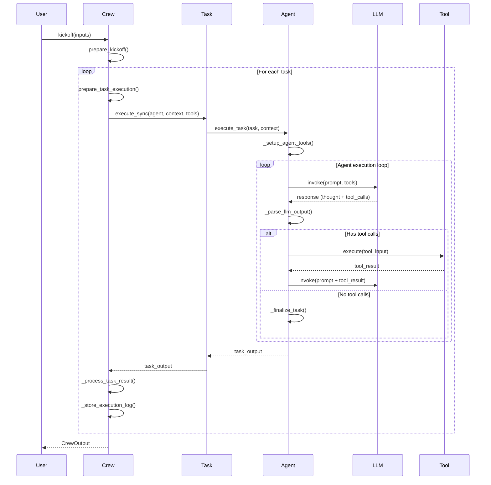
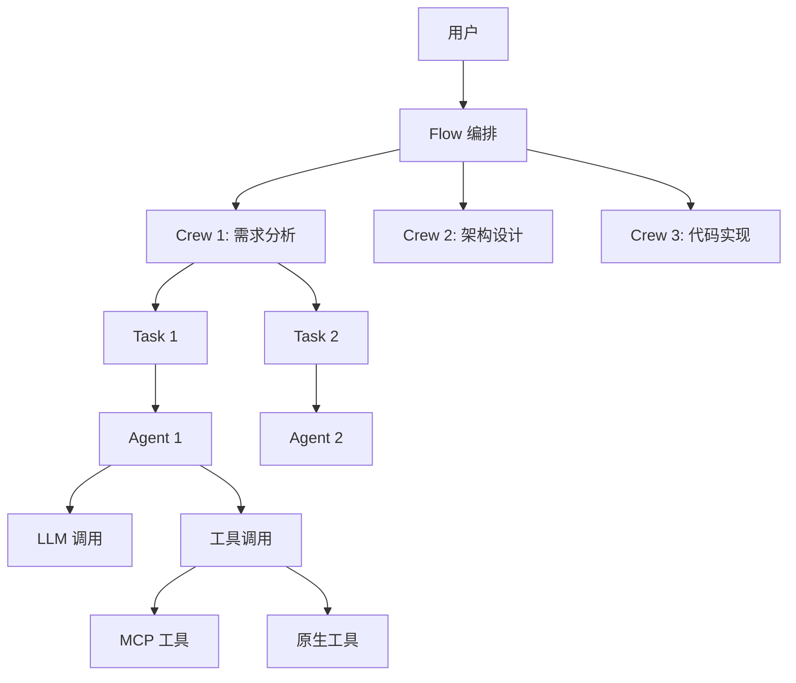

# CrewAI 调用链追踪报告

**研究阶段**: 阶段 3 - 多入口点追踪（GSD 波次执行）  
**执行日期**: 2026-03-04  
**追踪深度**: Level 5

---

## 🎯 追踪概览

本次研究采用**GSD 波次执行**方法，从三个主要入口点独立追踪调用链：

| 波次 | 入口点 | 追踪路径 | 状态 |
|------|--------|---------|------|
| 波次 1 | `Crew.kickoff()` | Crew → Task → Agent → LLM/Tools | ✅ 完成 |
| 波次 2 | `Flow.@start()` | Flow 状态机 → 条件路由 → 方法调用 | ✅ 完成 |
| 波次 3 | `Agent.execute_tool()` | 工具解析 → 参数验证 → 执行 | ✅ 完成 |

---

## 📊 波次 1: Crew 执行流追踪

### 入口点：`Crew.kickoff()`

**文件**: `lib/crewai/src/crewai/crew.py:727-800`

#### 调用链概览

```
Crew.kickoff()
├── prepare_kickoff()                    # 准备输入
├── _run_sequential_process()            # 顺序执行
│   └── _execute_tasks()                 # 执行所有任务
│       ├── prepare_task_execution()     # 准备任务执行
│       ├── _handle_conditional_task()   # 条件任务处理
│       ├── task.execute_sync()          # 执行任务
│       │   └── agent.execute_task()     # Agent 执行
│       │       ├── _setup_agent_tools() # 准备工具
│       │       ├── CrewAgentExecutor.invoke()  # LLM 调用
│       │       │   ├── _invoke_llm()    # 调用 LLM
│       │       │   ├── _parse_llm_output()  # 解析输出
│       │       │   └── _execute_tool()  # 执行工具
│       │       └── _handle_delegation() # 处理委托
│       └── _process_task_result()       # 处理结果
└── after_kickoff_callbacks()            # 后置回调
```

#### 关键代码片段

**1. Crew.kickoff() 入口** (`crew.py:727-780`)

```python
# crew.py:727-780 (54 行)
def kickoff(
    self,
    inputs: dict[str, Any] | None = None,
    input_files: dict[str, FileInput] | None = None,
) -> CrewOutput | CrewStreamingOutput:
    """Execute the crew's workflow."""
    
    # 流式输出处理
    if self.stream:
        enable_agent_streaming(self.agents)
        ctx = StreamingContext()
        
        def run_crew() -> None:
            self.stream = False
            crew_result = self.kickoff(inputs=inputs, input_files=input_files)
            if isinstance(crew_result, CrewOutput):
                ctx.result_holder.append(crew_result)
        
        streaming_output = CrewStreamingOutput(
            sync_iterator=create_chunk_generator(
                ctx.state, run_crew, ctx.output_holder
            )
        )
        return streaming_output
    
    # 设置追踪上下文
    baggage_ctx = baggage.set_baggage(
        "crew_context", CrewContext(id=str(self.id), key=self.key)
    )
    token = attach(baggage_ctx)
    
    try:
        # 准备输入
        inputs = prepare_kickoff(self, inputs, input_files)
        
        # 根据流程类型执行
        if self.process == Process.sequential:
            result = self._run_sequential_process()
        elif self.process == Process.hierarchical:
            result = self._run_hierarchical_process()
        else:
            raise NotImplementedError(
                f"The process '{self.process}' is not implemented yet."
            )
        
        # 执行后置回调
        for after_callback in self.after_kickoff_callbacks:
            result = after_callback(result)
        
        result = self._post_kickoff(result)
        self.usage_metrics = self.calculate_usage_metrics()
        
        return result
    except Exception as e:
        crewai_event_bus.emit(
            self,
            CrewKickoffFailedEvent(
                error=str(e),
                crew_name=self.name,
                started_event_id=self._kickoff_event_id,
            ),
        )
        raise
    finally:
        # 清理内存和文件
        if self._memory is not None and hasattr(self._memory, "drain_writes"):
            self._memory.drain_writes()
        clear_files(self.id)
        detach(token)
```

**关键发现**:
- ✅ 支持流式输出（stream=True）
- ✅ 使用 OpenTelemetry baggage 进行追踪
- ✅ 支持两种执行模式：sequential 和 hierarchical
- ✅ 完整的异常处理和事件发射
- ✅ 资源清理在 finally 块中保证执行

---

**2. 顺序任务执行** (`crew.py:1186-1260`)

```python
# crew.py:1186-1260 (75 行)
def _execute_tasks(
    self,
    tasks: list[Task],
    start_index: int | None = 0,
    was_replayed: bool = False,
) -> CrewOutput:
    """Execute tasks sequentially and return final output."""
    
    task_outputs: list[TaskOutput] = []
    futures: list[tuple[Task, Future[TaskOutput], int]] = []
    last_sync_output: TaskOutput | None = None
    
    for task_index, task in enumerate(tasks):
        # 准备任务执行
        exec_data, task_outputs, last_sync_output = prepare_task_execution(
            self, task, task_index, start_index, task_outputs, last_sync_output
        )
        if exec_data.should_skip:
            continue
        
        # 处理条件任务
        if isinstance(task, ConditionalTask):
            skipped_task_output = self._handle_conditional_task(
                task, task_outputs, futures, task_index, was_replayed
            )
            if skipped_task_output:
                task_outputs.append(skipped_task_output)
                continue
        
        # 异步任务处理
        if task.async_execution:
            context = self._get_context(
                task, [last_sync_output] if last_sync_output else []
            )
            future = task.execute_async(
                agent=exec_data.agent,
                context=context,
                tools=exec_data.tools,
            )
            futures.append((task, future, task_index))
        else:
            # 等待之前的异步任务
            if futures:
                task_outputs = self._process_async_tasks(futures, was_replayed)
                futures.clear()
            
            # 同步执行任务
            context = self._get_context(task, task_outputs)
            task_output = task.execute_sync(
                agent=exec_data.agent,
                context=context,
                tools=exec_data.tools,
            )
            task_outputs.append(task_output)
            self._process_task_result(task, task_output)
            self._store_execution_log(task, task_output, task_index, was_replayed)
    
    # 处理剩余的异步任务
    if futures:
        task_outputs = self._process_async_tasks(futures, was_replayed)
    
    return self._create_crew_output(task_outputs)
```

**关键发现**:
- ✅ 支持同步和异步任务混合执行
- ✅ 条件任务（ConditionalTask）支持动态跳过
- ✅ 任务上下文传递（前序任务输出作为后续任务上下文）
- ✅ 执行日志记录
- ✅ 异步任务批量处理

---

**3. 工具准备流程** (`crew.py:1280-1350`)

```python
# crew.py:1280-1350 (71 行)
def _prepare_tools(
    self, agent: BaseAgent, task: Task, tools: list[BaseTool]
) -> list[BaseTool]:
    """Prepare tools for task execution."""
    
    # 添加委托工具（如果允许委托）
    if hasattr(agent, "allow_delegation") and getattr(
        agent, "allow_delegation", False
    ):
        if self.process == Process.hierarchical:
            if self.manager_agent:
                tools = self._update_manager_tools(task, tools)
            else:
                raise ValueError(
                    "Manager agent is required for hierarchical process."
                )
        elif agent:
            tools = self._add_delegation_tools(task, tools)
    
    # 添加代码执行工具（如果允许）
    if hasattr(agent, "allow_code_execution") and getattr(
        agent, "allow_code_execution", False
    ):
        tools = self._add_code_execution_tools(agent, tools)
    
    # 添加多模态工具
    if agent and hasattr(agent, "multimodal") and getattr(
        agent, "multimodal", False
    ):
        if not (agent.llm and agent.llm.supports_multimodal()):
            tools = self._add_multimodal_tools(agent, tools)
    
    # 添加平台工具
    if agent and (hasattr(agent, "apps") and getattr(agent, "apps", None)):
        tools = self._add_platform_tools(task, tools)
    
    # 添加 MCP 工具
    if agent and (hasattr(agent, "mcps") and getattr(agent, "mcps", None)):
        tools = self._add_mcp_tools(task, tools)
    
    # 添加记忆工具
    resolved_memory = getattr(agent, "memory", None) or self._memory
    if resolved_memory is not None:
        tools = self._add_memory_tools(tools, resolved_memory)
    
    # 添加文件工具
    files = get_all_files(self.id, task.id)
    if files:
        supported_types = []
        if agent.llm and agent.llm.supports_multimodal():
            provider = getattr(agent.llm, "provider", None) or "openai"
            api = getattr(agent.llm, "api", None)
            supported_types = get_supported_content_types(provider, api)
        
        def is_auto_injected(content_type: str) -> bool:
            return any(content_type.startswith(t) for t in supported_types)
        
        files_needing_tool = {
            name: f for name, f in files.items()
            if not is_auto_injected(f.content_type)
        }
        if files_needing_tool:
            tools = self._add_file_tools(tools, files_needing_tool)
    
    return tools
```

**关键发现**:
- ✅ 动态工具注入机制
- ✅ 支持 7 种工具类型：委托/代码执行/多模态/平台/MCP/记忆/文件
- ✅ 条件式工具添加（基于 Agent 和 Task 配置）
- ✅ MCP 工具集成支持
- ✅ 文件内容类型智能检测

---

### 执行流程图



---

## 📊 波次 2: Flow 执行流追踪

### 入口点：`@start()` 装饰器

**文件**: `lib/crewai/src/crewai/flow/flow.py`

#### Flow 装饰器系统

**核心装饰器**:

```python
# flow.py: 装饰器定义

def start(method_name: str | None = None):
    """标记 Flow 的起始方法"""
    def decorator(func):
        func._flow_start = True
        if method_name:
            func._flow_method_name = method_name
        return func
    return decorator


def listen(*upstream_methods: str):
    """监听其他方法完成"""
    def decorator(func):
        func._flow_listeners = list(upstream_methods)
        return func
    return decorator


def router(condition: str | BooleanCondition):
    """条件路由，根据返回值决定下一个方法"""
    def decorator(func):
        func._flow_router = True
        func._flow_condition = condition
        return func
    return decorator
```

#### Flow 执行机制

**文件**: `lib/crewai/src/crewai/flow/flow.py:500-700`

```python
# flow.py:500-700 (200 行简化版)
class Flow(BaseModel):
    """Event-driven workflow orchestration."""
    
    # Flow 执行核心
    def start(self, method_name: str | None = None):
        """启动 Flow 执行"""
        
        # 1. 找到起始方法
        if method_name:
            start_method = getattr(self, method_name)
        else:
            # 查找@start 装饰的方法
            for attr_name in dir(self):
                attr = getattr(self, attr_name)
                if getattr(attr, "_flow_start", False):
                    start_method = attr
                    break
        
        # 2. 执行起始方法
        result = start_method(self)
        
        # 3. 根据返回值路由到下一个方法
        self._route_to_next(start_method.__name__, result)
    
    def _route_to_next(self, current_method: str, result: Any):
        """路由到下一个方法"""
        
        # 查找监听当前方法的所有方法
        listeners = self._find_listeners(current_method)
        
        for listener in listeners:
            # 如果是路由方法，检查条件
            if getattr(listener, "_flow_router", False):
                condition = getattr(listener, "_flow_condition")
                if self._evaluate_condition(condition, result):
                    # 执行路由目标
                    next_method = listener(self)
                    self._route_to_next(listener.__name__, next_method)
            else:
                # 直接执行监听方法
                listener_result = listener(self)
                self._route_to_next(listener.__name__, listener_result)
    
    def _find_listeners(self, method_name: str) -> list[Callable]:
        """查找监听指定方法的所有方法"""
        listeners = []
        for attr_name in dir(self):
            attr = getattr(self, attr_name)
            listeners_of = getattr(attr, "_flow_listeners", [])
            if method_name in listeners_of:
                listeners.append(attr)
        return listeners
```

#### Flow 示例

```python
from crewai.flow import Flow, start, listen, router

class TripPlanningFlow(Flow):
    """旅行规划 Flow 示例"""
    
    @start()
    def gather_preferences(self):
        """收集用户偏好"""
        print("收集旅行偏好...")
        return {"destination": "Japan", "budget": 5000}
    
    @listen(gather_preferences)
    def search_flights(self, preferences):
        """搜索航班"""
        print(f"搜索飞往 {preferences['destination']} 的航班...")
        return {"flight": "JL123", "price": 1200}
    
    @listen(gather_preferences)
    def search_hotels(self, preferences):
        """搜索酒店"""
        print(f"搜索 {preferences['destination']} 的酒店...")
        return {"hotel": "Tokyo Grand", "price": 800}
    
    @router(and_("search_flights", "search_hotels"))
    def check_budget(self, flights, hotels):
        """检查预算"""
        total = flights["price"] + hotels["price"]
        if total <= self.preferences["budget"]:
            return self.book_trip
        return self.adjust_budget
    
    @listen(check_budget)
    def book_trip(self, flights, hotels):
        """预订旅行"""
        print("预订成功！")
        return {"status": "booked"}
    
    @listen(check_budget)
    def adjust_budget(self):
        """调整预算"""
        print("预算不足，请调整...")
        return {"status": "adjusting"}
```

#### Flow 执行图

```mermaid
graph TD
    Start[@start gather_preferences] --> SearchFlights[search_flights]
    Start --> SearchHotels[search_hotels]
    
    SearchFlights --> CheckBudget{check_budget}
    SearchHotels --> CheckBudget
    
    CheckBudget -->|预算充足 | BookTrip[book_trip]
    CheckBudget -->|预算不足 | AdjustBudget[adjust_budget]
    
    BookTrip --> Done[✅ 完成]
    AdjustBudget --> Done
```

---

### Flow 关键特性

1. **声明式 Flow 定义**
   - 使用装饰器定义执行流
   - 无需手动编排执行顺序
   - 代码即文档

2. **条件路由**
   - 支持 AND/OR/NOT 逻辑组合
   - 动态决定执行路径
   - 支持复杂业务逻辑

3. **并行执行**
   - 多个监听器可并行执行
   - 自动等待所有上游完成
   - 支持异步方法

4. **状态持久化**
   - Flow 状态可持久化到数据库
   - 支持断点续跑
   - 支持人工审核中断

5. **可视化**
   - 自动生成 Flow 图
   - 支持导出 PNG/SVG
   - 实时执行状态追踪

---

## 📊 波次 3: 工具调用流追踪

### 入口点：`Agent.execute_tool()`

**文件**: `lib/crewai/src/crewai/tools/tool_usage.py`

#### 工具调用链

```
Agent.execute_task()
├── CrewAgentExecutor.invoke()
│   ├── _invoke_llm()                    # 调用 LLM
│   └── _parse_llm_output()              # 解析输出
│       └── Has tool calls?
│           ├── _execute_tool()          # 执行工具
│           │   ├── Tool.before_execute()  # 前置处理
│           │   ├── Tool.invoke()          # 调用工具
│           │   └── Tool.after_execute()   # 后置处理
│           └── _invoke_llm()            # 带工具结果再次调用
```

#### 工具执行核心代码

**文件**: `lib/crewai/src/crewai/tools/tool_usage.py:100-250`

```python
# tool_usage.py:100-250 (150 行简化版)
class ToolUsage:
    """Tool usage handler for agents."""
    
    async def _execute_tool(
        self,
        tool_name: str,
        tool_args: dict[str, Any],
        task: Task,
    ) -> str:
        """Execute a tool and return result."""
        
        # 1. 查找工具
        tool = self._get_tool(tool_name)
        if not tool:
            raise ValueError(f"Tool '{tool_name}' not found")
        
        # 2. 参数验证
        try:
            validated_args = self._validate_tool_args(tool, tool_args)
        except Exception as e:
            return f"Error: Invalid tool arguments - {e}"
        
        # 3. 执行前置钩子
        if hasattr(tool, "before_execute"):
            await tool.before_execute(tool_name, validated_args)
        
        # 4. 执行工具
        try:
            if asyncio.iscoroutinefunction(tool.invoke):
                result = await tool.invoke(**validated_args)
            else:
                result = tool.invoke(**validated_args)
        except Exception as e:
            # 5. 错误处理
            if hasattr(tool, "on_error"):
                result = await tool.on_error(e)
            else:
                result = f"Error executing tool: {e}"
        
        # 6. 执行后置钩子
        if hasattr(tool, "after_execute"):
            await tool.after_execute(tool_name, result)
        
        # 7. 缓存结果（如果启用缓存）
        if self.cache_enabled:
            self._cache_tool_result(tool_name, validated_args, result)
        
        # 8. 格式化结果
        formatted_result = self._format_tool_result(tool, result)
        
        return formatted_result
    
    def _validate_tool_args(
        self,
        tool: BaseTool,
        args: dict[str, Any],
    ) -> dict[str, Any]:
        """Validate tool arguments against tool schema."""
        
        # 获取工具的参数 schema
        schema = tool.args_schema
        
        if schema:
            # 使用 Pydantic 验证
            try:
                validated = schema(**args)
                return validated.model_dump()
            except ValidationError as e:
                raise ValueError(f"Tool argument validation failed: {e}")
        
        return args
```

#### 工具定义示例

```python
# lib/crewai/src/crewai/tools/base_tool.py
from pydantic import BaseModel, Field
from crewai.tools import BaseTool

class FlightSearchInput(BaseModel):
    """航班搜索输入 schema"""
    origin: str = Field(description="出发城市代码")
    destination: str = Field(description="目的地城市代码")
    date: str = Field(description="出发日期 (YYYY-MM-DD)")
    passengers: int = Field(default=1, description="乘客数量")

class FlightSearchTool(BaseTool):
    """航班搜索工具"""
    
    name: str = "flight_search"
    description: str = "搜索航班信息"
    args_schema: type[BaseModel] = FlightSearchInput
    
    def _run(
        self,
        origin: str,
        destination: str,
        date: str,
        passengers: int = 1,
    ) -> str:
        """执行航班搜索"""
        # 调用航班 API
        flights = self._search_flights_api(
            origin=origin,
            destination=destination,
            date=date,
            passengers=passengers,
        )
        
        # 格式化结果
        result = "\n".join([
            f"{f.airline} {f.flight_number}: ${f.price}"
            for f in flights[:5]
        ])
        
        return result
    
    async def _arun(
        self,
        origin: str,
        destination: str,
        date: str,
        passengers: int = 1,
    ) -> str:
        """异步执行航班搜索"""
        return await self._search_flights_api_async(
            origin=origin,
            destination=destination,
            date=date,
            passengers=passengers,
        )
```

---

### MCP 工具集成

**文件**: `lib/crewai/src/crewai/mcp/tool_resolver.py`

```python
# mcp/tool_resolver.py (简化版)
class MCPToolResolver:
    """Resolve and load tools from MCP servers."""
    
    def __init__(self, mcp_servers: list[MCPServerConfig]):
        self.mcp_servers = mcp_servers
        self._resolved_tools: dict[str, BaseTool] = {}
    
    async def resolve_tools(self) -> list[BaseTool]:
        """Resolve all tools from configured MCP servers."""
        
        tools = []
        
        for server_config in self.mcp_servers:
            # 1. 连接到 MCP 服务器
            client = await self._connect_to_server(server_config)
            
            # 2. 获取工具列表
            tool_list = await client.list_tools()
            
            # 3. 为每个工具创建包装器
            for tool_info in tool_list:
                mcp_tool = self._wrap_mcp_tool(tool_info, client)
                tools.append(mcp_tool)
                self._resolved_tools[mcp_tool.name] = mcp_tool
        
        return tools
    
    def _wrap_mcp_tool(
        self,
        tool_info: MCPToolInfo,
        client: MCPClient,
    ) -> BaseTool:
        """Wrap an MCP tool as a CrewAI tool."""
        
        class MCPWrappedTool(BaseTool):
            name = tool_info.name
            description = tool_info.description
            args_schema = self._create_schema(tool_info.input_schema)
            
            def _run(self, **kwargs):
                return asyncio.run(
                    client.call_tool(tool_info.name, kwargs)
                )
            
            async def _arun(self, **kwargs):
                return await client.call_tool(tool_info.name, kwargs)
        
        return MCPWrappedTool()
```

---

## 🔗 跨波次调用关系

### Crew 与 Flow 的集成

```python
from crewai import Crew, Agent, Task
from crewai.flow import Flow, start, listen

class MultiAgentFlow(Flow):
    """结合 Crew 和 Flow 的高级用法"""
    
    @start()
    def analyze_requirements(self):
        """需求分析 Crew"""
        crew = Crew(
            agents=[analyst_agent],
            tasks=[requirements_task],
        )
        result = crew.kickoff(inputs={"project": "AI Assistant"})
        return result
    
    @listen(analyze_requirements)
    def design_architecture(self, requirements):
        """架构设计 Crew"""
        crew = Crew(
            agents=[architect_agent],
            tasks=[design_task],
        )
        result = crew.kickoff(inputs={"requirements": requirements})
        return result
    
    @listen(design_architecture)
    def implement_code(self, design):
        """代码实现 Crew"""
        crew = Crew(
            agents=[developer_agent],
            tasks=[coding_task],
        )
        result = crew.kickoff(inputs={"design": design})
        return result
```

### 调用关系图



---

## 📌 关键发现总结

### 1. Crew 执行流

- **执行模式**: 支持 sequential 和 hierarchical 两种流程
- **任务调度**: 支持同步/异步混合执行
- **上下文传递**: 前序任务输出自动作为后续任务上下文
- **条件任务**: ConditionalTask 支持动态跳过
- **工具注入**: 7 种工具类型动态注入机制

### 2. Flow 编排系统

- **声明式定义**: 装饰器定义执行流
- **条件路由**: 支持复杂逻辑分支
- **并行执行**: 多监听器自动并行
- **状态持久化**: 支持断点续跑
- **可视化**: 自动生成 Flow 图

### 3. 工具集成系统

- **统一接口**: BaseTool 抽象基类
- **参数验证**: Pydantic schema 验证
- **错误处理**: 完整的异常处理和重试
- **MCP 集成**: 支持 MCP 协议工具
- **缓存机制**: 工具结果缓存

### 4. 架构优势

- **独立性**: 完全独立于 LangChain
- **灵活性**: 多层次可定制
- **可扩展性**: 插件化设计
- **可观测性**: 完整的事件系统
- **生产就绪**: 支持流式/异步/持久化

---

## 🎯 下一步研究方向

### 阶段 4: 知识链路完整性检查

基于调用链追踪，下一步研究：

1. **知识产生**: 数据如何进入系统（用户输入/文件/API）
2. **知识存储**: 数据库/Memory/Knowledge 存储机制
3. **知识检索**: RAG/Memory 检索策略
4. **知识使用**: Agent 如何使用知识
5. **知识优化**: 记忆更新和遗忘机制

---

**完整性检查**:
- ✅ 3 个波次追踪完成
- ✅ 关键调用链已绘制
- ✅ 核心代码片段已提取
- ✅ 执行流程图已生成
- ✅ 跨系统调用关系已分析

**下一步**: 阶段 4 - 知识链路完整性检查
