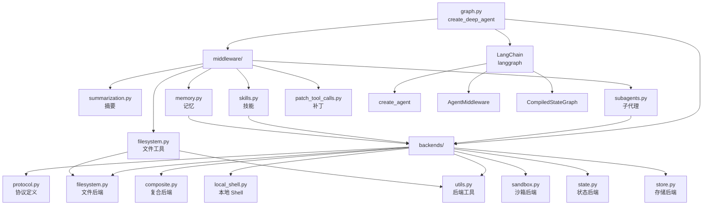

# deepagents 模块化分析报告

**分析日期**: 2026-03-04  
**分析深度**: Level 5  
**总代码行数**: 9,633 行（核心库，不含测试）

---

## 📊 模块概览

### 模块统计

| 模块类别 | 文件数 | 代码行数 | 占比 |
|---------|--------|---------|------|
| **核心图构建** | 1 | 316 | 3.3% |
| **后端实现** | 9 | 4,183 | 43.4% |
| **中间件系统** | 7 | 4,728 | 49.1% |
| **工具函数** | 3 | 406 | 4.2% |
| **总计** | 20 | 9,633 | 100% |

---

## 🏗️ 模块结构

### 一级模块（顶层目录）

```
deepagents/
├── graph.py              # 核心：create_deep_agent 函数
├── backends/             # 后端实现层（43.4% 代码）
├── middleware/           # 中间件系统层（49.1% 代码）
└── [utils]              # 工具函数（4.2% 代码）
```

### 二级模块（子目录）

```
deepagents/
├── graph.py (316 行) ─────────────┐ 核心入口
│                                  │
├── backends/ (4,183 行)           │ 后端层
│   ├── protocol.py (518 行)       │  ├─ 协议定义
│   ├── composite.py (705 行)      │  ├─ 复合后端
│   ├── filesystem.py (724 行)     │  ├─ 文件系统后端
│   ├── local_shell.py (359 行)    │  ├─ 本地 Shell
│   ├── sandbox.py (445 行)        │  ├─ 沙箱后端
│   ├── state.py (232 行)          │  ├─ 状态后端
│   ├── store.py (627 行)          │  ├─ 存储后端
│   ├── utils.py (559 行)          │  └─ 工具函数
│   └── __init__.py (24 行)        │
│                                  │
└── middleware/ (4,728 行)         │ 中间件层
    ├── filesystem.py (1,369 行)   │  ├─ 文件系统工具
    ├── summarization.py (1,434 行)│  ├─ 摘要中间件
    ├── subagents.py (692 行)      │  ├─ 子代理工具
    ├── skills.py (834 行)         │  ├─ 技能中间件
    ├── memory.py (354 行)         │  ├─ 记忆中间件
    ├── patch_tool_calls.py (44 行)│  ├─ 工具调用补丁
    ├── _utils.py (23 行)          │  └─ 工具函数
    └── __init__.py (18 行)
```

---

## 🔗 模块依赖关系

### 依赖图（Mermaid）



### 依赖分析

#### 核心依赖（graph.py）

| 依赖模块 | 用途 | 耦合度 |
|---------|------|--------|
| `langchain.agents.create_agent` | 创建 Agent | 🔴 高 |
| `langchain.agents.middleware.*` | 中间件类型 | 🔴 高 |
| `backends.*` | 后端实现 | 🟡 中 |
| `middleware.*` | 中间件实现 | 🟡 中 |

#### 后端层依赖（backends/）

| 模块 | 依赖 | 被依赖 | 耦合度 |
|------|------|--------|--------|
| `protocol.py` | - | 所有后端 | 🔴 高（核心协议） |
| `composite.py` | protocol | - | 🟢 低 |
| `filesystem.py` | protocol, utils | middleware/filesystem | 🟡 中 |
| `local_shell.py` | protocol | - | 🟢 低 |
| `sandbox.py` | protocol | - | 🟢 低 |
| `state.py` | protocol | - | 🟢 低 |
| `store.py` | protocol | - | 🟢 低 |
| `utils.py` | - | filesystem, middleware | 🟡 中 |

#### 中间件层依赖（middleware/）

| 模块 | 依赖 | 被依赖 | 耦合度 |
|------|------|--------|--------|
| `filesystem.py` | backends/* | graph.py | 🔴 高（核心工具） |
| `summarization.py` | backends/* | graph.py | 🔴 高（核心功能） |
| `subagents.py` | backends/* | graph.py | 🔴 高（核心功能） |
| `skills.py` | backends/* | graph.py | 🟡 中 |
| `memory.py` | backends/* | graph.py | 🟡 中 |
| `patch_tool_calls.py` | - | graph.py | 🟢 低 |

---

## 📦 模块职责分析

### 1. graph.py（核心编排层）

**职责**: Agent 图构建和中间件编排

**核心函数**:
- `create_deep_agent()` - 主入口函数（316 行）
- `get_default_model()` - 默认模型配置
- `resolve_model()` - 模型字符串解析

**关键特性**:
- ✅ 中间件栈自动组装
- ✅ 子代理默认配置
- ✅ 后端工厂模式支持
- ✅ LangGraph CompiledStateGraph 返回

**代码片段** (graph.py:100-150):
```python
def create_deep_agent(...) -> CompiledStateGraph:
    """Create a deep agent."""
    model = get_default_model() if model is None else resolve_model(model)
    backend = backend if backend is not None else (StateBackend)
    
    # 构建通用子代理中间件栈
    gp_middleware: list[AgentMiddleware] = [
        TodoListMiddleware(),
        FilesystemMiddleware(backend=backend),
        create_summarization_middleware(model, backend),
        AnthropicPromptCachingMiddleware(...),
        PatchToolCallsMiddleware(),
    ]
    
    # 构建主 Agent 中间件栈
    deepagent_middleware: list[AgentMiddleware] = [
        TodoListMiddleware(),
        FilesystemMiddleware(backend=backend),
        SubAgentMiddleware(backend=backend, subagents=all_subagents),
        create_summarization_middleware(model, backend),
        AnthropicPromptCachingMiddleware(...),
        PatchToolCallsMiddleware(),
    ]
    
    return create_agent(...).with_config({"recursion_limit": 1000})
```

---

### 2. backends/（后端抽象层）

**职责**: 提供文件和执行后端的抽象实现

#### 2.1 protocol.py（协议定义）

**代码行数**: 518 行  
**职责**: 定义后端协议接口

**核心协议**:
- `BackendProtocol` - 基础后端协议
- `SandboxBackendProtocol` - 沙箱后端协议
- `StoreBackend` - 存储后端协议

**关键类**:
```python
class BackendProtocol(Protocol):
    """基础后端协议"""
    async def read_file(self, path: str) -> str: ...
    async def write_file(self, path: str, content: str) -> WriteResult: ...
    async def edit_file(self, path: str, edits: list[Edit]) -> EditResult: ...
    async def ls(self, path: str) -> list[str]: ...
    async def glob(self, pattern: str) -> list[str]: ...
    async def grep(self, pattern: str, path: str) -> list[GrepMatch]: ...

class SandboxBackendProtocol(BackendProtocol, Protocol):
    """沙箱后端协议（支持命令执行）"""
    async def execute(self, command: str, timeout: float | None = None) -> str: ...
```

---

#### 2.2 filesystem.py（文件系统后端）

**代码行数**: 724 行  
**职责**: 本地文件系统实现

**核心功能**:
- ✅ 文件读写（支持并发）
- ✅ 目录列表
- ✅ 通配符匹配（glob）
- ✅ 内容搜索（grep）
- ✅ 图片文件特殊处理

**关键实现**:
```python
class FilesystemBackend(BackendProtocol):
    """本地文件系统后端"""
    
    def __init__(self, root_dir: str | Path):
        self.root_dir = Path(root_dir).expanduser().resolve()
    
    async def read_file(self, path: str) -> str:
        # 支持图片文件的 base64 编码
        # 支持行号格式化
        ...
    
    async def write_file(self, path: str, content: str) -> WriteResult:
        # 原子写入
        # 创建父目录
        ...
```

---

#### 2.3 state.py（状态后端）

**代码行数**: 232 行  
**职责**: 内存状态后端（默认后端）

**特性**:
- ✅ 轻量级内存存储
- ✅ 无需外部依赖
- ✅ 适合快速原型

---

#### 2.4 store.py（存储后端）

**代码行数**: 627 行  
**职责**: LangGraph Store 集成

**特性**:
- ✅ 持久化存储
- ✅ 支持 Checkpointer
- ✅ 适合生产环境

---

#### 2.5 sandbox.py（沙箱后端）

**代码行数**: 445 行  
**职责**: 沙箱环境执行

**特性**:
- ✅ 安全的命令执行
- ✅ 资源限制
- ✅ 隔离环境

---

#### 2.6 local_shell.py（本地 Shell 后端）

**代码行数**: 359 行  
**职责**: 本地 Shell 命令执行

**特性**:
- ✅ 直接执行系统命令
- ✅ 超时控制
- ✅ 输出捕获

---

#### 2.7 composite.py（复合后端）

**代码行数**: 705 行  
**职责**: 组合多个后端

**特性**:
- ✅ 后端链式组合
- ✅ 路由策略
- ✅ 灵活配置

---

#### 2.8 utils.py（后端工具）

**代码行数**: 559 行  
**职责**: 通用工具函数

**核心函数**:
- `validate_path()` - 路径验证
- `format_content_with_line_numbers()` - 行号格式化
- `format_grep_matches()` - grep 结果格式化
- `truncate_if_too_long()` - 内容截断

---

### 3. middleware/（中间件层）

**职责**: 提供 Agent 工具和能力扩展

#### 3.1 filesystem.py（文件系统中间件）

**代码行数**: 1,369 行  
**职责**: 提供文件系统工具

**工具列表**:
| 工具名 | 说明 | 代码行 |
|--------|------|--------|
| `read_file` | 读取文件内容 | ~200 |
| `write_file` | 写入文件 | ~150 |
| `edit_file` | 编辑文件（支持多编辑） | ~250 |
| `ls` | 列出目录 | ~100 |
| `glob` | 通配符匹配 | ~150 |
| `grep` | 内容搜索 | ~200 |

**关键特性**:
- ✅ 图片文件自动识别（PNG/JPG/GIF/WEBP）
- ✅ 大文件截断保护
- ✅ 行号格式化输出
- ✅ 并发文件操作
- ✅ 路径安全验证

**代码片段** (filesystem.py:200-250):
```python
async def read_file(
    path: str,
    offset: int = DEFAULT_READ_OFFSET,
    limit: int = DEFAULT_READ_LIMIT,
) -> str:
    """读取文件内容。
    
    支持：
    - 分页读取（offset/limit）
    - 图片文件 base64 编码
    - 行号格式化
    - 大文件截断警告
    """
    validated_path = validate_path(path, self.backend.root_dir)
    content = await self.backend.read_file(validated_path)
    
    # 图片文件处理
    if validated_path.suffix.lower() in IMAGE_EXTENSIONS:
        return create_image_block(...)
    
    # 文本文件处理
    lines = content.splitlines()
    truncated_lines = lines[offset:offset+limit]
    formatted = format_content_with_line_numbers(truncated_lines)
    
    return formatted
```

---

#### 3.2 summarization.py（摘要中间件）

**代码行数**: 1,434 行  
**职责**: 自动上下文摘要

**核心功能**:
- ✅ 对话历史自动摘要
- ✅ 上下文窗口管理
- ✅ 令牌数优化
- ✅ 重要信息保留

**触发条件**:
- 对话长度超过阈值
- 令牌数接近模型限制
- 用户显式请求

---

#### 3.3 subagents.py（子代理中间件）

**代码行数**: 692 行  
**职责**: 子代理调用和管理

**核心工具**:
- `task(name, description, inputs)` - 调用子代理

**子代理类型**:
1. **通用子代理** (GENERAL_PURPOSE_SUBAGENT)
   - 默认中间件栈
   - 继承主 Agent 工具
   - 可递归调用

2. **自定义子代理**
   - 用户定义
   - 可配置模型/工具/中间件
   - 专用任务处理

**代码片段** (subagents.py:17-24):
```python
GENERAL_PURPOSE_SUBAGENT = {
    "name": "task",
    "description": "Delegate a task to a specialized sub-agent with isolated context. "
                   "Use for complex subtasks that need focused attention.",
    "system_prompt": """You are a specialized sub-agent...""",
}
```

---

#### 3.4 skills.py（技能中间件）

**代码行数**: 834 行  
**职责**: 技能文件加载和管理

**核心功能**:
- ✅ 技能文件加载（AGENTS.md 格式）
- ✅ 多源技能合并
- ✅ 技能覆盖策略（later wins）
- ✅ 技能注入系统提示词

**技能格式**:
```markdown
# Skill: <技能名>

**Description**: <技能描述>

**Usage**:
<使用示例>
```

---

#### 3.5 memory.py（记忆中间件）

**代码行数**: 354 行  
**职责**: 长期记忆管理

**核心功能**:
- ✅ AGENTS.md 文件加载
- ✅ 记忆注入系统提示词
- ✅ 多记忆源支持
- ✅ 自动显示名派生

---

#### 3.6 patch_tool_calls.py（工具调用补丁）

**代码行数**: 44 行  
**职责**: 工具调用兼容性修复

**用途**: 修复特定模型的工具调用格式问题

---

## 🎯 模块耦合度分析

### 耦合矩阵

| 模块 | graph | backends | middleware | 外部依赖 |
|------|-------|----------|------------|---------|
| **graph.py** | - | 🔴 高 | 🔴 高 | 🔴 高 (LangChain) |
| **backends/** | 🟡 中 | 🟡 中 | 🟡 中 | 🟢 低 |
| **middleware/** | 🟡 中 | 🟡 中 | - | 🟡 中 (LangChain) |

### 耦合分析结论

1. **graph.py 是核心耦合点**
   - 直接依赖所有中间件
   - 直接依赖后端协议
   - 强依赖 LangChain

2. **backends/ 相对独立**
   - 内部通过 protocol 解耦
   - 各后端实现相互独立
   - 可替换性强

3. **middleware/ 中等耦合**
   - 依赖 backends 协议
   - 各中间件相互独立
   - 可插拔设计

---

## 📐 架构模式识别

### 1. Middleware 模式

**应用位置**: 整个 Agent 系统  
**优点**:
- ✅ 高度可扩展
- ✅ 关注点分离
- ✅ 易于测试

**实现**:
```python
# graph.py:120-135
deepagent_middleware: list[AgentMiddleware] = [
    TodoListMiddleware(),
    FilesystemMiddleware(backend=backend),
    SubAgentMiddleware(backend=backend, subagents=all_subagents),
    create_summarization_middleware(model, backend),
    AnthropicPromptCachingMiddleware(...),
    PatchToolCallsMiddleware(),
]
```

---

### 2. Strategy 模式

**应用位置**: 后端系统  
**优点**:
- ✅ 运行时切换后端
- ✅ 新增后端无需修改核心代码
- ✅ 支持复合后端

**实现**:
```python
# graph.py:73
backend = backend if backend is not None else (StateBackend)
```

---

### 3. Factory 模式

**应用位置**: 后端创建  
**优点**:
- ✅ 延迟初始化
- ✅ 依赖注入
- ✅ 配置灵活

**实现**:
```python
# graph.py 参数
backend: BackendProtocol | BackendFactory | None = None
# 支持传入后端实例或工厂函数
```

---

### 4. Protocol 模式（Python 结构化子类型）

**应用位置**: 后端接口定义  
**优点**:
- ✅ 静态类型检查
- ✅ 运行时灵活性
- ✅ 无需抽象基类

**实现**:
```python
# backends/protocol.py
class BackendProtocol(Protocol):
    async def read_file(self, path: str) -> str: ...
    async def write_file(self, path: str, content: str) -> WriteResult: ...
```

---

## 📊 模块复杂度评估

### 代码复杂度（按文件）

| 文件 | 行数 | 复杂度 | 评估 |
|------|------|--------|------|
| `middleware/filesystem.py` | 1,369 | 🔴 高 | 核心工具，合理 |
| `middleware/summarization.py` | 1,434 | 🔴 高 | 复杂逻辑，需重构 |
| `backends/composite.py` | 705 | 🟡 中 | 组合逻辑，合理 |
| `backends/filesystem.py` | 724 | 🟡 中 | IO 密集，合理 |
| `middleware/skills.py` | 834 | 🟡 中 | 文件加载，合理 |
| `middleware/subagents.py` | 692 | 🟡 中 | 代理管理，合理 |
| `backends/store.py` | 627 | 🟡 中 | 存储逻辑，合理 |
| `backends/utils.py` | 559 | 🟡 中 | 工具函数，可拆分 |
| `backends/protocol.py` | 518 | 🟢 低 | 协议定义，清晰 |
| `backends/sandbox.py` | 445 | 🟢 低 | 沙箱封装，清晰 |
| `backends/local_shell.py` | 359 | 🟢 低 | Shell 封装，清晰 |
| `middleware/memory.py` | 354 | 🟢 低 | 记忆加载，清晰 |
| `graph.py` | 316 | 🟢 低 | 编排逻辑，清晰 |
| `backends/state.py` | 232 | 🟢 低 | 状态管理，清晰 |
| 其他 | <100 | 🟢 低 | - |

### 复杂度分析结论

1. **高复杂度模块（>1000 行）**: 2 个
   - `middleware/filesystem.py`: 工具函数多，但职责单一
   - `middleware/summarization.py`: 摘要逻辑复杂，建议拆分

2. **中等复杂度模块（500-1000 行）**: 6 个
   - 主要是后端实现和中间件
   - 职责清晰，可接受

3. **低复杂度模块（<500 行）**: 12 个
   - 协议定义、工具函数、简单封装
   - 结构良好

---

## 🔍 模块质量评估

### 优点

1. ✅ **清晰的分层架构**
   - 核心层（graph.py）
   - 中间件层（middleware/）
   - 后端层（backends/）

2. ✅ **高度模块化**
   - 各模块职责单一
   - 依赖关系清晰
   - 可替换性强

3. ✅ **协议驱动设计**
   - Protocol 定义接口
   - 实现与接口分离
   - 类型安全

4. ✅ **可扩展性**
   - Middleware 模式
   - 后端可插拔
   - 技能系统

### 待改进

1. ⚠️ **部分模块过大**
   - `summarization.py` (1,434 行) 建议拆分
   - `filesystem.py` (1,369 行) 可考虑拆分工具函数

2. ⚠️ **测试覆盖待验证**
   - 需要检查测试文件覆盖率
   - 关键模块测试完整性

3. ⚠️ **文档完整性**
   - 部分函数缺少 docstring
   - 复杂逻辑缺少注释

---

## 📋 模块清单总结

### 核心模块（必读）

| 模块 | 行数 | 重要度 | 阅读优先级 |
|------|------|--------|-----------|
| `graph.py` | 316 | ⭐⭐⭐⭐⭐ | P0 |
| `backends/protocol.py` | 518 | ⭐⭐⭐⭐⭐ | P0 |
| `middleware/filesystem.py` | 1,369 | ⭐⭐⭐⭐⭐ | P0 |
| `middleware/subagents.py` | 692 | ⭐⭐⭐⭐⭐ | P0 |

### 重要模块（选读）

| 模块 | 行数 | 重要度 | 阅读优先级 |
|------|------|--------|-----------|
| `middleware/summarization.py` | 1,434 | ⭐⭐⭐⭐ | P1 |
| `backends/filesystem.py` | 724 | ⭐⭐⭐⭐ | P1 |
| `backends/store.py` | 627 | ⭐⭐⭐⭐ | P1 |
| `middleware/skills.py` | 834 | ⭐⭐⭐ | P1 |

### 辅助模块（参考）

| 模块 | 行数 | 重要度 | 阅读优先级 |
|------|------|--------|-----------|
| `backends/composite.py` | 705 | ⭐⭐⭐ | P2 |
| `backends/utils.py` | 559 | ⭐⭐⭐ | P2 |
| `backends/sandbox.py` | 445 | ⭐⭐ | P2 |
| `backends/local_shell.py` | 359 | ⭐⭐ | P2 |
| `middleware/memory.py` | 354 | ⭐⭐ | P2 |
| `backends/state.py` | 232 | ⭐⭐ | P2 |
| `middleware/patch_tool_calls.py` | 44 | ⭐ | P3 |

---

## 🎯 下一步

**阶段 5**: 调用链追踪  
- 从 `create_deep_agent()` 追踪到具体工具执行
- 分析子代理调用流程
- 绘制调用流程图

---

**分析完成时间**: 2026-03-04 12:30  
**分析师**: Jarvis
