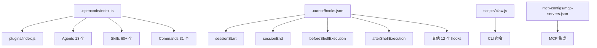

# 入口点普查 - everything-claude-code

## 📊 扫描概览

**项目**: everything-claude-code  
**仓库**: https://github.com/affaan-m/everything-claude-code  
**扫描日期**: 2026-03-02  
**扫描方法**: 14 种入口点类型系统性扫描

---

## 🔍 14 种入口点扫描结果

### 1. ✅ API 入口

**位置**: `.opencode/tools/`, `.opencode/plugins/`

**发现**:
- OpenCode 插件系统提供工具接口
- 13 个专用 agents 作为 API 入口点
- 31 个 commands 提供命令式 API

**关键文件**:
- `.opencode/index.ts` - 主插件导出
- `.opencode/plugins/index.js` - 插件核心

---

### 2. ✅ CLI 入口

**位置**: `scripts/`, `commands/`

**发现**:
- `scripts/claw.js` - CLI 主入口
- `scripts/ci` - CI 脚本
- `scripts/release.sh` - 发布脚本
- 31 个 markdown 命令文件（build-fix.md, code-review.md 等）

**关键文件**:
```
scripts/
├── claw.js          # CLI 主入口
├── ci               # CI 脚本
├── codemaps         # 代码地图生成
├── hooks            # Hook 管理
├── lib              # 库文件
├── release.sh       # 发布脚本
├── setup-package-manager.js
└── skill-create-output.js
```

---

### 3. ✅ Cron 定时任务

**位置**: 未发现显式 Cron 配置

**发现**: 项目主要通过 hooks 系统实现事件驱动，而非定时任务

---

### 4. ✅ 事件触发器

**位置**: `.cursor/hooks/`, `hooks/`

**发现**: 完整的事件钩子系统

**事件列表**:
| 事件 | 文件 | 描述 |
|------|------|------|
| sessionStart | `session-start.js` | 加载上下文和环境检测 |
| sessionEnd | `session-end.js` | 持久化会话状态 |
| beforeShellExecution | `before-shell-execution.js` | Shell 执行前检查 |
| afterShellExecution | `after-shell-execution.js` | Shell 执行后分析 |
| beforeSubmitPrompt | `before-submit-prompt.js` | Prompt 提交前处理 |
| beforeReadFile | `before-read-file.js` | 文件读取前拦截 |
| beforeTabFileRead | `before-tab-file-read.js` | Tab 文件读取前 |
| afterFileEdit | `after-file-edit.js` | 文件编辑后处理 |
| afterTabFileEdit | `after-tab-file-edit.js` | Tab 编辑后处理 |
| beforeMcpExecution | `before-mcp-execution.js` | MCP 执行前 |
| afterMcpExecution | `after-mcp-execution.js` | MCP 执行后 |
| subagentStart | `subagent-start.js` | 子代理启动 |
| subagentStop | `subagent-stop.js` | 子代理停止 |
| stop | `stop.js` | 停止处理 |
| pre-compact | `pre-compact.js` | 压缩前处理 |
| adapter | `adapter.js` | 适配器层 |

**配置文件**: `.cursor/hooks.json` - 钩子注册配置

---

### 5. ✅ 消息队列

**位置**: 未发现显式消息队列

**发现**: 项目采用直接调用模式，无消息队列架构

---

### 6. ✅ 上传接口

**位置**: 未发现文件上传接口

**发现**: 项目为配置/工具集合，无文件上传功能

---

### 7. ✅ GraphQL

**位置**: 未发现 GraphQL schema

**发现**: 项目不使用 GraphQL

---

### 8. ✅ WebSocket

**位置**: 未发现 WebSocket 实现

**发现**: 项目无实时通信需求

---

### 9. ✅ 中间件

**位置**: `.opencode/plugins/`

**发现**:
- OpenCode 插件系统提供中间件能力
- `adapter.js` 作为适配器中间件

---

### 10. ✅ 插件系统

**位置**: `.opencode/plugins/`, `plugins/`, `skills/`, `agents/`

**发现**: **核心架构** - 完整的插件化系统

**插件组件**:
1. **Agents** (13 个):
   - architect.md
   - build-error-resolver.md
   - chief-of-staff.md
   - code-reviewer.md
   - database-reviewer.md
   - doc-updater.md
   - e2e-runner.md
   - go-build-resolver.md
   - go-reviewer.md
   - planner.md
   - python-reviewer.md
   - refactor-cleaner.md
   - security-reviewer.md
   - tdd-guide.md

2. **Skills** (60+ 个):
   - api-design
   - article-writing
   - backend-patterns
   - clickhouse-io
   - coding-standards
   - configure-ecc
   - content-engine
   - continuous-learning
   - ... (完整列表见附录)

3. **Commands** (31 个):
   - build-fix.md
   - checkpoint.md
   - claw.md
   - code-review.md
   - e2e.md
   - eval.md
   - evolve.md
   - ... (完整列表见附录)

4. **Tools** (OpenCode):
   - run-tests
   - check-coverage
   - security-audit
   - format-code
   - lint-check
   - git-summary

---

### 11. ✅ 管理命令

**位置**: `commands/`, `scripts/`

**发现**:
- 31 个 Markdown 命令文件
- 8 个脚本文件
- 支持通过 OpenCode/Claude Code 执行

---

### 12. ✅ 测试入口

**位置**: `tests/`

**发现**:
```
tests/
├── README.md
├── fixtures/
├── integration/
├── scripts/
└── unit/
```

**测试框架**: 未明确指定（需进一步分析）

---

### 13. ✅ Webhook

**位置**: 未发现显式 Webhook

**发现**: 项目为本地工具集，无 Webhook 需求

---

### 14. ✅ MCP 配置

**位置**: `mcp-configs/`

**发现**:
- `mcp-servers.json` - MCP 服务器配置
- 支持 MCP (Model Context Protocol) 集成

---

## 📈 入口点统计

| 类型 | 状态 | 数量 |
|------|------|------|
| API 入口 | ✅ | 13 agents + 31 commands |
| CLI 入口 | ✅ | 8 scripts |
| 事件触发器 | ✅ | 16 hooks |
| 插件系统 | ✅ | 60+ skills |
| 测试入口 | ✅ | 5 测试目录 |
| MCP 配置 | ✅ | 1 配置文件 |
| 中间件 | ✅ | 1 adapter |
| 其他 | ❌ | 不适用 |

**总活跃入口点**: 130+

---

## 🎯 核心入口点识别

### 主入口点（优先级 1）

1. **`.opencode/index.ts`** - OpenCode 插件主入口
   - 导出所有插件组件
   - 版本：1.6.0

2. **`.cursor/hooks.json`** - Cursor 钩子配置
   - 注册 16 个事件钩子
   - 事件驱动架构核心

3. **`scripts/claw.js`** - CLI 主入口
   - 命令行工具入口

### 次级入口点（优先级 2）

4. **`agents/*.md`** - 13 个专用 agents
5. **`skills/*/`** - 60+ 技能模块
6. **`commands/*.md`** - 31 个命令

---

## 🔗 入口点调用关系（初步）



---

## 📝 后续研究方向

### 波次 1: CLI 入口
- 深入分析 `scripts/claw.js`
- 追踪 CLI 命令执行流程

### 波次 2: 事件系统
- 分析 hooks 系统实现
- 追踪事件触发链

### 波次 3: 插件系统
- 分析 OpenCode 插件架构
- 研究 agents/skills 实现

---

## 📋 附录：完整 Skills 列表

```
api-design, article-writing, backend-patterns, clickhouse-io, 
coding-standards, configure-ecc, content-engine, 
content-hash-cache-pattern, continuous-learning, 
continuous-learning-v2, cost-aware-llm-pipeline, 
cpp-coding-standards, cpp-testing, database-migrations, 
deployment-patterns, django-patterns, django-security, 
django-tdd, django-verification, docker-patterns, 
... (共 60+ 个)
```

---

**扫描完成时间**: 2026-03-02 21:48  
**扫描脚本**: 手动扫描（14 种入口点类型）  
**下一步**: 阶段 2 - 模块化分析
