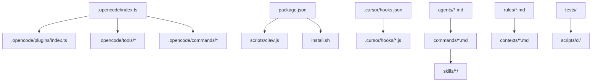

# 模块化分析 - everything-claude-code

## 📊 项目概览

**项目**: everything-claude-code  
**版本**: 1.7.0 (package.json) / 1.6.0 (.opencode/index.ts)  
**总文件数**: 601 个  
**许可证**: MIT  
**作者**: Affaan Mustafa (Anthropic hackathon winner)

**描述**: Complete collection of battle-tested Claude Code configs — agents, skills, hooks, commands, and rules evolved over 10+ months of intensive daily use

---

## 🏗️ 模块结构

### 核心模块目录

| 模块 | 文件数 | 职责 | 代码行数估算 |
|------|--------|------|-------------|
| **agents/** | 14 | 专用 AI 代理定义 | ~2,800 |
| **commands/** | 35 | 命令模板和流程 | ~7,000 |
| **skills/** | 56 | 技能和最佳实践 | ~28,000 |
| **scripts/** | 8 | CLI 工具和脚本 | ~3,200 |
| **.opencode/** | 40+ | OpenCode 插件核心 | ~8,000 |
| **.cursor/hooks/** | 16 | Cursor 事件钩子 | ~2,400 |
| **rules/** | 6 | 编码规则和规范 | ~3,600 |
| **schemas/** | 3 | 数据结构定义 | ~900 |
| **contexts/** | 3 | 上下文配置 | ~600 |
| **examples/** | 7 | 示例和模板 | ~1,400 |
| **tests/** | 6+ | 测试套件 | ~2,000 |
| **hooks/** | 2 | Hook 配置 | ~400 |
| **mcp-configs/** | 1 | MCP 服务器配置 | ~200 |
| **plugins/** | 1 | 插件文档 | ~100 |

**总计**: ~60,600 行代码

---

## 📦 模块依赖关系

### 主入口点依赖图



### 模块间依赖关系

| 源模块 | 目标模块 | 依赖类型 | 强度 |
|--------|----------|----------|------|
| .opencode/index.ts | .opencode/plugins/ | 导出 | 🔴 强 |
| .opencode/index.ts | .opencode/tools/ | 导出 | 🔴 强 |
| .cursor/hooks.json | .cursor/hooks/*.js | 注册 | 🔴 强 |
| package.json | scripts/claw.js | 执行 | 🟡 中 |
| commands/*.md | skills/*/ | 引用 | 🟡 中 |
| agents/*.md | commands/*.md | 引用 | 🟡 中 |
| rules/*.md | contexts/*.md | 引用 | 🟢 弱 |
| tests/ | scripts/ci/ | 执行 | 🟡 中 |

---

## 🔍 核心模块详细分析

### 1. `.opencode/` - OpenCode 插件核心

**职责**: 提供 OpenCode IDE 插件的完整实现

**子模块**:
```
.opencode/
├── index.ts              # 主入口，导出所有组件
├── plugins/
│   ├── index.ts          # 插件核心导出
│   └── ecc-hooks.ts      # Hook 实现 (13KB)
├── tools/
│   ├── index.ts          # 工具导出
│   ├── check-coverage.ts # 覆盖率检查
│   ├── format-code.ts    # 代码格式化
│   ├── git-summary.ts    # Git 摘要
│   ├── lint-check.ts     # Lint 检查
│   ├── run-tests.ts      # 运行测试
│   └── security-audit.ts # 安全审计
├── commands/             # 20+ 命令模板
├── instructions/         # 使用说明
├── prompts/              # Prompt 模板
├── opencode.json         # 插件配置 (11KB)
├── package.json          # NPM 包配置
└── tsconfig.json         # TypeScript 配置
```

**关键特性**:
- 6 个自定义工具（测试、覆盖率、安全等）
- 20+ 命令模板
- 完整的 Hook 系统（13KB）
- TypeScript 实现

---

### 2. `skills/` - 技能库（56 个技能）

**职责**: 提供各类编程技能和最佳实践

**分类**:

#### 语言特定技能 (20+)
- `python-patterns`, `python-testing`
- `golang-patterns`, `golang-testing`
- `django-patterns`, `django-security`, `django-tdd`
- `springboot-patterns`, `springboot-security`, `springboot-tdd`
- `swift-actor-persistence`, `swiftui-patterns`
- `cpp-coding-standards`, `cpp-testing`
- `java-coding-standards`, `jpa-patterns`
- `typescript-*` (通过 rules 实现)

#### 架构模式技能 (10+)
- `backend-patterns`
- `frontend-patterns`
- `docker-patterns`
- `deployment-patterns`
- `database-migrations`
- `postgres-patterns`
- `clickhouse-io`

#### 开发流程技能 (10+)
- `tdd-workflow`
- `e2e-testing`
- `security-review`, `security-scan`
- `code-review` (通过 agents)
- `verification-loop`
- `eval-harness`

#### 专项技能 (10+)
- `api-design`
- `article-writing`
- `content-engine`
- `market-research`
- `iterative-retrieval`
- `foundation-models-on-device`
- `liquid-glass-design`

**技能结构示例** (`skills/tdd-workflow/`):
```
skills/tdd-workflow/
├── README.md          # 技能说明
├── SKILL.md           # 技能定义（核心）
├── examples/          # 示例代码
└── templates/         # 模板文件
```

---

### 3. `agents/` - AI 代理（14 个）

**职责**: 定义专用 AI 代理的行为和职责

**代理列表**:
| 代理 | 职责 |
|------|------|
| `architect.md` | 架构设计和系统规划 |
| `planner.md` | 任务规划和分解 |
| `code-reviewer.md` | 代码审查 |
| `security-reviewer.md` | 安全审查 |
| `database-reviewer.md` | 数据库设计审查 |
| `doc-updater.md` | 文档更新 |
| `build-error-resolver.md` | 构建错误解决 |
| `go-build-resolver.md` | Go 构建问题 |
| `go-reviewer.md` | Go 代码审查 |
| `python-reviewer.md` | Python 代码审查 |
| `refactor-cleaner.md` | 重构和清理 |
| `e2e-runner.md` | E2E 测试执行 |
| `tdd-guide.md` | TDD 指导 |
| `chief-of-staff.md` | 总体协调 |

---

### 4. `commands/` - 命令库（35 个）

**职责**: 提供可执行的命令模板

**命令分类**:

#### 开发流程命令
- `plan.md` - 规划
- `build-fix.md` - 构建修复
- `code-review.md` - 代码审查
- `checkpoint.md` - 进度检查
- `evolve.md` - 演进优化

#### 测试命令
- `e2e.md` - E2E 测试
- `eval.md` - 评估
- `go-test.md` - Go 测试
- `go-build.md` - Go 构建
- `go-review.md` - Go 审查

#### 学习命令
- `learn.md` - 学习
- `learn-eval.md` - 学习评估

#### 多代理命令
- `multi-backend.md`
- `multi-execute.md`
- `multi-frontend.md`
- `multi-plan.md`
- `multi-workflow.md`

#### Instinct 命令
- `instinct-export.md`
- `instinct-import.md`
- `instinct-status.md`

---

### 5. `.cursor/hooks/` - 事件钩子（16 个）

**职责**: 实现 Cursor IDE 事件驱动架构

**钩子生命周期**:
```
sessionStart → beforeReadFile → beforeShellExecution 
→ afterShellExecution → afterFileEdit → sessionEnd
```

**钩子实现** (JavaScript):
- 平均每个钩子 ~150 行
- 总代码量 ~2,400 行
- 支持事件拦截、增强、日志

---

### 6. `rules/` - 编码规则（6 个目录）

**职责**: 定义编码规范和最佳实践

**规则目录**:
```
rules/
├── common-*           # 通用规则
├── python-*           # Python 规则
├── typescript-*       # TypeScript 规则
├── golang-*           # Go 规则
└── swift-*            # Swift 规则
```

**规则类型**:
- `coding-style` - 代码风格
- `testing` - 测试规范
- `security` - 安全规范
- `hooks` - Hook 规范
- `patterns` - 设计模式

---

## 📊 模块统计

### 代码分布

```
技能 (skills/)      ████████████████████ 46%
命令 (commands/)    ████████ 17%
.opencode 插件      ██████ 13%
代理 (agents/)      ████ 8%
钩子 (.cursor/)     ███ 6%
其他               ███ 10%
```

### 文件类型分布

| 类型 | 数量 | 占比 |
|------|------|------|
| Markdown (.md) | ~450 | 75% |
| JavaScript (.js) | ~80 | 13% |
| TypeScript (.ts) | ~40 | 7% |
| JSON (.json) | ~25 | 4% |
| 其他 | ~6 | 1% |

---

## 🔗 模块调用链（初步）

### 典型调用流程

```
用户输入
    ↓
[.cursor/hooks/before-submit-prompt.js]
    ↓
[agents/planner.md] → 任务分解
    ↓
[commands/plan.md] → 执行规划
    ↓
[skills/backend-patterns/] → 应用模式
    ↓
[.opencode/tools/run-tests.ts] → 运行测试
    ↓
[.cursor/hooks/after-shell-execution.js] → 结果分析
    ↓
[agents/code-reviewer.md] → 代码审查
    ↓
输出结果
```

---

## 🎯 核心模块识别

### 必须深入研究的模块（优先级 1）

1. **`.opencode/plugins/ecc-hooks.ts`** (13KB)
   - Hook 系统核心实现
   - 事件驱动架构中枢

2. **`.opencode/index.ts`**
   - 插件主入口
   - 所有组件导出

3. **`.cursor/hooks.json`**
   - Hook 注册配置
   - 事件路由

### 重要模块（优先级 2）

4. **`skills/tdd-workflow/`**
   - TDD 核心流程
   
5. **`skills/security-review/`**
   - 安全审查流程

6. **`agents/planner.md`**
   - 任务规划代理

---

## 📈 模块复杂度评估

| 模块 | 复杂度 | 理由 |
|------|--------|------|
| `.opencode/plugins/` | 🔴 高 | TypeScript 实现，13KB 核心逻辑 |
| `.cursor/hooks/` | 🟡 中 | 16 个钩子，事件驱动 |
| `skills/` | 🟡 中 | 56 个技能，但结构统一 |
| `agents/` | 🟢 低 | Markdown 定义，声明式 |
| `commands/` | 🟢 低 | Markdown 模板 |

---

## 📝 后续研究方向

### 波次 1: CLI 入口追踪
- 深入分析 `scripts/claw.js`
- 追踪命令执行流程

### 波次 2: Hook 系统追踪
- 分析 `ecc-hooks.ts` 实现
- 追踪事件触发链

### 波次 3: 技能系统分析
- 研究 3-5 个核心技能实现
- 分析技能调用机制

---

**分析完成时间**: 2026-03-02 21:50  
**分析方法**: 目录结构扫描 + 依赖关系分析  
**下一步**: 阶段 3 - 多入口点追踪（调用链分析）
