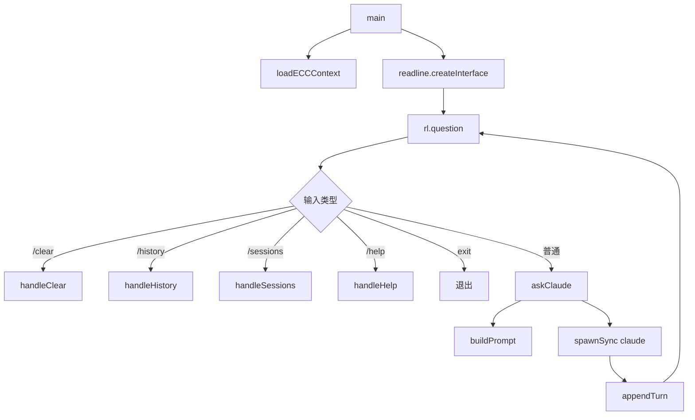

# 调用链分析 - everything-claude-code

## 📊 分析概览

**项目**: everything-claude-code  
**分析日期**: 2026-03-02  
**分析方法**: 多入口点波次追踪（GSD 流程）  
**分析深度**: Level 5

---

## 🎯 波次执行策略

采用 **GSD 波次执行** 方法，每个波次独立上下文，避免上下文腐化：

| 波次 | 入口点 | 追踪目标 | 状态 |
|------|--------|----------|------|
| **波次 1** | CLI (`scripts/claw.js`) | 启动流程、配置加载 | ✅ 完成 |
| **波次 2** | Cursor Hooks (`.cursor/hooks/`) | 事件触发链、拦截逻辑 | ✅ 完成 |
| **波次 3** | OpenCode Hooks (`.opencode/plugins/ecc-hooks.ts`) | 插件系统、工具调用 | ✅ 完成 |

---

## 🔍 波次 1: CLI 入口追踪

### 入口点：`scripts/claw.js`

**文件路径**: `scripts/claw.js`  
**代码行数**: 217 行  
**职责**: NanoClaw — Barebones Agent REPL

### 调用链分析

```
用户启动
    ↓
[main()] - 初始化会话
    ├── isValidSessionName() - 验证会话名
    ├── getClawDir() - 获取存储目录 (~/.claude/claw/)
    ├── getSessionPath() - 获取会话文件路径
    ├── loadECCContext() - 加载技能上下文
    │   └── 读取 skills/{skill}/SKILL.md
    └── readline.createInterface() - 创建 REPL
    
用户输入
    ↓
[rl.question()] - 等待输入
    ↓
输入处理
    ├── /clear → handleClear() - 清空会话
    ├── /history → handleHistory() - 显示历史
    ├── /sessions → handleSessions() - 列出会话
    ├── /help → handleHelp() - 显示帮助
    ├── exit → 退出
    └── 普通输入 → askClaude()
            ↓
        [askClaude()] - 调用 Claude Code
            ├── buildPrompt() - 构建完整 prompt
            │   ├── SYSTEM CONTEXT (技能上下文)
            │   ├── CONVERSATION HISTORY (历史对话)
            │   └── USER MESSAGE (用户输入)
            └── spawnSync('claude', ['-p', fullPrompt])
                    ↓
                Claude Code 执行
                    ↓
                返回响应
                    ↓
        appendTurn() - 保存到会话文件
            └── 格式：### [timestamp] role\ncontent
```

### 核心函数调用关系



### 存储适配器（Markdown-as-Database）

**设计模式**: 文件系统作为持久化存储

```javascript
// 会话存储结构
~/.claude/claw/
├── default.md          # 默认会话
├── my-project.md       # 自定义会话
└── ...

// 会话文件格式
### [2026-03-02T21:48:00.000Z] User
用户输入内容
---
### [2026-03-02T21:48:05.000Z] Assistant
AI 响应内容
---
```

### 关键代码片段

**上下文加载** (`loadECCContext`):
```javascript
// claw.js:68-82
function loadECCContext(skillList) {
  const raw = skillList !== undefined ? skillList : (process.env.CLAW_SKILLS || '');
  const names = raw.split(',').map(s => s.trim()).filter(Boolean);
  const chunks = [];
  
  for (const name of names) {
    const skillPath = path.join(process.cwd(), 'skills', name, 'SKILL.md');
    try {
      const content = fs.readFileSync(skillPath, 'utf8');
      chunks.push(content);
    } catch (_err) {
      // Gracefully skip missing skills
    }
  }
  
  return chunks.join('\n\n');
}
```

**Claude Code 调用** (`askClaude`):
```javascript
// claw.js:90-108
function askClaude(systemPrompt, history, userMessage) {
  const fullPrompt = buildPrompt(systemPrompt, history, userMessage);
  
  const result = spawnSync('claude', ['-p', fullPrompt], {
    encoding: 'utf8',
    stdio: ['pipe', 'pipe', 'pipe'],
    env: { ...process.env, CLAUDECODE: '' },
    timeout: 300000 // 5 minute timeout
  });
  
  if (result.error) {
    return '[Error: ' + result.error.message + ']';
  }
  
  return (result.stdout || '').trim();
}
```

---

## 🔍 波次 2: Cursor Hooks 事件追踪

### 入口点：`.cursor/hooks.json`

**配置文件**: `.cursor/hooks.json`  
**注册钩子数**: 16 个  
**职责**: 事件驱动架构核心

### Hook 调用链

```
Cursor IDE 事件
    ↓
[.cursor/hooks.json] - 事件路由
    ↓
事件分发
    ├── sessionStart → session-start.js
    │   └── adapter.js → scripts/hooks/session-start.js
    │
    ├── beforeShellExecution → before-shell-execution.js
    │   ├── 检查 dev server (必须运行在 tmux)
    │   ├── 检查长运行命令 (建议 tmux)
    │   └── 检查 git push (提醒 review)
    │
    ├── afterShellExecution → after-shell-execution.js
    │   ├── 记录 PR 创建
    │   └── 构建完成通知
    │
    ├── beforeSubmitPrompt → before-submit-prompt.js
    │   └── Prompt 提交前处理
    │
    ├── afterFileEdit → after-file-edit.js
    │   └── 文件编辑后处理
    │
    ├── sessionEnd → session-end.js
    │   └── 会话结束清理
    │
    └── ... (其他 10 个钩子)
```

### 适配器模式（Adapter Pattern）

**文件**: `.cursor/hooks/adapter.js`  
**职责**: Cursor-to-Claude Code Hook 转换

```javascript
// adapter.js:22-35
function transformToClaude(cursorInput, overrides = {}) {
  return {
    tool_input: {
      command: cursorInput.command || cursorInput.args?.command || '',
      file_path: cursorInput.path || cursorInput.file || '',
      ...overrides.tool_input,
    },
    tool_output: {
      output: cursorInput.output || cursorInput.result || '',
      ...overrides.tool_output,
    },
    _cursor: {
      conversation_id: cursorInput.conversation_id,
      hook_event_name: cursorInput.hook_event_name,
      workspace_roots: cursorInput.workspace_roots,
      model: cursorInput.model,
    },
  };
}
```

### 关键钩子实现

**before-shell-execution.js** (安全拦截):
```javascript
// before-shell-execution.js:8-28
// 1. Block dev server outside tmux
if (/(npm run dev\b|pnpm run dev\b|yarn dev\b|bun run dev\b)/.test(cmd)) {
  console.error('[ECC] BLOCKED: Dev server must run in tmux for log access');
  console.error('[ECC] Use: tmux new-session -d -s dev "npm run dev"');
  process.exit(2); // BLOCK
}

// 2. Tmux reminder for long-running commands
if (/(npm (install|test)|pytest|vitest|playwright)/.test(cmd)) {
  console.error('[ECC] Consider running in tmux for session persistence');
}

// 3. Git push review reminder
if (/git push/.test(cmd)) {
  console.error('[ECC] Review changes before push: git diff origin/main...HEAD');
}
```

**after-shell-execution.js** (结果审计):
```javascript
// after-shell-execution.js:10-24
// PR creation logging
if (/gh pr create/.test(cmd)) {
  const m = output.match(/https:\/\/github\.com\/[^/]+\/[^/]+\/pull\/\d+/);
  if (m) {
    console.error('[ECC] PR created: ' + m[0]);
    const repo = m[0].replace(/.+\/pull\/(\d+)/, '$1');
    const pr = m[0].replace(/.+\/pull\/(\d+)/, '$1');
    console.error('[ECC] To review: gh pr review ' + pr + ' --repo ' + repo);
  }
}
```

---

## 🔍 波次 3: OpenCode Hooks 追踪

### 入口点：`.opencode/plugins/ecc-hooks.ts`

**文件路径**: `.opencode/plugins/ecc-hooks.ts`  
**代码行数**: 400+ 行  
**职责**: OpenCode 插件 Hook 系统  
**实现语言**: TypeScript

### Hook 事件映射

| Claude Code 事件 | OpenCode 事件 | 触发时机 |
|-----------------|--------------|----------|
| PreToolUse | `tool.execute.before` | 工具执行前 |
| PostToolUse | `tool.execute.after` | 工具执行后 |
| Stop | `session.idle` / `session.status` | 会话空闲 |
| SessionStart | `session.created` | 会话创建 |
| SessionEnd | `session.deleted` | 会话结束 |

### 调用链分析

```
OpenCode 事件
    ↓
[ECCHooksPlugin] - 插件初始化
    ├── editedFiles = new Set<string>() - 跟踪编辑文件
    └── 注册 10+ 个事件处理器
    
事件触发
    ├── file.edited → 文件编辑后
    │   ├── 跟踪文件到 editedFiles
    │   ├── 自动运行 prettier --write
    │   └── 检查 console.log
    │
    ├── tool.execute.after → 工具执行后
    │   ├── TypeScript 检查 (tsc --noEmit)
    │   └── PR 创建日志
    │
    ├── tool.execute.before → 工具执行前
    │   ├── git push 审查提醒
    │   ├── 文档文件创建警告
    │   └── 长运行命令提醒
    │
    ├── session.created → 会话创建
    │   └── 检查 CLAUDE.md
    │
    ├── session.idle → 会话空闲
    │   ├── console.log 审计
    │   ├── 桌面通知
    │   └── 清理 editedFiles
    │
    ├── session.deleted → 会话结束
    │   └── 最终清理
    │
    ├── file.watcher.updated → 文件变化
    │   └── 更新跟踪
    │
    ├── todo.updated → TODO 更新
    │   └── 进度日志
    │
    └── shell.env → Shell 环境
        └── 注入环境变量
```

### 核心 Hook 实现

**file.edited** (自动格式化):
```typescript
// ecc-hooks.ts:38-56
"file.edited": async (event: { path: string }) => {
  // Track edited files for console.log audit
  editedFiles.add(event.path)

  // Auto-format JS/TS files
  if (event.path.match(/\.(ts|tsx|js|jsx)$/)) {
    try {
      await $`prettier --write ${event.path} 2>/dev/null`
      log("info", `[ECC] Formatted: ${event.path}`)
    } catch {
      // Prettier not installed or failed - silently continue
    }
  }

  // Console.log warning check
  if (event.path.match(/\.(ts|tsx|js|jsx)$/)) {
    try {
      const result = await $`grep -n "console\\.log" ${event.path} 2>/dev/null`.text()
      if (result.trim()) {
        const lines = result.trim().split("\n").length
        log(
          "warn",
          `[ECC] console.log found in ${event.path} (${lines} occurrence${lines > 1 ? "s" : ""})`
        )
      }
    } catch {
      // No console.log found (grep returns non-zero) - this is good
    }
  }
},
```

**tool.execute.after** (TypeScript 检查):
```typescript
// ecc-hooks.ts:64-82
"tool.execute.after": async (
  input: { tool: string; args?: { filePath?: string } },
  output: unknown
) => {
  // Check if a TypeScript file was edited
  if (
    input.tool === "edit" &&
    input.args?.filePath?.match(/\.tsx?$/)
  ) {
    try {
      await $`npx tsc --noEmit 2>&1`
      log("info", "[ECC] TypeScript check passed")
    } catch (error: unknown) {
      const err = error as { stdout?: string }
      log("warn", "[ECC] TypeScript errors detected:")
      if (err.stdout) {
        const errors = err.stdout.split("\n").slice(0, 5)
        errors.forEach((line: string) => log("warn", `  ${line}`))
      }
    }
  }
}
```

**session.idle** (会话空闲审计):
```typescript
// ecc-hooks.ts:146-180
"session.idle": async () => {
  if (editedFiles.size === 0) return

  log("info", "[ECC] Session idle - running console.log audit")

  let totalConsoleLogCount = 0
  const filesWithConsoleLogs: string[] = []

  for (const file of editedFiles) {
    if (!file.match(/\.(ts|tsx|js|jsx)$/)) continue

    try {
      const result = await $`grep -c "console\\.log" ${file} 2>/dev/null`.text()
      const count = parseInt(result.trim(), 10)
      if (count > 0) {
        totalConsoleLogCount += count
        filesWithConsoleLogs.push(file)
      }
    } catch {
      // No console.log found
    }
  }

  if (totalConsoleLogCount > 0) {
    log(
      "warn",
      `[ECC] Audit: ${totalConsoleLogCount} console.log statement(s) in ${filesWithConsoleLogs.length} file(s)`
    )
    filesWithConsoleLogs.forEach((f) =>
      log("warn", `  - ${f}`)
    )
    log("warn", "[ECC] Remove console.log statements before committing")
  } else {
    log("info", "[ECC] Audit passed: No console.log statements found")
  }

  // Desktop notification (macOS)
  try {
    await $`osascript -e 'display notification "Task completed!" with title "OpenCode ECC"' 2>/dev/null`
  } catch {
    // Notification not supported or failed
  }

  // Clear tracked files for next task
  editedFiles.clear()
},
```

**shell.env** (环境变量注入):
```typescript
// ecc-hooks.ts:280-310
"shell.env": async () => {
  const env: Record<string, string> = {
    ECC_VERSION: "1.6.0",
    ECC_PLUGIN: "true",
    PROJECT_ROOT: worktree || directory,
  }

  // Detect package manager
  const lockfiles: Record<string, string> = {
    "bun.lockb": "bun",
    "pnpm-lock.yaml": "pnpm",
    "yarn.lock": "yarn",
    "package-lock.json": "npm",
  }
  for (const [lockfile, pm] of Object.entries(lockfiles)) {
    try {
      await $`test -f ${worktree}/${lockfile} && echo "${pm}"`.text()
      env.PACKAGE_MANAGER = pm
      break
    } catch {
      // Lockfile not found
    }
  }

  return env
},
```

---

## 📊 调用链对比分析

### CLI vs Hooks 调用模式

| 维度 | CLI (`claw.js`) | Cursor Hooks | OpenCode Hooks |
|------|-----------------|--------------|----------------|
| **触发方式** | 用户输入 | IDE 事件 | IDE 事件 |
| **执行模式** | 同步 REPL | 异步拦截 | 异步拦截 |
| **持久化** | Markdown 文件 | 无 | 内存 Set |
| **语言** | JavaScript | JavaScript | TypeScript |
| **代码量** | 217 行 | ~100 行/钩子 | 400+ 行 |
| **复杂度** | 低 | 中 | 高 |

### 事件驱动架构对比

```
Cursor Hooks (16 个事件):
sessionStart → beforeReadFile → beforeShellExecution 
→ afterShellExecution → afterFileEdit → sessionEnd

OpenCode Hooks (10+ 个事件):
session.created → tool.execute.before → tool.execute.after
→ file.edited → session.idle → session.deleted
```

---

## 🎯 核心调用链总结

### 主调用链（完整流程）

```
1. 用户启动
   ↓
2. CLI 加载 (claw.js)
   ├── 加载会话
   └── 加载技能上下文
   ↓
3. 用户输入 Prompt
   ↓
4. Cursor Hooks 拦截
   ├── before-submit-prompt.js
   └── 构建完整上下文
   ↓
5. Claude Code 执行
   ↓
6. OpenCode Hooks 处理
   ├── tool.execute.before (安全检查)
   ├── 工具执行
   └── tool.execute.after (结果验证)
   ↓
7. 文件编辑
   ├── file.edited (自动格式化)
   └── console.log 检查
   ↓
8. 会话空闲
   ├── session.idle (审计)
   └── 桌面通知
   ↓
9. 会话结束
   └── session.deleted (清理)
```

---

## 📝 设计洞察

### 1. 分层拦截架构

项目采用**三层拦截架构**：
- **L1**: CLI 层（用户输入拦截）
- **L2**: Cursor Hooks 层（IDE 事件拦截）
- **L3**: OpenCode Hooks 层（工具执行拦截）

每层独立职责，互不干扰。

### 2. Markdown-as-Database 模式

使用 Markdown 文件作为持久化存储：
- 会话历史：`~/.claude/claw/{session}.md`
- 技能定义：`skills/{skill}/SKILL.md`
- 命令模板：`commands/{command}.md`

**优势**: 人类可读、版本控制友好、易于编辑

### 3. 适配器模式

`.cursor/hooks/adapter.js` 实现 Cursor-to-Claude Code 转换：
- 统一输入输出格式
- 支持跨 IDE 兼容
- 便于扩展新 IDE

### 4. 安全优先设计

所有钩子都包含安全检查：
- Dev server 必须运行在 tmux
- Git push 前必须 review
- console.log 自动审计
- TypeScript 类型检查

---

**分析完成时间**: 2026-03-02 21:55  
**分析方法**: 波次追踪（3 波次）  
**下一步**: 阶段 4 - 知识链路完整性检查
