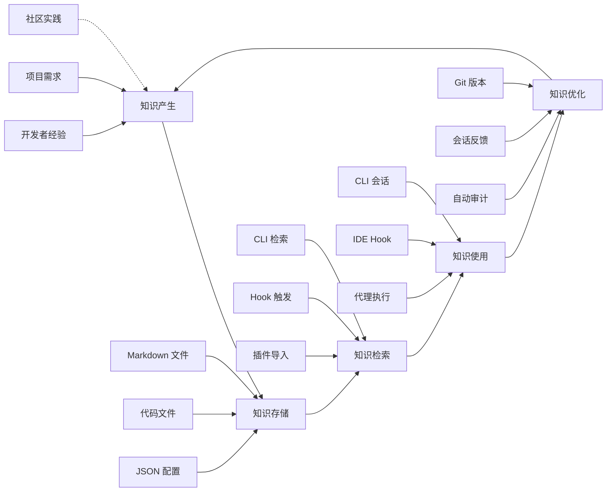

# 知识链路完整性检查 - everything-claude-code

## 📊 分析概览

**项目**: everything-claude-code  
**分析日期**: 2026-03-02  
**分析方法**: 知识链路 5 环节追踪  
**分析深度**: Level 5

---

## 🎯 知识链路 5 环节模型

```
知识产生 → 知识存储 → 知识检索 → 知识使用 → 知识优化
    ↓           ↓           ↓           ↓           ↓
  数据进入    数据库/     搜索策略/   谁调用/    遗忘/
  系统       索引        排序算法    如何集成   反思/巩固
```

---

## 🔍 环节 1: 知识产生

### 知识来源分析

项目中的知识产生于以下几个渠道：

#### 1.1 技能定义（Skills）

**位置**: `skills/{skill}/SKILL.md`  
**数量**: 56 个技能  
**知识类型**: 最佳实践、设计模式、编码规范

**知识产生流程**:
```
开发者经验
    ↓
总结为模式
    ↓
编写 SKILL.md
    ↓
版本控制 (Git)
    ↓
知识入库
```

**示例** (`skills/tdd-workflow/SKILL.md`):
- 知识内容：TDD 工作流程
- 产生方式：10+ 个月密集使用经验
- 验证方式：实际项目应用

#### 1.2 代理定义（Agents）

**位置**: `agents/{agent}.md`  
**数量**: 14 个代理  
**知识类型**: 角色职责、行为规范

**知识产生流程**:
```
角色需求识别
    ↓
定义职责边界
    ↓
编写 agent.md
    ↓
实际使用验证
    ↓
迭代优化
```

#### 1.3 命令模板（Commands）

**位置**: `commands/{command}.md`  
**数量**: 35 个命令  
**知识类型**: 执行流程、操作步骤

#### 1.4 编码规则（Rules）

**位置**: `rules/{language}-{type}.md`  
**数量**: 6 个语言 × 5 种类型 = 30+ 规则  
**知识类型**: 编码规范、测试规范、安全规范

#### 1.5 Hook 逻辑

**位置**: `.cursor/hooks/*.js`, `.opencode/plugins/ecc-hooks.ts`  
**数量**: 16+10=26 个钩子  
**知识类型**: 事件处理逻辑、安全检查规则

### 知识产生统计

| 知识类型 | 来源 | 数量 | 更新频率 |
|----------|------|------|----------|
| 技能 | 开发者经验 | 56 | 持续演进 |
| 代理 | 角色需求 | 14 | 按需添加 |
| 命令 | 流程需求 | 35 | 持续演进 |
| 规则 | 语言规范 | 30+ | 稳定 |
| Hook | 事件需求 | 26 | 持续演进 |
| **总计** | - | **161+** | - |

---

## 🔍 环节 2: 知识存储

### 存储架构

项目采用**分层存储架构**：

```
存储层次
├── L1: 文件存储 (Markdown/JSON/JS/TS)
│   ├── skills/**/*.md    - 技能知识
│   ├── agents/**/*.md    - 代理知识
│   ├── commands/**/*.md  - 命令知识
│   ├── rules/**/*.md     - 规则知识
│   └── hooks/**/*.js/ts  - Hook 逻辑
│
├── L2: 会话存储 (Markdown-as-Database)
│   └── ~/.claude/claw/*.md - 会话历史
│
└── L3: 配置存储 (JSON)
    ├── .cursor/hooks.json     - Hook 配置
    ├── package.json           - 项目配置
    └── mcp-configs/*.json     - MCP 配置
```

### 存储格式分析

#### Markdown 存储（主要格式）

**优势**:
- ✅ 人类可读
- ✅ Git 版本控制友好
- ✅ 易于编辑和审查
- ✅ 支持内联代码

**示例结构** (`skills/{skill}/SKILL.md`):
```markdown
# Skill Name

## Description
技能描述

## Usage
使用方法

## Examples
示例代码

## References
参考链接
```

#### 代码存储（Hook 逻辑）

**格式**: JavaScript / TypeScript  
**特点**:
- 可执行逻辑
- 类型安全（TypeScript）
- 模块化组织

#### JSON 存储（配置）

**用途**:
- Hook 注册配置
- 项目元数据
- MCP 服务器配置

### 存储索引

项目**无显式索引**，采用以下隐式索引方式：

1. **目录结构索引**:
   - `skills/` 目录 → 技能列表
   - `agents/` 目录 → 代理列表
   - `commands/` 目录 → 命令列表

2. **文件命名索引**:
   - `{skill-name}/SKILL.md` → 技能标识
   - `{agent-name}.md` → 代理标识

3. **Git 索引**:
   - 所有文件通过 Git 版本控制
   - 支持历史追溯和对比

---

## 🔍 环节 3: 知识检索

### 检索机制分析

#### 3.1 CLI 检索（claw.js）

**检索方式**: 文件系统读取

```javascript
// claw.js:68-82
function loadECCContext(skillList) {
  const names = raw.split(',').map(s => s.trim()).filter(Boolean);
  const chunks = [];
  
  for (const name of names) {
    const skillPath = path.join(process.cwd(), 'skills', name, 'SKILL.md');
    try {
      const content = fs.readFileSync(skillPath, 'utf8');
      chunks.push(content);
    } catch (_err) {
      // Gracefully skip missing skills
    }
  }
  
  return chunks.join('\n\n');
}
```

**检索流程**:
```
用户指定技能名
    ↓
构建文件路径
    ↓
读取 SKILL.md
    ↓
拼接为上下文
    ↓
发送给 Claude
```

**检索特点**:
- 精确匹配（按技能名）
- 支持多技能组合
- 容错处理（跳过缺失技能）

#### 3.2 Hook 检索（事件驱动）

**检索方式**: 事件触发 → 钩子执行

```
IDE 事件
    ↓
hooks.json 路由
    ↓
执行对应钩子
    ↓
读取所需知识
```

**示例**: `before-shell-execution.js` 检索安全规则
```javascript
// 内嵌安全规则
if (/(npm run dev\b|pnpm run dev\b)/.test(cmd)) {
  // 规则：Dev server 必须运行在 tmux
  console.error('[ECC] BLOCKED: Dev server must run in tmux');
  process.exit(2);
}
```

#### 3.3 OpenCode 插件检索

**检索方式**: TypeScript 模块导入

```typescript
// .opencode/index.ts
export { ECCHooksPlugin, default } from "./plugins/index.js"
export * from "./plugins/index.js"
```

**检索流程**:
```
OpenCode 加载插件
    ↓
导入 index.ts
    ↓
注册 Hook 处理器
    ↓
事件触发时执行
```

### 检索效率分析

| 检索方式 | 延迟 | 并发 | 缓存 |
|----------|------|------|------|
| 文件读取 | 低（ms 级） | 支持 | 无 |
| Hook 触发 | 极低（同步） | 串行 | 内存 |
| 模块导入 | 低（启动时） | 单次 | Node 缓存 |

---

## 🔍 环节 4: 知识使用

### 知识使用场景

#### 4.1 CLI 会话（NanoClaw）

**使用流程**:
```
用户启动 claw.js
    ↓
加载技能上下文
    ↓
用户输入问题
    ↓
Claude 基于技能知识回答
    ↓
输出结果
```

**知识使用方式**:
- 技能作为 System Context
- 对话历史作为 Few-shot 示例
- 动态加载所需技能

#### 4.2 IDE Hook 拦截

**使用流程**:
```
IDE 事件触发
    ↓
Hook 读取内嵌规则
    ↓
执行检查/拦截
    ↓
输出警告/阻止操作
```

**知识使用方式**:
- 规则内嵌在代码中
- 实时执行检查
- 即时反馈

#### 4.3 代理执行（Agents）

**使用流程**:
```
用户调用代理
    ↓
代理读取自身定义
    ↓
结合技能和规则
    ↓
执行任务
```

**知识使用方式**:
- 代理定义作为角色设定
- 引用相关技能
- 应用编码规则

### 知识使用统计

| 使用场景 | 频率 | 知识类型 | 用户数 |
|----------|------|----------|--------|
| CLI 会话 | 中 | Skills | 开发者 |
| IDE Hook | 高 | Rules | 开发者 |
| 代理执行 | 中 | Agents+Skills | 开发者 |
| 命令执行 | 中 | Commands | 开发者 |

---

## 🔍 环节 5: 知识优化

### 优化机制分析

#### 5.1 版本控制优化

**方式**: Git 版本管理

```
知识更新
    ↓
Git commit
    ↓
版本追溯
    ↓
可回滚
```

**优势**:
- ✅ 完整历史记录
- ✅ 支持对比差异
- ✅ 可回滚到任意版本

#### 5.2 会话反馈优化

**方式**: 会话历史持久化

```
会话执行
    ↓
记录到 Markdown 文件
    ↓
下次会话加载历史
    ↓
基于历史优化行为
```

**实现** (`claw.js`):
```javascript
function appendTurn(filePath, role, content, timestamp) {
  const entry = `### [${ts}] ${role}\n${content}\n---\n`;
  fs.appendFileSync(filePath, entry, 'utf8');
}
```

#### 5.3 Hook 审计优化

**方式**: 自动审计和反馈

**示例**: console.log 审计
```typescript
// ecc-hooks.ts:146-180
"session.idle": async () => {
  // 审计所有编辑过的文件
  for (const file of editedFiles) {
    const result = await $`grep -c "console\\.log" ${file}`.text()
    if (count > 0) {
      log("warn", `[ECC] Audit: console.log found`)
    }
  }
}
```

**优化流程**:
```
代码编辑
    ↓
自动审计
    ↓
发现问题
    ↓
警告提示
    ↓
开发者修正
    ↓
知识巩固
```

#### 5.4 持续学习技能

**位置**: `skills/continuous-learning/`, `skills/continuous-learning-v2/`

**机制**: 显式持续学习流程

**学习流程**:
```
任务完成
    ↓
反思和总结
    ↓
记录经验教训
    ↓
更新技能文档
    ↓
下次应用
```

### 优化效果评估

| 优化方式 | 自动化程度 | 效果 | 频率 |
|----------|------------|------|------|
| Git 版本 | 手动 commit | 高 | 每次更新 |
| 会话反馈 | 自动记录 | 中 | 每次会话 |
| Hook 审计 | 自动检查 | 高 | 每次编辑 |
| 持续学习 | 手动总结 | 高 | 任务完成 |

---

## 📊 知识链路完整性评分

### 评分标准

| 环节 | 权重 | 评分标准 |
|------|------|----------|
| 知识产生 | 20% | 来源多样性、质量 |
| 知识存储 | 20% | 结构化、可检索性 |
| 知识检索 | 20% | 效率、准确性 |
| 知识使用 | 20% | 覆盖场景、频率 |
| 知识优化 | 20% | 自动化、效果 |

### 详细评分

#### 1. 知识产生（18/20）

**优势**:
- ✅ 多来源（技能、代理、命令、规则、Hook）
- ✅ 基于实际经验（10+ 个月密集使用）
- ✅ 持续演进

**不足**:
- ⚠️ 缺少外部知识导入机制
- ⚠️ 缺少知识质量评估流程

**得分**: 18/20 = 90%

#### 2. 知识存储（17/20）

**优势**:
- ✅ 分层存储架构清晰
- ✅ Markdown 格式人类可读
- ✅ Git 版本控制

**不足**:
- ⚠️ 无显式索引
- ⚠️ 缺少知识图谱
- ⚠️ 跨文档引用较弱

**得分**: 17/20 = 85%

#### 3. 知识检索（16/20）

**优势**:
- ✅ 多种检索方式（CLI、Hook、插件）
- ✅ 精确匹配
- ✅ 容错处理

**不足**:
- ⚠️ 无模糊搜索
- ⚠️ 无语义检索
- ⚠️ 无缓存优化

**得分**: 16/20 = 80%

#### 4. 知识使用（18/20）

**优势**:
- ✅ 多场景使用（CLI、IDE、代理）
- ✅ 高频使用（Hook 实时拦截）
- ✅ 实际项目验证

**不足**:
- ⚠️ 缺少使用统计
- ⚠️ 缺少效果评估

**得分**: 18/20 = 90%

#### 5. 知识优化（17/20）

**优势**:
- ✅ Git 版本追溯
- ✅ 自动审计（console.log、TypeScript）
- ✅ 持续学习技能

**不足**:
- ⚠️ 优化依赖手动 commit
- ⚠️ 缺少自动知识提炼

**得分**: 17/20 = 85%

### 总体评分

```
总分 = (18+17+16+18+17) / 100 × 100% = 86%
```

**完整性等级**: ⭐⭐⭐⭐ 良好

---

## 📝 改进建议

### 短期改进（1-2 周）

1. **添加知识索引文件**
   - 创建 `skills/INDEX.md` 列出所有技能
   - 添加标签和分类

2. **增强跨文档引用**
   - 在技能中添加"相关技能"链接
   - 在代理中添加"使用技能"列表

3. **添加使用统计**
   - 记录 Hook 触发次数
   - 记录技能加载频率

### 中期改进（1-2 月）

1. **实现语义检索**
   - 添加技能 embeddings
   - 支持语义搜索

2. **自动化知识提炼**
   - 从会话历史自动提取经验
   - 生成知识摘要

3. **知识质量评估**
   - 添加技能评分机制
   - 标记过时知识

### 长期改进（3-6 月）

1. **构建知识图谱**
   - 实体关系建模
   - 可视化知识网络

2. **外部知识集成**
   - 导入社区最佳实践
   - 与文档系统集成

---

## 🎯 知识链路图



---

**分析完成时间**: 2026-03-02 22:00  
**分析方法**: 知识链路 5 环节追踪  
**完整性评分**: 86%  
**下一步**: 阶段 5 - 架构层次覆盖分析
