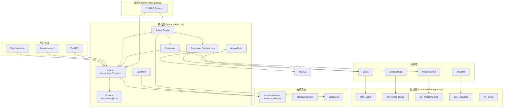

# LlamaIndex 模块化分析报告

**研究项目**: LlamaIndex  
**GitHub**: https://github.com/run-llama/llama_index  
**分析日期**: 2026-03-02

---

## 📦 项目整体结构

LlamaIndex 采用**单体仓库 (Monorepo)** 架构，包含 10 个主要包：

```
llama_index/
├── llama-index-core/          # 核心引擎 (40+ 模块)
├── llama-index-integrations/  # 第三方集成 (31 包)
├── llama-index-packs/         # 预构建 RAG 模式 (51 包)
├── llama-index-cli/           # 命令行工具
├── llama-index-experimental/  # 实验性功能
├── llama-index-finetuning/    # 微调工具
├── llama-index-instrumentation/ # 事件追踪/可观测性
├── llama-datasets/            # 示例数据集 (22 个)
├── llama-dev/                 # 开发者工具
└── llama-index-utils/         # 工具函数 (4 个)
```

---

## 🔬 核心模块分析 (llama-index-core)

### 模块统计

| 模块 | 文件数 | 代码行数 | 职责 |
|------|--------|----------|------|
| **indices** | 90 | 14,168 | 索引系统（向量、树、列表等） |
| **query_engine** | 26 | 3,850 | 查询引擎实现 |
| **agent** | 16 | 3,214 | Agent 系统和工具使用 |
| **llms** | 10 | 2,952 | LLM 抽象层 |
| **tools** | 15 | 2,065 | 工具定义和调用 |
| **response_synthesizers** | 16 | ~2,500 | 响应合成器 |
| **evaluation** | 19 | ~3,000 | 评估框架 |
| **workflow** | 14 | 196 | 工作流编排 |
| **retrievers** | 6 | 993 | 检索器抽象 |
| **embeddings** | 6 | 520 | 嵌入模型抽象 |
| **vector_stores** | 4 | 1,053 | 向量存储抽象 |

**总计**: 4,147 个 Python 文件，456,479 行代码

---

## 🏗️ 模块依赖图 (Mermaid)



---

## 📋 模块职责详解

### 1. Schema 层 (`llama_index/core/schema.py`)

**职责**: 定义核心数据结构

```python
# 核心类
- Document: 文档对象（文本 + 元数据）
- BaseNode: 节点抽象基类
- TextNode: 文本节点
- ImageNode: 图像节点
- QueryBundle: 查询封装（查询文本 + embedding）
- NodeWithScore: 带分数的节点（用于检索结果）
- MetadataMode: 元数据模式枚举
```

**关键设计**: 所有数据在系统中以 `Node` 形式流动，支持多模态。

---

### 2. Indices 层 (`llama_index/core/indices/`)

**职责**: 索引系统 - 数据的组织和检索策略

**主要索引类型**:

| 索引 | 类名 | 适用场景 |
|------|------|----------|
| **VectorStoreIndex** | 向量索引 | 语义搜索，最常用 |
| **SummaryIndex** | 列表索引 | 顺序遍历，摘要 |
| **TreeIndex** | 树索引 | 分层摘要，大规模数据 |
| **KeywordTableIndex** | 关键词索引 | 关键词匹配 |
| **PropertyGraphIndex** | 属性图索引 | 知识图谱 |
| **ComposableGraph** | 可组合图 | 多索引组合 |

**文件结构**:
```
indices/
├── vector_store/          # 向量索引
├── list/                  # 列表索引
├── tree/                  # 树索引
├── keyword_table/         # 关键词索引
├── property_graph/        # 属性图索引
├── document_summary/      # 文档摘要索引
├── query_engine/          # 索引查询实现
└── common/                # 公共逻辑
```

---

### 3. Query Engine 层 (`llama_index/core/query_engine/`)

**职责**: 执行查询并生成响应

**查询引擎类型**:

```
query_engine/
├── retrieval_query_engine/    # 检索式查询（最常用）
├── custom_query_engine/       # 自定义查询
├── multi_step_query_engine/   # 多步查询
├── transform_query_engine/    # 查询变换
├── retry_query_engine/        # 重试查询
├── router_query_engine/       # 路由查询（多引擎选择）
├── recursive_retriever/       # 递归检索
└── flare/                     # FLARE 主动检索
```

**调用链**:
```
query(query_str) 
  → retriever.retrieve(query_str) 
  → response_synthesizer.synthesize(query, nodes)
  → Response
```

---

### 4. Retrievers 层 (`llama_index/core/retrievers/`)

**职责**: 从索引中检索相关节点

**核心接口**:
```python
class BaseRetriever(ABC):
    def retrieve(self, query_bundle: QueryBundle) -> List[NodeWithScore]:
        ...
    
    async def aretrieve(self, query_bundle: QueryBundle) -> List[NodeWithScore]:
        ...
```

**实现**:
- `VectorIndexRetriever`: 向量相似度检索
- `ListIndexRetriever`: 列表遍历
- `PropertyGraphIndexRetriever`: 图遍历
- `RouterRetriever`: 路由选择多个检索器

---

### 5. Response Synthesizers 层 (`llama_index/core/response_synthesizers/`)

**职责**: 将检索到的节点合成为最终响应

**合成策略**:

| 策略 | 类名 | 描述 |
|------|------|------|
| **Refine** | `Refine` | 迭代优化响应 |
| **CompactAndRefine** | `CompactAndRefine` | 压缩后优化 |
| **TreeSummarize** | `TreeSummarize` | 树形摘要 |
| **Generation** | `Generation` | 直接生成 |
| **Accumulate** | `Accumulate` | 简单拼接 |
| **CompactAccumulate** | `CompactAccumulate` | 压缩后拼接 |

---

### 6. Agent 层 (`llama_index/core/agent/`)

**职责**: Agent 系统和工具使用

**组件**:
```
agent/
├── function_calling/        # 函数调用 Agent
├── react/                   # ReAct Agent
├── planning/                # 规划 Agent
├── runner/                  # Agent 执行器
└── types.py                 # 类型定义
```

**关键类**:
- `FunctionCallingAgent`: 基于 LLM 函数调用
- `ReActAgent`: 推理 + 行动循环
- `AgentRunner`: 执行循环管理

---

### 7. Workflow 层 (`llama_index/core/workflow/`)

**职责**: 工作流编排（新增功能）

**特点**:
- 基于事件驱动
- 支持异步执行
- 可视化工作流定义

```python
from llama_index.core.workflow import Workflow, Start, End

class MyWorkflow(Workflow):
    @step
    async def process(self, ev: Start) -> End:
        ...
```

---

### 8. Instrumentation 层 (`llama_index/core/instrumentation/`)

**职责**: 可观测性和事件追踪

**事件类型**:
```
instrumentation/events/
├── llm/           # LLM 调用事件
├── embedding/     # Embedding 事件
├── retrieval/     # 检索事件
├── query/         # 查询事件
├── agent/         # Agent 事件
└── workflow/      # 工作流事件
```

**集成**:
- OpenTelemetry
- Arize Phoenix
- Langfuse
- 自定义回调

---

## 🔗 模块依赖关系

### 核心依赖链

```
用户代码
    ↓
Settings / ServiceContext (配置)
    ↓
StorageContext (存储)
    ↓
Indices (索引)
    ↓
Retrievers (检索)
    ↓
Query Engine (查询编排)
    ↓
Response Synthesizer (响应合成)
    ↓
LLM / Embedding (模型调用)
    ↓
Integrations (第三方实现)
```

### 跨包依赖

| 包 | 依赖 llama-index-core | 被依赖 |
|----|----------------------|--------|
| llama-index-integrations | ✅ | Packs |
| llama-index-packs | ✅ | 用户 |
| llama-index-cli | ✅ | 用户 |
| llama-index-experimental | ✅ | - |
| llama-index-finetuning | ✅ | - |
| llama-datasets | ✅ | 用户 |

---

## 📊 模块复杂度分析

### 高复杂度模块 (需重点关注)

1. **indices/** (90 文件，14K 行)
   - 原因：支持 10+ 种索引类型，每种有多个实现
   - 关键文件：`vector_store/base.py`, `property_graph/index.py`

2. **query_engine/** (26 文件，3.8K 行)
   - 原因：查询逻辑复杂，支持多种模式
   - 关键文件：`retrieval_query_engine/base.py`

3. **evaluation/** (19 文件)
   - 原因：评估指标多样，计算复杂
   - 关键文件：`retrieval/metrics.py`, `response/metrics.py`

### 中等复杂度模块

4. **agent/** (16 文件，3.2K 行)
5. **response_synthesizers/** (16 文件)
6. **tools/** (15 文件，2K 行)

### 低复杂度模块 (抽象层)

7. **embeddings/** (6 文件，520 行)
8. **retrievers/** (6 文件，993 行)
9. **vector_stores/** (4 文件，1K 行)
10. **workflow/** (14 文件，196 行) - 新模块，还在发展中

---

## 🎯 模块使用频率评估

| 模块 | 使用频率 | 典型场景 |
|------|----------|----------|
| **VectorStoreIndex** | ⭐⭐⭐⭐⭐ | RAG 基础 |
| **QueryEngine** | ⭐⭐⭐⭐⭐ | 查询执行 |
| **Settings** | ⭐⭐⭐⭐⭐ | 全局配置 |
| **Document/TextNode** | ⭐⭐⭐⭐⭐ | 数据表示 |
| **Retrievers** | ⭐⭐⭐⭐ | 检索策略 |
| **ResponseSynthesizers** | ⭐⭐⭐⭐ | 响应生成 |
| **Agent** | ⭐⭐⭐ | 高级用法 |
| **Workflow** | ⭐⭐ | 新兴功能 |
| **Evaluation** | ⭐⭐⭐ | 质量评估 |

---

## 🔍 关键模块文件清单

### 必须阅读的核心文件

1. `llama-index-core/llama_index/core/schema.py` - 数据结构定义
2. `llama-index-core/llama_index/core/indices/vector_store/base.py` - 向量索引
3. `llama-index-core/llama_index/core/query_engine/retrieval_query_engine/base.py` - 查询引擎
4. `llama-index-core/llama_index/core/settings.py` - 全局设置
5. `llama-index-core/llama_index/core/service_context.py` - 服务上下文
6. `llama-index-core/llama_index/core/storage/storage_context.py` - 存储上下文
7. `llama-index-core/llama_index/core/base/llm_generic/base.py` - LLM 抽象
8. `llama-index-core/llama_index/core/instrumentation/events/base.py` - 事件系统

---

## 📈 模块演进趋势

### 新增模块 (v0.10+)

- **workflow/**: 工作流编排
- **voice_agents/**: 语音代理
- **graph_rag/**: Graph RAG
- **sparse_embeddings/**: 稀疏嵌入

### 扩展方向

- **多模态**: ImageNode, MultiModalLLM
- **Agent 系统**: 工具调用、规划、记忆
- **评估框架**: 自动化评估基准
- **可观测性**: OpenTelemetry 集成

---

## 📝 总结

LlamaIndex 采用**清晰的分层架构**:

1. **Schema 层**: 统一数据结构
2. **Indices 层**: 多样化索引策略
3. **Query 层**: 灵活的查询编排
4. **抽象层**: LLM/Embedding/VectorStore 接口
5. **集成层**: 300+ 第三方集成
6. **模式层**: 51 个预构建 RAG 模式

**设计优点**:
- ✅ 模块化程度高，易于扩展
- ✅ 抽象层清晰，支持多后端
- ✅ 生态系统丰富（Integrations + Packs）
- ✅ 可观测性内置

**学习路径建议**:
1. 从 `VectorStoreIndex` 入门
2. 理解 `QueryEngine` 调用链
3. 探索 `Packs` 中的高级模式
4. 深入 `Agent` 和 `Workflow`

---

**分析完成时间**: 2026-03-02 16:48  
**下一阶段**: 阶段 3 - 调用链追踪
