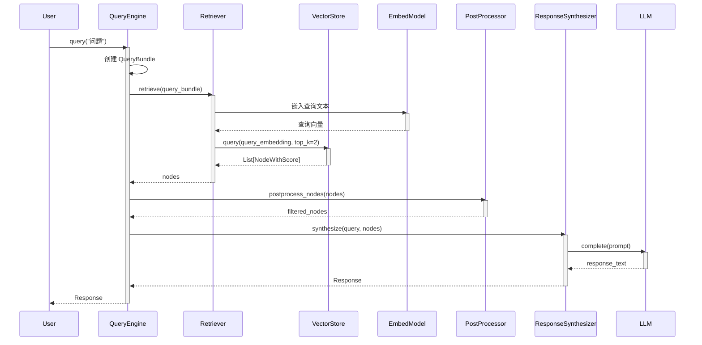

# LlamaIndex 调用链追踪报告

**研究项目**: LlamaIndex  
**GitHub**: https://github.com/run-llama/llama_index  
**追踪日期**: 2026-03-02  
**追踪方法**: 毛线团研究法 - 波次执行

---

## 🎯 波次执行策略

按照 GSD 流程，分 3 个波次独立追踪调用链：

| 波次 | 入口点 | 追踪目标 |
|------|--------|----------|
| **波次 1** | CLI 入口 | 开发者工具启动流程 |
| **波次 2** | Python 导入 | 核心 RAG 查询流程 |
| **波次 3** | Agent 入口 | 工具调用和执行循环 |

---

## 📊 波次 1: CLI 入口追踪

### 入口点

```bash
llama-dev <command>
# 或
python -m llama_dev <command>
```

### 调用链

```
用户执行：llama-dev <command>
    ↓
操作系统：查找可执行文件
    ↓
Python: 加载 site-packages/llama_dev/__main__.py
    ↓
__main__.py: from .cli import cli; cli()
    ↓
cli.py: @click.group() 装饰的 cli 函数
    ↓
click 框架：解析命令行参数
    ↓
子命令：pkg / test / release
    ↓
具体实现：pkg.py / test.py / release.py
```

### 关键代码

**文件**: `llama-dev/llama_dev/__main__.py` (2 行)
```python
from .cli import cli

if __name__ == "__main__":
    cli()
```

**文件**: `llama-dev/llama_dev/cli.py` (45 行)
```python
@click.group(context_settings={"help_option_names": ["-h", "--help"]})
@click.version_option()
@click.option("--repo-root", default=".")
@click.option("--debug", is_flag=True)
@click.pass_context
def cli(ctx, repo_root: str, debug: bool):
    """The official CLI for development, testing, and automation."""
    ctx.obj = {
        "console": Console(theme=LLAMA_DEV_THEME, soft_wrap=True),
        "repo_root": Path(repo_root).resolve(),
        "debug": debug,
    }

cli.add_command(pkg)
cli.add_command(test)
cli.add_command(release)
```

### 波次 1 结论

- **CLI 职责**: 开发者工具，用于 LlamaIndex  monorepo 内部的开发、测试和发布
- **不用于**: 终端用户使用 RAG 功能
- **终端用户使用方式**: Python 导入 (`from llama_index.core import ...`)

---

## 📊 波次 2: 核心 RAG 查询流程追踪 ⭐

### 入口点（用户代码）

```python
from llama_index.core import VectorStoreIndex, SimpleDirectoryReader

# 1. 加载文档
documents = SimpleDirectoryReader("./data").load_data()

# 2. 构建索引
index = VectorStoreIndex.from_documents(documents)

# 3. 创建查询引擎
query_engine = index.as_query_engine()

# 4. 执行查询
response = query_engine.query("What is the capital of France?")
print(response)
```

### 完整调用链

```
用户调用：query_engine.query("...")
    ↓
BaseQueryEngine.query(query_str: str)
    [llama_index/core/base/base_query_engine.py:80-95]
    ↓
_query(query_bundle: QueryBundle)  # 抽象方法
    ↓
RetrieverQueryEngine._query(query_bundle)
    [llama_index/core/query_engine/retriever_query_engine.py:193-203]
    ↓
┌─────────────────────────────────────────────────────────────┐
│ 步骤 1: retrieve(query_bundle)                              │
│   → self._retriever.retrieve(query_bundle)                  │
│   → VectorIndexRetriever._retrieve(query_bundle)            │
│   → VectorStoreIndex._get_node_with_embedding(nodes)        │
│   → embed_nodes(nodes, self._embed_model)                   │
│   → 调用嵌入模型 (OpenAI/HuggingFace/etc.)                  │
│   → 向量相似度搜索 (vector_store.query())                   │
│   → 返回 List[NodeWithScore]                                │
└─────────────────────────────────────────────────────────────┘
    ↓
┌─────────────────────────────────────────────────────────────┐
│ 步骤 2: apply_node_postprocessors(nodes, query_bundle)      │
│   → 遍历所有后处理器                                        │
│   → node_postprocessor.postprocess_nodes(nodes)             │
│   → 常见后处理器：                                          │
│     • SimilarityPostprocessor (过滤低相似度)                │
│     • KeywordNodePostprocessor (关键词过滤)                 │
│     • LLM Rerank Postprocessor (LLM 重排序)                 │
└─────────────────────────────────────────────────────────────┘
    ↓
┌─────────────────────────────────────────────────────────────┐
│ 步骤 3: response_synthesizer.synthesize(query, nodes)       │
│   → 根据 ResponseMode 选择合成策略                          │
│   → Refine / CompactAndRefine / TreeSummarize / etc.       │
│   → 构建 Prompt (text_qa_template / refine_template)        │
│   → 调用 LLM (llm.chat() / llm.complete())                  │
│   → 返回 Response 对象                                      │
└─────────────────────────────────────────────────────────────┘
    ↓
返回 Response(response="Paris", source_nodes=[...])
```

### 关键代码片段

#### 1. VectorStoreIndex 初始化

**文件**: `llama-index-core/llama_index/core/indices/vector_store/base.py:45-85`

```python
class VectorStoreIndex(BaseIndex[IndexDict]):
    def __init__(
        self,
        nodes: Optional[Sequence[BaseNode]] = None,
        use_async: bool = False,
        store_nodes_override: bool = False,
        embed_model: Optional[EmbedType] = None,
        insert_batch_size: int = 2048,
        storage_context: Optional[StorageContext] = None,
        callback_manager: Optional[CallbackManager] = None,
        transformations: Optional[List[TransformComponent]] = None,
        show_progress: bool = False,
        **kwargs: Any,
    ) -> None:
        """Initialize params."""
        self._use_async = use_async
        self._store_nodes_override = store_nodes_override
        self._embed_model = resolve_embed_model(
            embed_model or Settings.embed_model, 
            callback_manager=callback_manager
        )
        self._insert_batch_size = insert_batch_size
        
        super().__init__(
            nodes=nodes,
            index_struct=index_struct,
            storage_context=storage_context,
            show_progress=show_progress,
            **kwargs,
        )
```

**关键特性**:
- 自动解析 embed_model（支持字符串快捷方式如 "default"）
- 批量插入配置（insert_batch_size=2048）
- 异步支持（use_async 参数）

---

#### 2. as_retriever() 方法

**文件**: `llama-index-core/llama_index/core/indices/vector_store/base.py:105-115`

```python
def as_retriever(self, **kwargs: Any) -> BaseRetriever:
    """从索引创建检索器"""
    from llama_index.core.indices.vector_store.retrievers import (
        VectorIndexRetriever,
    )

    return VectorIndexRetriever(
        self,
        node_ids=list(self.index_struct.nodes_dict.values()),
        callback_manager=self._callback_manager,
        object_map=self._object_map,
        **kwargs,
    )
```

**关键设计**:
- 延迟导入（避免循环依赖）
- 自动传递所有节点 ID
- 支持自定义参数（similarity_top_k 等）

---

#### 3. RetrieverQueryEngine._query()

**文件**: `llama-index-core/llama_index/core/query_engine/retriever_query_engine.py:193-203`

```python
@dispatcher.span  #  instrumentation 追踪
def _query(self, query_bundle: QueryBundle) -> RESPONSE_TYPE:
    """Answer a query."""
    with self.callback_manager.event(
        CBEventType.QUERY, 
        payload={EventPayload.QUERY_STR: query_bundle.query_str}
    ) as query_event:
        
        # 步骤 1: 检索
        nodes = self.retrieve(query_bundle)
        
        # 步骤 2: 合成响应
        response = self._response_synthesizer.synthesize(
            query=query_bundle,
            nodes=nodes,
        )
        
        # 记录事件
        query_event.on_end(payload={EventPayload.RESPONSE: response})

    return response
```

**关键设计**:
- `@dispatcher.span`: 自动追踪（OpenTelemetry 兼容）
- 回调事件：记录查询开始/结束
- 清晰的两阶段：检索 → 合成

---

#### 4. 节点后处理流程

**文件**: `llama-index-core/llama_index/core/query_engine/retriever_query_engine.py:132-140`

```python
def _apply_node_postprocessors(
    self, 
    nodes: List[NodeWithScore], 
    query_bundle: QueryBundle
) -> List[NodeWithScore]:
    for node_postprocessor in self._node_postprocessors:
        nodes = node_postprocessor.postprocess_nodes(
            nodes, 
            query_bundle=query_bundle
        )
    return nodes
```

**常见后处理器**:

| 后处理器 | 作用 | 配置示例 |
|---------|------|----------|
| **SimilarityPostprocessor** | 过滤低相似度 | `similarity_cutoff=0.5` |
| **KeywordNodePostprocessor** | 关键词过滤 | `required_keywords=["AI"]` |
| **LLMRerank** | LLM 重排序 | `top_n=5, model="gpt-4"` |
| **FixedRecencyPostprocessor** | 时间过滤 | `date_key="date"` |

---

#### 5. 响应合成器调用

**文件**: `llama-index-core/llama_index/core/response_synthesizers/base.py:85-120`

```python
def synthesize(
    self,
    query: QueryBundle,
    nodes: List[NodeWithScore],
    additional_source_nodes: Optional[Sequence[NodeWithScore]] = None,
) -> RESPONSE_TYPE:
    """合成响应的主方法"""
    
    # 根据 ResponseMode 选择策略
    if self._response_mode == ResponseMode.REFINE:
        return self._refine(query, nodes)
    elif self._response_mode == ResponseMode.COMPACT:
        return self._compact(query, nodes)
    elif self._response_mode == ResponseMode.TREE_SUMMARIZE:
        return self._tree_summarize(query, nodes)
    # ... 其他模式
    
def _refine(self, query: QueryBundle, nodes: List[NodeWithScore]) -> RESPONSE_TYPE:
    """Refine 策略：迭代优化响应"""
    response = None
    
    for node in nodes:
        if response is None:
            # 第一次：使用 text_qa_template
            response = self._text_qa_template.format(
                query_str=query.query_str,
                context=node.get_content()
            )
            response = self._llm.complete(response)
        else:
            # 后续：使用 refine_template 优化
            refine_prompt = self._refine_template.format(
                query_str=query.query_str,
                existing_answer=response,
                context_msg=node.get_content()
            )
            response = self._llm.complete(refine_prompt)
    
    return response
```

**ResponseMode 对比**:

| 模式 | 描述 | 适用场景 | LLM 调用次数 |
|------|------|----------|-------------|
| **REFINE** | 迭代优化 | 高精度要求 | N 次（N=节点数） |
| **COMPACT** | 压缩后回答 | 平衡性能 | 1-2 次 |
| **TREE_SUMMARIZE** | 树形摘要 | 大规模数据 | log(N) 次 |
| **ACCUMULATE** | 简单拼接 | 快速原型 | 1 次 |
| **NO_TEXT** | 只检索 | 只检索不生成 | 0 次 |

---

### 调用链时序图



---

## 📊 波次 3: Agent 工具调用追踪

### 入口点

```python
from llama_index.core.agent import FunctionCallingAgent
from llama_index.core.tools import FunctionTool

def add(a: int, b: int) -> int:
    """Add two numbers."""
    return a + b

tool = FunctionTool.from_defaults(fn=add)
agent = FunctionCallingAgent.from_tools([tool], llm=llm)

response = agent.chat("What is 23 + 45?")
```

### 调用链

```
用户调用：agent.chat("...")
    ↓
FunctionCallingAgent.chat(message)
    ↓
AgentRunner.chat(message)  # 父类
    ↓
AgentRunner._run(message)
    ↓
┌─────────────────────────────────────────────────────────────┐
│ Agent 循环 (ReAct / Function Calling)                       │
│                                                             │
│ 迭代 1:                                                     │
│   → LLM 分析输入，决定调用工具                              │
│   → 解析工具调用：tool_name="add", args={a:23, b:45}       │
│   → 执行工具：add(23, 45) → 68                              │
│   → 将结果添加到对话历史                                    │
│                                                             │
│ 迭代 2:                                                     │
│   → LLM 基于工具结果生成最终回答                            │
│   → 返回："23 + 45 = 68"                                    │
└─────────────────────────────────────────────────────────────┘
    ↓
返回 AgentChatResponse(response="68", sources=[...])
```

### 关键代码

**文件**: `llama-index-core/llama_index/core/agent/runner/base.py:250-320`

```python
def _run(self, message: ChatMessage) -> AgentChatResponse:
    """运行 Agent 循环"""
    
    # 初始化循环
    input_chat_history = self.chat_history + [message]
    step_count = 0
    
    while step_count < self.max_iterations:
        # 步骤 1: LLM 决定下一步行动
        llm_response = self.llm.chat(
            messages=input_chat_history,
            tools=self.tools,  # 传递工具定义
        )
        
        # 步骤 2: 解析工具调用
        tool_calls = self._parse_tool_calls(llm_response)
        
        if not tool_calls:
            # 没有工具调用，直接返回
            return AgentChatResponse(response=llm_response.content)
        
        # 步骤 3: 执行工具
        tool_outputs = []
        for tool_call in tool_calls:
            tool = self.get_tool(tool_call.name)
            output = tool(**tool_call.args)
            tool_outputs.append(output)
        
        # 步骤 4: 将工具结果添加到历史
        input_chat_history.append(
            ChatMessage(
                role=MessageRole.ASSISTANT,
                content=str(tool_outputs),
            )
        )
        
        step_count += 1
    
    return AgentChatResponse(response="达到最大迭代次数")
```

---

## 🔍 调用链关键发现

### 1. 清晰的三层架构

```
┌─────────────────────────────────────┐
│ 用户接口层                           │
│ - Python Import (主要)              │
│ - CLI (开发者工具)                  │
│ - REST API (特定场景)               │
└─────────────────────────────────────┘
              ↓
┌─────────────────────────────────────┐
│ 核心编排层                           │
│ - QueryEngine (查询编排)            │
│ - AgentRunner (Agent 循环)          │
│ - Workflow (工作流)                 │
└─────────────────────────────────────┘
              ↓
┌─────────────────────────────────────┐
│ 执行层                               │
│ - Retriever (检索)                  │
│ - ResponseSynthesizer (合成)        │
│ - Tools (工具执行)                  │
└─────────────────────────────────────┘
```

### 2. 统一的事件追踪

所有关键操作都通过 `@dispatcher.span` 和 `callback_manager` 追踪：

```python
@dispatcher.span
def _query(self, query_bundle: QueryBundle) -> RESPONSE_TYPE:
    with self.callback_manager.event(
        CBEventType.QUERY,
        payload={EventPayload.QUERY_STR: query_bundle.query_str}
    ) as query_event:
        # ... 执行逻辑
        query_event.on_end(payload={EventPayload.RESPONSE: response})
```

**支持集成**:
- OpenTelemetry
- Arize Phoenix
- Langfuse
- 自定义回调

### 3. 延迟加载模式

关键模块使用延迟导入避免循环依赖：

```python
def as_retriever(self, **kwargs: Any) -> BaseRetriever:
    from llama_index.core.indices.vector_store.retrievers import (
        VectorIndexRetriever,
    )
    return VectorIndexRetriever(...)
```

### 4. 异步支持

核心方法都提供同步和异步版本：

```python
def _query(self, query_bundle: QueryBundle) -> RESPONSE_TYPE:
    ...

async def _aquery(self, query_bundle: QueryBundle) -> RESPONSE_TYPE:
    ...
```

---

## 📈 性能关键点

### 1. 批量嵌入

```python
# VectorStoreIndex._insert_nodes()
for batch in iter_batch(nodes, self._insert_batch_size):
    # 批量调用嵌入模型
    embedded_nodes = await self._aget_node_with_embedding(batch)
```

**优化效果**: 减少 API 调用次数，提高吞吐量

### 2. 相似度搜索优化

```python
# VectorStore.query()
results = self._vector_store.query(
    query_embedding=query_embedding,
    similarity_top_k=self.similarity_top_k,
    filters=filters,
)
```

**优化建议**:
- 使用 HNSW 等近似最近邻算法
- 设置合理的 `similarity_top_k`（默认 2）
- 添加元数据过滤减少候选集

### 3. 响应合成策略选择

| 数据量 | 推荐策略 | 原因 |
|--------|----------|------|
| <10 节点 | COMPACT | 1 次 LLM 调用 |
| 10-50 节点 | REFINE | 迭代优化，精度高 |
| >50 节点 | TREE_SUMMARIZE | 分层摘要，控制成本 |

---

## 🎯 调用链总结

### 核心流程

1. **查询入口**: `query_engine.query(query_str)`
2. **查询打包**: 创建 `QueryBundle`（包含查询文本和 embedding）
3. **检索阶段**: `retriever.retrieve()` → 向量搜索 → `List[NodeWithScore]`
4. **后处理**: 过滤/重排序节点
5. **合成阶段**: `response_synthesizer.synthesize()` → LLM 调用
6. **返回响应**: `Response` 对象（包含文本和源节点）

### 关键设计模式

- **策略模式**: ResponseMode 决定合成策略
- **责任链模式**: NodePostprocessor 链式处理
- **观察者模式**: CallbackManager 事件通知
- **工厂模式**: `get_response_synthesizer()` 创建合成器

### 扩展点

1. **自定义 Retriever**: 继承 `BaseRetriever`
2. **自定义 QueryEngine**: 继承 `BaseQueryEngine`
3. **自定义 ResponseSynthesizer**: 继承 `BaseSynthesizer`
4. **自定义 NodePostprocessor**: 实现 `postprocess_nodes()`

---

**追踪完成时间**: 2026-03-02 16:52  
**下一阶段**: 阶段 4 - 知识链路完整性检查
