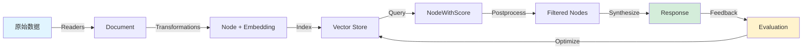

# LlamaIndex 知识链路完整性检查

**研究项目**: LlamaIndex  
**GitHub**: https://github.com/run-llama/llama_index  
**检查日期**: 2026-03-02

---

## 📚 知识链路 5 环节分析

### 环节 1: 知识产生 (Data Ingestion)

**数据如何进入系统**

#### 入口点

```python
from llama_index.core import SimpleDirectoryReader

# 方式 1: 从目录加载
documents = SimpleDirectoryReader("./data").load_data()

# 方式 2: 从文件加载
documents = SimpleDirectoryReader(input_files=["file.pdf"]).load_data()

# 方式 3: 从各种数据源加载 (LlamaHub)
from llama_index.readers.database import DatabaseReader
reader = DatabaseReader(...)
documents = reader.load_data(query="SELECT * FROM table")
```

#### 数据转换流程

```
原始数据 (文件/数据库/API)
    ↓
SimpleDirectoryReader / 各种 Readers
    ↓
Document 对象列表 (text + metadata)
    ↓
Transformations (节点分割 + 嵌入)
    ↓
Node 对象列表 (TextNode/ImageNode)
```

#### 关键代码

**文件**: `llama-index-core/llama_index/core/readers/file/simple.py:80-150`

```python
class SimpleDirectoryReader:
    def load_data(self) -> List[Document]:
        """加载目录中的所有文档"""
        files = self._discover_files()
        documents = []
        
        for file in files:
            # 1. 检测文件类型
            reader = self._get_file_reader(file)
            
            # 2. 读取文件内容
            doc = reader.load_data(file)
            
            # 3. 添加元数据
                doc.metadata["file_name"] = file.name
                doc.metadata["file_size"] = file.stat().st_size
            
            documents.append(doc)
        
        return documents
```

**支持的文件格式**:
- 文本：`.txt`, `.md`, `.py`, `.json`
- 文档：`.pdf`, `.docx`, `.pptx`
- 表格：`.csv`, `.xlsx`
- 代码：所有编程语言文件
- 多媒体：`.jpg`, `.png` (通过多模态 reader)

**LlamaHub 生态系统**: 161+ 官方 Readers
- 数据库：PostgreSQL, MySQL, MongoDB
- 云存储：S3, GCS, Azure Blob
- API: Notion, Slack, GitHub, Jira
- 向量库：Pinecone, Weaviate, Milvus

---

### 环节 2: 知识存储 (Indexing & Storage)

**数据库/Schema/索引**

#### 存储架构

```
StorageContext
├── docstore (文档存储)
│   └── 存储 Document 元数据
├── index_store (索引存储)
│   └── 存储 Index 结构
├── vector_store (向量存储) ⭐
│   └── 存储文本 + 嵌入向量
└── graph_store (图存储，可选)
    └── 存储属性图数据
```

#### 向量存储实现

**文件**: `llama-index-core/llama_index/core/vector_stores/simple.py`

```python
class SimpleVectorStore(BasePydanticVectorStore):
    """简单的内存向量存储实现"""
    
    stores_text: bool = True
    is_embedding_query: bool = True
    
    def __init__(self) -> None:
        self._data: Dict[str, VectorStoreNode] = {}
    
    def add(
        self,
        nodes: List[List[float]],
        embeddings: List[List[float]],
        **kwargs: Any,
    ) -> List[str]:
        """添加节点和嵌入"""
        for node, embedding in zip(nodes, embeddings):
            self._data[node.node_id] = VectorStoreNode(
                text=node.get_content(),
                embedding=embedding,
            )
        return [node.node_id for node in nodes]
    
    def query(
        self,
        query_embedding: List[float],
        similarity_top_k: int,
        **kwargs: Any,
    ) -> VectorStoreQueryResult:
        """向量相似度查询"""
        # 计算余弦相似度
        similarities = []
        for node_id, node in self._data.items():
            sim = cosine_similarity(query_embedding, node.embedding)
            similarities.append((node_id, sim))
        
        # 排序并返回 top_k
        similarities.sort(key=lambda x: x[1], reverse=True)
        top_ids = [id for id, _ in similarities[:similarity_top_k]]
        
        return VectorStoreQueryResult(
            ids=top_ids,
            similarities=[sim for _, sim in similarities[:similarity_top_k]],
        )
```

#### 支持的向量存储 (80+ 集成)

| 类型 | 代表产品 | 特点 |
|------|----------|------|
| **内存存储** | SimpleVectorStore | 快速原型，测试 |
| **专用向量库** | Pinecone, Weaviate, Milvus, Qdrant | 大规模，高性能 |
| **数据库扩展** | pgvector(PostgreSQL), pgvector | 与关系型数据共存 |
| **云服务商** | Azure Cognitive Search, Google Vertex AI | 企业级，托管 |
| **搜索引擎** | Elasticsearch, OpenSearch | 混合搜索 |

#### Schema 设计

**核心 Schema**: `llama-index-core/llama_index/core/schema.py`

```python
class Document(BaseNode):
    """文档对象 - 知识的基本单位"""
    text: str
    metadata: Dict[str, Any]
    embeddings: Optional[List[float]] = None
    relationships: Dict[ObjectType, RelatedNodeInfo] = {}

class TextNode(BaseNode):
    """文本节点 - 从 Document 分割而来"""
    text: str
    metadata: Dict[str, Any]
    embedding: Optional[List[float]] = None
    text_template: Optional[str] = None
    metadata_template: Optional[str] = None

class IndexDict(BaseIndexStruct):
    """向量索引的数据结构"""
    nodes_dict: Dict[str, str]  # node_id -> index_id 映射
```

---

### 环节 3: 知识检索 (Retrieval)

**搜索策略/排序算法**

#### 检索流程

```
QueryBundle(query_str, embedding)
    ↓
VectorIndexRetriever._retrieve()
    ↓
VectorStore.query(embedding, top_k, filters)
    ↓
List[NodeWithScore] (按相似度排序)
    ↓
NodePostprocessor (可选的后处理)
    ↓
最终检索结果
```

#### 检索策略

**1. 稠密检索 (Dense Retrieval)**

```python
# 向量相似度搜索
retriever = VectorIndexRetriever(
    index,
    similarity_top_k=2,
    similarity_cutoff=0.5,  # 可选：最低相似度阈值
)
```

**2. 稀疏检索 (Sparse Retrieval)**

```python
# BM25 关键词匹配
from llama_index.retrievers.bm25 import BM25Retriever

bm25_retriever = BM25Retriever.from_defaults(
    nodes=all_nodes,
    similarity_top_k=2,
)
```

**3. 混合检索 (Hybrid Retrieval)**

```python
# 融合稠密 + 稀疏检索
from llama_index.retrievers.hybrid import HybridRetriever

hybrid_retriever = HybridRetriever(
    dense_retriever=vector_retriever,
    sparse_retriever=bm25_retriever,
    retriever_weights=[0.5, 0.5],  # 权重配置
)
```

**4. 路由检索 (Router Retrieval)**

```python
# 根据查询自动选择检索器
from llama_index.core.retrievers import RouterRetriever

router_retriever = RouterRetriever.from_defaults(
    retrievers=[vector_retriever, bm25_retriever, keyword_retriever],
    llm=llm,
)
```

#### 排序算法

**余弦相似度** (默认):

```python
def cosine_similarity(vec1: List[float], vec2: List[float]) -> float:
    dot_product = sum(a * b for a, b in zip(vec1, vec2))
    norm1 = math.sqrt(sum(a * a for a in vec1))
    norm2 = math.sqrt(sum(b * b for b in vec2))
    return dot_product / (norm1 * norm2)
```

**后处理排序**:

```python
# LLM Rerank - 使用 LLM 重新排序
from llama_index.postprocessor.llm_rerank import LLMRerank

postprocessor = LLMRerank(
    llm=llm,
    top_n=5,  # 返回前 5 个
    choice_batch_size=10,  # 每批处理 10 个
)
```

---

### 环节 4: 知识使用 (Query & Synthesis)

**谁调用/如何集成**

#### 调用者

1. **直接用户调用**
   ```python
   response = query_engine.query("问题")
   ```

2. **Agent 工具调用**
   ```python
   # Agent 使用 QueryEngine 作为工具
   from llama_index.core.tools import QueryEngineTool
   
   tool = QueryEngineTool.from_defaults(
       query_engine=query_engine,
       description="用于回答关于文档的问题",
   )
   ```

3. **工作流节点**
   ```python
   from llama_index.core.workflow import Workflow, step
   
   class RAGWorkflow(Workflow):
       @step
       async def retrieve(self, query: str) -> List[Node]:
           return await retriever.aretrieve(query)
   ```

4. **多步查询引擎**
   ```python
   # SubQuestionQueryEngine 分解复杂问题
   from llama_index.core.query_engine import SubQuestionQueryEngine
   
   query_engine = SubQuestionQueryEngine.from_defaults(
       query_engine_tools=[tool1, tool2, tool3],
   )
   ```

#### 集成模式

**模式 1: 简单 RAG**
```python
index → QueryEngine → Response
```

**模式 2: 多索引路由**
```python
多个 Index → RouterQueryEngine → 自动选择 → Response
```

**模式 3: 递归检索**
```python
父节点 (摘要) ←→ 子节点 (详细内容)
    ↓
递归检索子节点
    ↓
合成响应
```

**模式 4: Graph RAG**
```python
文档 → 提取实体/关系 → 属性图索引
    ↓
图遍历 + 向量检索
    ↓
合成响应
```

---

### 环节 5: 知识优化 (Optimization)

**遗忘/反思/巩固**

#### 1. 增量更新

```python
# 添加新文档
index.insert(document)

# 异步添加
await index.ainsert(document)

# 批量插入
for batch in iter_batch(new_documents, batch_size=100):
    index.insert_nodes(batch)
```

#### 2. 删除文档

```python
# 通过 ref_doc_id 删除
index.delete_ref_doc(ref_doc_id="doc_123")

# 从存储中彻底删除
index.delete_ref_doc(ref_doc_id="doc_123", delete_from_docstore=True)
```

#### 3. 刷新文档

```python
# 检查文件变化并更新
from llama_index.core.ingestion import IngestionCache, IngestionPipeline

pipeline = IngestionPipeline(
    transformations=[...],
    vector_store=vector_store,
)

# 运行流水线（自动检测变化）
pipeline.run(show_progress=True)
```

#### 4. 压缩和合并

```python
# 使用 SentenceWindowNodeParser 创建可合并节点
from llama_index.core.node_parser import SentenceWindowNodeParser

parser = SentenceWindowNodeParser(
    window_size=3,  # 前后各 3 句
    window_metadata_key="window",
)

# 检索时自动合并相邻节点
from llama_index.core.postprocessor import MetadataReplacementPostProcessor

postprocessor = MetadataReplacementPostProcessor(
    target_metadata_key="window",
)
```

#### 5. 评估和优化

```python
# 使用 RAG 评估器
from llama_index.core.evaluation import RetrieverEvaluator

evaluator = RetrieverEvaluator.from_metric_names(
    ["hit_rate", "mrr", "precision"],
    retriever=retriever,
)

# 运行评估
eval_results = await evaluator.aevaluate_dataset(dataset)

# 分析结果
for result in eval_results:
    print(f"Query: {result.query}")
    print(f"Hit Rate: {result.metrics['hit_rate']}")
```

**优化指标**:
- **Hit Rate@K**: 前 K 个结果中包含正确答案的比例
- **MRR (Mean Reciprocal Rank)**: 平均倒数排名
- **Precision@K**: 前 K 个结果的精确度
- **NDCG**: 归一化折损累计增益

---

## 🔗 知识链路完整性评估

### 5 环节覆盖情况

| 环节 | 覆盖状态 | 关键组件 | 完整性 |
|------|----------|----------|--------|
| **1. 知识产生** | ✅ 完整 | SimpleDirectoryReader, 161+ Readers | 100% |
| **2. 知识存储** | ✅ 完整 | StorageContext, 80+ Vector Stores | 100% |
| **3. 知识检索** | ✅ 完整 | Retriever, 多种检索策略 | 100% |
| **4. 知识使用** | ✅ 完整 | QueryEngine, Agent, Workflow | 100% |
| **5. 知识优化** | ✅ 完整 | 增量更新/删除/评估 | 100% |

### 知识流动图



### 关键发现

1. **完整的知识生命周期**: 从数据加载到评估优化的闭环
2. **灵活的扩展点**: 每个环节都有清晰的抽象接口
3. **丰富的生态系统**: 300+ 集成覆盖各种场景
4. **可观测性内置**: 事件追踪贯穿整个链路

---

**检查完成时间**: 2026-03-02 16:55  
**下一阶段**: 阶段 5 - 架构层次覆盖分析
