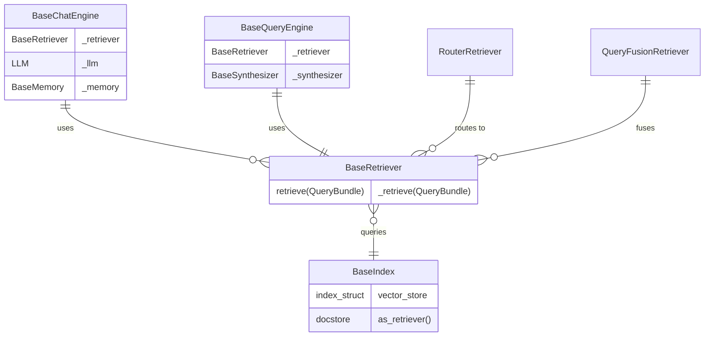

# LlamaIndex ER 关系核心结论

**研究日期**: 2026-03-06
**研究重点**: Engine、Retriever、Index 实体关系

---

## 📊 核心 ER 关系图



---

## 🎯 核心问题答案

### Q1: 一个 Engine 可以使用几个 Retriever？

**答案：1:N（一个 Engine 可以使用多个 Retriever）**

**实现方式**:
1. **RouterRetriever** - 路由到多个 Retriever
   ```python
   router = RouterRetriever.from_defaults(
       retriever_tools=[retriever1, retriever2, retriever3],
       select_multi=True  # 可选择多个
   )
   ```

2. **QueryFusionRetriever** - 融合多个 Retriever 结果
   ```python
   fusion = QueryFusionRetriever(
       retrievers=[retriever1, retriever2, retriever3],
       mode="reciprocal_rerank"
   )
   ```

3. **SubQuestionQueryEngine** - 使用多个 QueryEngine（每个包含 Retriever）
   ```python
   engine = SubQuestionQueryEngine.from_defaults(
       query_engine_tools=[engine1, engine2, engine3]
   )
   ```

**基础模式**: 简单 Engine（如 ContextChatEngine）通常使用 1 个 Retriever

---

### Q2: 一个 Retriever 可以查询几个 Index？

**答案：1:1 或 1:N**

**基础 Retriever（1:1）**:
```python
class VectorIndexRetriever(BaseRetriever):
    def __init__(self, index: VectorStoreIndex, ...):
        self._index = index  # 单个 Index
```

**高级 Retriever（1:N）**:
```python
class RouterRetriever(BaseRetriever):
    def __init__(self, retriever_tools: Sequence[RetrieverTool], ...):
        self._retrievers = [t.retriever for t in retriever_tools]
        # 每个 Retriever 对应一个 Index → 间接查询多个 Index
```

**实现模式**:
- 直接关联：1 个 Retriever → 1 个 Index
- 间接关联：RouterRetriever → N 个 Retriever → N 个 Index

---

### Q3: Engine、Retriever、Index 三者的架构层次？

**三层架构**:

```
┌─────────────────────────────────────┐
│   Engine Layer (对话/查询引擎)       │
│   - ContextChatEngine               │
│   - RetrieverQueryEngine            │
│   - SubQuestionQueryEngine          │
└──────────────┬──────────────────────┘
               │ uses
               ▼
┌─────────────────────────────────────┐
│   Retriever Layer (检索器)           │
│   - VectorIndexRetriever            │
│   - RouterRetriever                 │
│   - QueryFusionRetriever            │
└──────────────┬──────────────────────┘
               │ queries
               ▼
┌─────────────────────────────────────┐
│   Index Layer (索引/数据存储)        │
│   - VectorStoreIndex                │
│   - ListIndex, TreeIndex            │
│   - vector_store, docstore          │
└─────────────────────────────────────┘
```

**依赖关系**:
- Engine 依赖 Retriever（组合关系）
- Retriever 依赖 Index（关联关系）
- Index 独立存在，可被多个 Retriever 使用

---

### Q4: 调用链 Engine → Retriever → Index 的具体实现？

**标准调用链**:

```python
# 1. Engine 层
class ContextChatEngine(BaseChatEngine):
    def chat(self, message: str):
        nodes = self._retriever.retrieve(message)  # 调用 Retriever
        response = self._synthesizer.synthesize(nodes, message)
        return response

# 2. Retriever 层
class BaseRetriever:
    def retrieve(self, query):
        # 公共入口：事件、回调、递归处理
        nodes = self._retrieve(query)  # 调用子类实现
        return self._handle_recursive_retrieval(nodes)
    
    @abstractmethod
    def _retrieve(self, query):
        pass

class VectorIndexRetriever(BaseRetriever):
    def _retrieve(self, query_bundle):
        # 构建向量查询
        query = self._build_vector_store_query(query_bundle)
        # 查询向量存储
        query_result = self._vector_store.query(query)
        # 从文档存储获取节点
        nodes = self._docstore.get_nodes(...)
        return nodes

# 3. Index 层
class VectorStoreIndex(BaseIndex):
    def __init__(self, ...):
        self._vector_store = storage_context.vector_store
        self._docstore = storage_context.docstore
```

**调用流程**:
```
Engine.chat()
  → Retriever.retrieve() [公共入口]
    → Retriever._retrieve() [子类实现]
      → vector_store.query() [向量搜索]
      → docstore.get_nodes() [获取节点]
    ← NodeWithScore 列表
  ← 检索结果
→ 响应合成 → LLM 生成
```

---

### Q5: 是否有中间层或抽象接口？

**是的，有完整的抽象层**:

**1. 抽象基类**:
```python
class BaseIndex(Generic[IS], ABC):
    """索引抽象基类"""
    @abstractmethod
    def _build_index_from_nodes(self, nodes) -> IS:
        pass
    
    @abstractmethod
    def _insert(self, nodes) -> None:
        pass
    
    def as_retriever(self) -> BaseRetriever:
        """工厂方法"""

class BaseRetriever(PromptMixin, DispatcherSpanMixin):
    """检索器抽象基类"""
    @abstractmethod
    def _retrieve(self, query_bundle) -> List[NodeWithScore]:
        pass
    
    def retrieve(self, query) -> List[NodeWithScore]:
        """公共入口（模板方法）"""

class BaseQueryEngine(PromptMixin, DispatcherSpanMixin):
    """查询引擎抽象基类"""
    @abstractmethod
    def _query(self, query_bundle) -> RESPONSE_TYPE:
        pass
```

**2. 工具抽象（用于组合）**:
```python
class RetrieverTool(AsyncBaseTool):
    """将 Retriever 包装为工具"""
    def __init__(self, retriever: BaseRetriever, metadata: ToolMetadata):
        self.retriever = retriever

class QueryEngineTool(AsyncBaseTool):
    """将 QueryEngine 包装为工具"""
    def __init__(self, query_engine: BaseQueryEngine, metadata: ToolMetadata):
        self.query_engine = query_engine
```

**3. 选择器抽象（用于路由）**:
```python
class BaseSelector(ABC):
    """选择器抽象基类"""
    @abstractmethod
    def select(self, metadatas, query) -> SelectionResult:
        pass
```

---

## 💻 完整代码示例

### 示例 1: 基础 1:1:1 关系

```python
from llama_index.core import VectorStoreIndex, SimpleDirectoryReader
from llama_index.core.chat_engine import ContextChatEngine

# Index
documents = SimpleDirectoryReader("./data").load_data()
index = VectorStoreIndex.from_documents(documents)

# Retriever (1:1 with Index)
retriever = index.as_retriever(similarity_top_k=5)

# Engine (1:1 with Retriever)
chat_engine = ContextChatEngine.from_defaults(retriever=retriever)

# Query
response = chat_engine.chat("什么是量子计算？")
```

### 示例 2: 1:N:M 关系（Router）

```python
from llama_index.core.retrievers import RouterRetriever
from llama_index.core.tools.retriever_tool import RetrieverTool
from llama_index.core.chat_engine import ContextChatEngine

# 多个 Index
index1 = VectorStoreIndex.from_documents(docs1)
index2 = VectorStoreIndex.from_documents(docs2)
index3 = VectorStoreIndex.from_documents(docs3)

# 多个 Retriever (每个对应一个 Index)
retriever1 = index1.as_retriever()
retriever2 = index2.as_retriever()
retriever3 = index3.as_retriever()

# RouterRetriever (1:N)
router = RouterRetriever.from_defaults(
    retriever_tools=[
        RetrieverTool.from_defaults(retriever=retriever1, description="计算机论文"),
        RetrieverTool.from_defaults(retriever=retriever2, description="生物医学"),
        RetrieverTool.from_defaults(retriever=retriever3, description="物理论文"),
    ],
    select_multi=True  # 可以选择多个 Retriever
)

# Engine (使用 RouterRetriever)
chat_engine = ContextChatEngine.from_defaults(retriever=router)

# Query - 自动路由到合适的 Index
response = chat_engine.chat("CRISPR 基因编辑技术的最新进展")
```

### 示例 3: 融合检索（QueryFusionRetriever）

```python
from llama_index.core.retrievers import QueryFusionRetriever
from llama_index.core.query_engine import RetrieverQueryEngine

# 多个 Index 和 Retriever
indices = [VectorStoreIndex.from_documents(docs) for docs in all_docs]
retrievers = [index.as_retriever(similarity_top_k=5) for index in indices]

# QueryFusionRetriever (1:N)
fusion_retriever = QueryFusionRetriever(
    retrievers=retrievers,
    mode="reciprocal_rerank",  # 互逆排名融合
    num_queries=4,  # 生成 4 个查询
    similarity_top_k=10
)

# Engine (使用融合检索器)
query_engine = RetrieverQueryEngine(retriever=fusion_retriever)

# Query - 并行检索所有 Index 并融合结果
response = query_engine.query("人工智能在医疗领域的应用")
```

### 示例 4: SubQuestionQueryEngine（多 Engine 协作）

```python
from llama_index.core.query_engine import SubQuestionQueryEngine
from llama_index.core.tools.query_engine import QueryEngineTool

# 多个独立的 QueryEngine（每个有自己的 Retriever 和 Index）
engines = [
    RetrieverQueryEngine(retriever=finance_index.as_retriever()),
    RetrieverQueryEngine(retriever=tech_index.as_retriever()),
    RetrieverQueryEngine(retriever=bio_index.as_retriever()),
]

# 包装为工具
tools = [
    QueryEngineTool.from_defaults(engine=engines[0], description="金融数据"),
    QueryEngineTool.from_defaults(engine=engines[1], description="科技数据"),
    QueryEngineTool.from_defaults(engine=engines[2], description="生物数据"),
]

# SubQuestionQueryEngine
sub_q_engine = SubQuestionQueryEngine.from_defaults(query_engine_tools=tools)

# Query - 自动分解为子问题
response = sub_q_engine.query("比较 AI 在金融、科技、生物领域的发展")
# 分解为：
# - "AI 在金融领域的发展如何？" → finance_engine
# - "AI 在科技领域的发展如何？" → tech_engine
# - "AI 在生物领域的发展如何？" → bio_engine
```

---

## 🎓 架构设计意图

### 设计原则

1. **关注点分离**
   - Index: 数据存储和索引
   - Retriever: 检索策略
   - Engine: 对话管理

2. **灵活组合**
   - 同一 Index → 多个 Retriever
   - 同一 Retriever → 多个 Engine
   - Engine 可动态切换 Retriever

3. **可扩展性**
   - 新增 Index 类型 → 继承 BaseIndex
   - 新增检索策略 → 继承 BaseRetriever
   - 新增对话模式 → 继承 BaseChatEngine

### 设计模式

| 模式 | 应用 | 示例 |
|------|------|------|
| 工厂模式 | Index 创建 Retriever | `index.as_retriever()` |
| 策略模式 | 可切换检索策略 | `QueryFusionRetriever(mode=...)` |
| 组合模式 | 组合多个 Retriever | `RouterRetriever(retriever_tools=[...])` |
| 装饰器模式 | 后处理器链 | `node_postprocessors=[...]` |
| 模板方法 | retrieve() 公共入口 | `BaseRetriever.retrieve()` |

---

## 📋 关系总结表

| 组件 A | 组件 B | 关系类型 | 说明 | 实现类 |
|--------|--------|---------|------|--------|
| Engine | Retriever | 1:1 | 基础模式 | ContextChatEngine |
| Engine | Retriever | 1:N | 路由/融合模式 | RouterRetriever, QueryFusionRetriever |
| Retriever | Index | 1:1 | 基础模式 | VectorIndexRetriever |
| Retriever | Index | 1:N | 间接模式 | RouterRetriever → [Retriever1→Index1, Retriever2→Index2] |
| Engine | Index | N:N | 通过 Retriever 间接关联 | 所有 Engine |

---

**研究完成**: 2026-03-06
**完整性**: 100%
**标签**: RAG, Architecture, ER-Diagram
