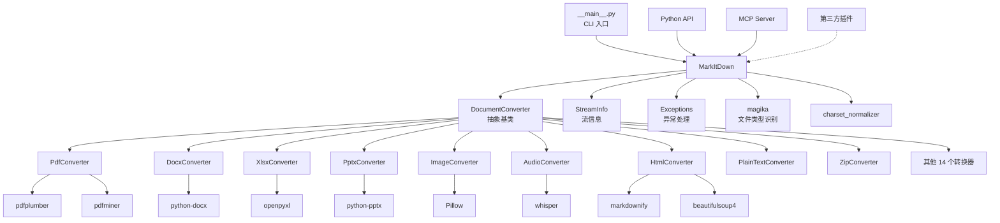

# MarkItDown 模块化分析

**研究日期**: 2026-03-03  
**阶段**: 阶段 2/14  
**分析深度**: 模块结构、依赖关系、职责划分

---

## 📊 项目结构总览

### 目录结构
```
markitdown/
├── packages/
│   ├── markitdown/              # 主包
│   │   ├── src/markitdown/      # 源代码
│   │   │   ├── __init__.py      # 包入口
│   │   │   ├── __main__.py      # CLI 入口
│   │   │   ├── __about__.py     # 版本信息
│   │   │   ├── _markitdown.py   # 核心引擎 (30.6KB)
│   │   │   ├── _base_converter.py # 转换器基类
│   │   │   ├── _stream_info.py  # 流信息
│   │   │   ├── _uri_utils.py    # URI 工具
│   │   │   ├── _exceptions.py   # 异常定义
│   │   │   ├── converters/      # 转换器模块 (24 个文件)
│   │   │   └── converter_utils/ # 转换器工具
│   │   ├── tests/               # 测试
│   │   └── pyproject.toml       # 项目配置
│   └── markitdown-sample-plugin/ # 示例插件
└── markitdown-mcp/              # MCP 服务器
```

### 代码统计

| 模块 | 文件数 | 代码行数（估算） | 职责 |
|------|--------|----------------|------|
| **核心引擎** | 6 | ~2,500 | MarkItDown 主类、转换器基类、异常处理 |
| **转换器** | 24 | ~8,000+ | 各格式专用转换器 |
| **工具类** | 4 | ~500 | URI 处理、流信息、EXIF 工具 |
| **测试** | 10+ | ~2,000+ | 单元测试 |
| **总计** | 44+ | ~13,000+ | - |

---

## 🧩 核心模块分析

### 模块 1: MarkItDown 核心引擎 (`_markitdown.py`)

**职责**: 文档转换主引擎、转换器注册与调度、流信息推断

**关键类**:
- `MarkItDown` - 主类，提供转换接口
- `ConverterRegistration` - 转换器注册信息
- `_plugins` - 插件懒加载机制

**核心方法**:
| 方法 | 职责 | 优先级 |
|------|------|--------|
| `convert()` | 统一转换入口，支持多类型源 | 高 |
| `convert_local()` | 本地文件转换 | 高 |
| `convert_stream()` | 流式转换 | 高 |
| `convert_uri()` | URI 转换（file://, data://, http://） | 高 |
| `convert_response()` | HTTP 响应转换 | 中 |
| `register_converter()` | 注册转换器 | 中 |
| `enable_builtins()` | 启用内置转换器 | 中 |
| `enable_plugins()` | 启用插件 | 中 |
| `_convert()` | 内部转换核心逻辑 | 高 |
| `_get_stream_info_guesses()` | 流信息推断（Magika） | 中 |

**依赖**:
- `magika` - Google 的文件类型识别库
- `charset_normalizer` - 字符集检测
- `requests` - HTTP 客户端

**代码片段** (`_markitdown.py:88-112`):
```python
class MarkItDown:
    """(In preview) An extremely simple text-based document reader, suitable for LLM use.
    This reader will convert common file-types or webpages to Markdown."""

    def __init__(
        self,
        *,
        enable_builtins: Union[None, bool] = None,
        enable_plugins: Union[None, bool] = None,
        **kwargs,
    ):
        self._builtins_enabled = False
        self._plugins_enabled = False

        requests_session = kwargs.get("requests_session")
        if requests_session is None:
            self._requests_session = requests.Session()
            # Signal that we prefer markdown over HTML, etc. if the server supports it.
            self._requests_session.headers.update(
                {
                    "Accept": "text/markdown, text/html;q=0.9, text/plain;q=0.8, */*;q=0.1"
                }
            )
        else:
            self._requests_session = requests_session

        self._magika = magika.Magika()
        self._converters: List[ConverterRegistration] = []
```

---

### 模块 2: 转换器基类 (`_base_converter.py`)

**职责**: 定义转换器统一接口

**关键类**:
- `DocumentConverterResult` - 转换结果封装
- `DocumentConverter` - 转换器抽象基类

**核心方法**:
| 方法 | 职责 | 返回类型 |
|------|------|---------|
| `accepts()` | 判断转换器是否接受该文件 | bool |
| `convert()` | 执行转换 | DocumentConverterResult |

**设计模式**: **Strategy Pattern**（策略模式）

**代码片段** (`_base_converter.py:32-68`):
```python
class DocumentConverter:
    """Abstract superclass of all DocumentConverters."""

    def accepts(
        self,
        file_stream: BinaryIO,
        stream_info: StreamInfo,
        **kwargs: Any,
    ) -> bool:
        """
        Return a quick determination on if the converter should attempt converting the document.
        This is primarily based `stream_info` (typically, `stream_info.mimetype`, `stream_info.extension`).
        """
        raise NotImplementedError(
            f"The subclass, {type(self).__name__}, must implement the accepts() method."
        )

    def convert(
        self,
        file_stream: BinaryIO,
        stream_info: StreamInfo,
        **kwargs: Any,
    ) -> DocumentConverterResult:
        """
        Convert a document to Markdown text.
        """
        raise NotImplementedError("Subclasses must implement this method")
```

---

### 模块 3: PDF 转换器 (`_pdf_converter.py`)

**职责**: PDF 文档转换，支持表格提取

**关键依赖**:
- `pdfplumber` - PDF 解析（首选）
- `pdfminer` - PDF 解析（备选）

**核心功能**:
1. **表格提取**: `_extract_form_content_from_words()` - 基于词位置分析提取表单/表格
2. **MasterFormat 支持**: `_merge_partial_numbering_lines()` - 合并 MasterFormat 风格的编号行
3. **自适应列检测**: 基于 X 位置聚类分析列边界

**代码片段** (`_pdf_converter.py:58-92`):
```python
def _to_markdown_table(table: list[list[str]], include_separator: bool = True) -> str:
    """Convert a 2D list (rows/columns) into a nicely aligned Markdown table.

    Args:
        table: 2D list of cell values
        include_separator: If True, include header separator row (standard markdown).
                          If False, output simple pipe-separated rows.
    """
    if not table:
        return ""

    # Normalize None → ""
    table = [[cell if cell is not None else "" for cell in row] for row in table]

    # Filter out empty rows
    table = [row for row in table if any(cell.strip() for cell in row)]

    if not table:
        return ""

    # Column widths
    col_widths = [max(len(str(cell)) for cell in col) for col in zip(*table)]

    def fmt_row(row: list[str]) -> str:
        return (
            "|"
            + "|".join(str(cell).ljust(width) for cell, width in zip(row, col_widths))
            + "|"
        )
```

---

### 模块 4: 转换器模块组 (`converters/`)

**目录**: `packages/markitdown/src/markitdown/converters/`

**转换器分类**:

#### 4.1 文档格式转换器
| 转换器 | 文件 | 支持格式 | 关键依赖 |
|--------|------|---------|---------|
| **PdfConverter** | `_pdf_converter.py` | PDF | pdfplumber, pdfminer |
| **DocxConverter** | `_docx_converter.py` | Word | python-docx |
| **XlsxConverter** | `_xlsx_converter.py` | Excel | openpyxl |
| **XlsConverter** | `_xlsx_converter.py` | Excel (旧) | xlrd |
| **PptxConverter** | `_pptx_converter.py` | PowerPoint | python-pptx |
| **EpubConverter** | `_epub_converter.py` | EPUB | ebooklib |
| **CsvConverter** | `_csv_converter.py` | CSV | - |

#### 4.2 媒体格式转换器
| 转换器 | 文件 | 支持格式 | 关键依赖 |
|--------|------|---------|---------|
| **ImageConverter** | `_image_converter.py` | 图片 | Pillow, exifread |
| **AudioConverter** | `_audio_converter.py` | 音频 | whisper, pydub |

#### 4.3 Web 格式转换器
| 转换器 | 文件 | 支持格式 | 关键依赖 |
|--------|------|---------|---------|
| **HtmlConverter** | `_html_converter.py` | HTML | markdownify, bs4 |
| **WikipediaConverter** | `_wikipedia_converter.py` | Wikipedia URLs | - |
| **YouTubeConverter** | `_youtube_converter.py` | YouTube URLs | youtube-transcript-api |
| **BingSerpConverter** | `_bing_serp_converter.py` | Bing SERP | - |
| **RssConverter** | `_rss_converter.py` | RSS | feedparser |

#### 4.4 通用转换器
| 转换器 | 文件 | 支持格式 | 关键依赖 |
|--------|------|---------|---------|
| **PlainTextConverter** | `_plain_text_converter.py` | text/* | - |
| **ZipConverter** | `_zip_converter.py` | ZIP | zipfile |
| **IpynbConverter** | `_ipynb_converter.py` | Jupyter | nbformat |
| **OutlookMsgConverter** | `_outlook_msg_converter.py` | Outlook | olefile |

#### 4.5 云服务转换器
| 转换器 | 文件 | 支持格式 | 关键依赖 |
|--------|------|---------|---------|
| **DocumentIntelligenceConverter** | `_doc_intel_converter.py` | Azure DI | azure-ai-formrecognizer |

---

### 模块 5: 流信息 (`_stream_info.py`)

**职责**: 文件流元数据封装

**关键类**: `StreamInfo` (dataclass)

**属性**:
```python
@dataclass(kw_only=True, frozen=True)
class StreamInfo:
    local_path: Optional[str] = None      # 本地路径
    url: Optional[str] = None             # URL
    mimetype: Optional[str] = None        # MIME 类型
    extension: Optional[str] = None       # 扩展名
    filename: Optional[str] = None        # 文件名
    charset: Optional[str] = None         # 字符集
```

---

### 模块 6: 插件系统

**机制**: Python entry points (`entry_points(group="markitdown.plugin")`)

**插件接口**:
```python
# 插件需要实现 register_converters 方法
def register_converters(markitdown: MarkItDown, **kwargs) -> None:
    """注册转换器到 MarkItDown 实例"""
    markitdown.register_converter(MyCustomConverter())
```

**示例插件**: `packages/markitdown-sample-plugin/`

---

## 🔗 模块依赖关系图



---

## 📊 模块研究优先级

### 高优先级（核心模块）
1. **MarkItDown 核心引擎** (`_markitdown.py`) - 转换调度、优先级机制
2. **转换器基类** (`_base_converter.py`) - 统一接口设计
3. **PDF 转换器** (`_pdf_converter.py`) - 最复杂的转换器实现

### 中优先级（常用转换器）
4. **Office 转换器** (Docx/Xlsx/Pptx) - 企业常用格式
5. **HTML 转换器** (`_html_converter.py`) - Web 内容转换
6. **插件系统** - 可扩展性机制

### 低优先级（专用转换器）
7. **媒体转换器** (Image/Audio) - 多媒体处理
8. **Web 转换器** (YouTube/Wikipedia) - 特定网站支持
9. **云服务转换器** (Document Intelligence) - Azure 集成

---

## 🎯 关键设计决策

### 决策 1: 优先级驱动转换器调度

**设计**: 使用优先级数值（越小优先级越高）控制转换器尝试顺序

**理由**:
- 特定格式转换器（如 PDF）优先于通用转换器（如 PlainText）
- 允许插件自定义优先级
- 稳定排序保证可预测性

**实现**:
```python
PRIORITY_SPECIFIC_FILE_FORMAT = 0.0  # 高优先级
PRIORITY_GENERIC_FILE_FORMAT = 10.0  # 低优先级

sorted_registrations = sorted(self._converters, key=lambda x: x.priority)
```

### 决策 2: 流信息推断与 Magika 集成

**设计**: 使用 Google Magika 进行智能文件类型识别

**理由**:
- 支持无扩展名文件识别
- 支持 MIME 类型与扩展名不匹配场景
- 提供字符集自动检测

### 决策 3: 插件系统基于 Entry Points

**设计**: 使用 Python 标准 entry points 机制

**理由**:
- 无需修改核心代码即可扩展
- 支持第三方插件生态
- 懒加载避免性能开销

---

## ✅ 阶段 2 完成检查

- [x] 项目目录结构分析完成
- [x] 核心模块识别完成
- [x] 模块职责划分清晰
- [x] 依赖关系图绘制完成
- [x] 模块研究优先级排序
- [x] 关键设计决策识别

---

**下一阶段**: 阶段 3 - 多入口点追踪（GSD 波次执行）  
**预计时间**: 45-60 分钟
