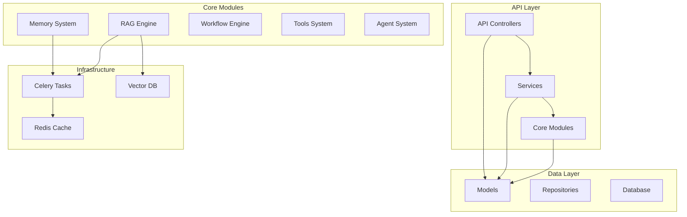

# MemoryBear 模块化分析报告

## 📊 项目概览

**项目名称**: MemoryBear  
**仓库**: https://github.com/qudi17/MemoryBear  
**分析时间**: 2026-03-02 20:20 GMT+8  
**代码规模**: 650 个 Python 文件，155,429 行代码

---

## 🏗️ 顶层模块结构

```
memorybear/
├── api/                          # 后端 API 服务 (主服务)
│   ├── app/                      # 应用核心代码
│   │   ├── main.py               # FastAPI 主入口
│   │   ├── celery_app.py         # Celery 配置
│   │   ├── tasks.py              # Celery 任务定义
│   │   ├── db.py                 # 数据库连接
│   │   ├── models/               # 数据库模型 (34 个模型文件)
│   │   ├── schemas/              # Pydantic Schema
│   │   ├── controllers/          # API 控制器 (48 个文件)
│   │   ├── services/             # 业务服务层 (70 个文件)
│   │   ├── repositories/         # 数据访问层
│   │   ├── core/                 # 核心业务逻辑 ⭐
│   │   │   ├── memory/           # 记忆系统 (140 个文件)
│   │   │   ├── rag/              # RAG 引擎 (118 个文件)
│   │   │   ├── workflow/         # 工作流引擎 (70 个文件)
│   │   │   ├── tools/            # 工具系统
│   │   │   ├── agent/            # Agent 系统
│   │   │   ├── storage/          # 存储系统
│   │   │   ├── permissions/      # 权限系统
│   │   │   └── validators/       # 验证器
│   │   ├── middleware/           # 中间件
│   │   ├── plugins/              # 插件系统
│   │   ├── cache/                # 缓存层
│   │   ├── utils/                # 工具函数
│   │   └── templates/            # 模板文件
│   ├── migrations/               # Alembic 数据库迁移
│   └── tests/                    # 测试代码
├── sandbox/                      # 沙箱服务 (代码执行)
│   ├── main.py                   # 沙箱主入口
│   └── app/                      # 沙箱应用
├── web/                          # 前端应用
└── redbear-mem-benchmark/        # 基准测试
```

---

## 📦 核心模块详细分析

### 1. 记忆系统模块 (`api/app/core/memory/`) ⭐⭐⭐

**文件数**: 140 个  
**职责**: 完整的记忆生命周期管理

**子模块结构**:
```
memory/
├── agent/                    # 记忆代理
│   ├── langgraph_graph/      # LangGraph 图结构
│   │   ├── nodes/            # 图节点
│   │   ├── routing/          # 路由逻辑
│   │   └── tools/            # 工具集成
│   ├── models/               # 数据模型
│   ├── services/             # 服务层
│   └── utils/                # 工具函数
├── analytics/                # 记忆分析
├── llm_tools/                # LLM 工具集成 (8 个文件)
├── models/                   # 记忆数据模型 (14 个文件)
├── ontology_services/        # 本体论服务 (5 个文件)
├── src/                      # 源代码
├── storage_services/         # 存储服务 (7 个文件)
│   ├── forgetting_engine/    # 遗忘引擎
│   ├── long_term_storage.py  # 长期存储
│   ├── short_term_storage.py # 短期存储
│   └── working_memory.py     # 工作记忆
└── utils/                    # 工具函数 (14 个文件)
```

**关键特性**:
- 9 种记忆类型支持 (工作/短期/长期/情景/外显/知觉等)
- LangGraph 图结构实现记忆流程
- 遗忘引擎自动管理记忆衰减
- 本体论服务支持语义关联

---

### 2. RAG 引擎模块 (`api/app/core/rag/`) ⭐⭐⭐

**文件数**: 118 个  
**职责**: 检索增强生成全流程

**子模块结构**:
```
rag/
├── app/                      # RAG 应用
├── common/                   # 通用组件 (14 个文件)
├── crawler/                  # 网络爬虫 (11 个文件)
│   ├── __main__.py           # CLI 入口
│   ├── web_crawler.py        # 网页爬虫
│   └── [平台爬虫]/
├── deepdoc/                  # 深度文档解析 (7 个文件)
├── graphrag/                 # GraphRAG (10 个文件)
│   ├── general/              # 通用 GraphRAG
│   ├── light/                # 轻量级 GraphRAG
│   └── utils/                # 工具函数
├── integrations/             # 第三方集成 (5 个文件)
│   ├── feishu/               # 飞书集成
│   └── yuque/                # 语雀集成
├── llm/                      # LLM 集成 (7 个文件)
│   ├── chat_model.py         # 聊天模型
│   ├── embedding_model.py    # 嵌入模型
│   └── cv_model.py           # 视觉模型
├── models/                   # 数据模型
├── nlp/                      # NLP 处理 (9 个文件)
├── prompts/                  # Prompt 模板 (36 个文件)
├── res/                      # 资源文件
├── utils/                    # 工具函数 (8 个文件)
└── vdb/                      # 向量数据库 (6 个文件)
    └── elasticsearch/        # ES 向量存储
```

**关键特性**:
- GraphRAG + 传统 RAG 双引擎
- 多平台爬虫 (飞书/语雀/网页)
- 多模态支持 (文本/图像/语音)
- Elasticsearch 向量存储

---

### 3. 工作流引擎模块 (`api/app/core/workflow/`) ⭐⭐

**文件数**: 70 个  
**职责**: 可视化工作流编排执行

**子模块结构**:
```
workflow/
├── executor.py               # 工作流执行器 (39,936 字节)
├── graph_builder.py          # 图构建器 (26,448 字节)
├── nodes/                    # 节点类型 (26 个文件)
│   ├── start_node.py         # 开始节点
│   ├── end_node.py           # 结束节点
│   ├── llm_node.py           # LLM 节点
│   ├── code.py               # 代码执行节点
│   ├── ifelse_node.py        # 条件分支
│   ├── question_classifier_node.py  # 问题分类
│   ├── variable_aggregator_node.py  # 变量聚合
│   └── [其他节点类型]
├── templates/                # 模板文件 (6 个文件)
├── variable/                 # 变量系统 (5 个文件)
├── variable_pool.py          # 变量池 (11,197 字节)
├── template_loader.py        # 模板加载器
├── template_renderer.py      # 模板渲染器
├── validator.py              # 验证器 (12,894 字节)
└── expression_evaluator.py   # 表达式求值器
```

**关键特性**:
- 基于 LangGraph 的图执行引擎
- 26 种节点类型支持
- 可视化工作流编排
- 变量池和模板系统

---

### 4. 工具系统模块 (`api/app/core/tools/`) ⭐⭐

**文件数**: 约 30 个  
**职责**: 工具管理和执行

**子模块结构**:
```
tools/
├── base.py                   # 工具基类 (6,509 字节)
├── langchain_adapter.py      # LangChain 适配器 (16,176 字节)
├── builtin/                  # 内置工具 (10 个文件)
│   ├── base.py               # 内置工具基类
│   ├── baidu_search_tool.py  # 百度搜索
│   ├── mineru_tool.py        # MinerU 解析
│   └── textin_tool.py        # TextIn OCR
├── custom/                   # 自定义工具 (6 个文件)
│   └── auth_manager.py       # 认证管理
└── mcp/                      # MCP 协议 (6 个文件)
    └── service_manager.py    # 服务管理
```

**关键特性**:
- LangChain 工具协议兼容
- MCP (Model Context Protocol) 支持
- 内置工具 + 自定义工具扩展

---

### 5. API 控制器模块 (`api/app/controllers/`) ⭐⭐⭐

**文件数**: 48 个  
**职责**: API 路由和请求处理

**核心控制器**:
| 控制器 | 文件大小 | 功能 |
|--------|---------|------|
| `memory_agent_controller.py` | 30,847 字节 | 记忆代理服务 |
| `knowledge_controller.py` | 25,991 字节 | 知识库管理 |
| `memory_dashboard_controller.py` | 23,935 字节 | 记忆仪表盘 |
| `multi_agent_controller.py` | 24,965 字节 | 多 Agent 协调 |
| `ontology_controller.py` | 41,552 字节 | 本体论管理 |
| `file_controller.py` | 16,518 字节 | 文件管理 |
| `document_controller.py` | 14,840 字节 | 文档管理 |
| `chunk_controller.py` | 20,176 字节 | 文本块管理 |
| `workflow/*` | 多个文件 | 工作流 API |

---

### 6. 服务层模块 (`api/app/services/`) ⭐⭐

**文件数**: 70 个  
**职责**: 业务逻辑编排

**子模块**:
```
services/
├── prompt/                   # Prompt 服务
├── memory_agent_service.py   # 记忆代理服务
└── [其他业务服务]
```

---

### 7. 数据库模型模块 (`api/app/models/`) ⭐⭐

**文件数**: 34 个  
**职责**: 数据持久化模型

**核心模型**:
| 模型 | 功能 |
|------|------|
| `memory_config_model.py` | 记忆配置 |
| `memory_increment_model.py` | 记忆增量 |
| `memory_short_model.py` | 短期记忆 |
| `knowledge_model.py` | 知识库 |
| `document_model.py` | 文档 |
| `conversation_model.py` | 对话 |
| `agent_app_config_model.py` | Agent 应用配置 |
| `multi_agent_model.py` | 多 Agent 配置 |
| `prompt_optimizer_model.py` | Prompt 优化 |
| `ontology_class.py` | 本体论类 |
| `ontology_scene.py` | 本体论场景 |

---

### 8. 沙箱模块 (`sandbox/`) ⭐

**文件数**: 约 20 个  
**职责**: 安全代码执行环境

**子模块**:
```
sandbox/
├── main.py                   # 主入口
├── app/
│   ├── config.py             # 配置
│   ├── controllers/          # 控制器 (5 个文件)
│   ├── core/                 # 核心 (6 个文件)
│   │   ├── runners/          # 代码运行器
│   │   │   ├── python/       # Python 运行器
│   │   │   └── nodejs/       # Node.js 运行器
│   │   ├── encryption.py     # 加密
│   │   └── executor.py       # 执行器
│   ├── middleware/           # 中间件 (3 个文件)
│   ├── services/             # 服务 (5 个文件)
│   └── models.py             # 数据模型
└── dependencies.py           # 依赖管理
```

**关键特性**:
- Python/Node.js 双语言支持
- chroot/setuid 安全隔离
- 并发控制和资源限制

---

## 🔗 模块依赖关系图



---

## 📊 模块统计

| 模块 | 文件数 | 代码行数 (估算) | 复杂度 |
|------|--------|----------------|--------|
| Memory System | 140 | ~35,000 | ⭐⭐⭐⭐⭐ |
| RAG Engine | 118 | ~30,000 | ⭐⭐⭐⭐⭐ |
| Workflow Engine | 70 | ~18,000 | ⭐⭐⭐⭐ |
| Services | 70 | ~15,000 | ⭐⭐⭐ |
| Controllers | 48 | ~25,000 | ⭐⭐⭐⭐ |
| Models | 34 | ~8,000 | ⭐⭐ |
| Tools | ~30 | ~10,000 | ⭐⭐⭐ |
| Sandbox | ~20 | ~5,000 | ⭐⭐⭐ |
| **总计** | **650+** | **~155,429** | - |

---

## 🎯 模块职责矩阵

| 模块 | 表现层 | 服务层 | 核心层 | 后台层 | 数据层 |
|------|--------|--------|--------|--------|--------|
| Controllers | ✅ | - | - | - | - |
| Services | - | ✅ | - | - | - |
| Memory | - | ✅ | ✅ | ✅ | ✅ |
| RAG | - | ✅ | ✅ | ✅ | ✅ |
| Workflow | - | ✅ | ✅ | - | - |
| Tools | - | ✅ | ✅ | - | - |
| Models | - | - | - | - | ✅ |
| Sandbox | ✅ | ✅ | ✅ | - | - |

---

## 🔑 核心模块关键文件

### Memory System
- `api/app/core/memory/agent/langgraph_graph/write_graph.py` - 记忆写入图
- `api/app/core/memory/storage_services/forgetting_engine/forgetting_scheduler.py` - 遗忘调度器
- `api/app/core/memory/ontology_services/ontology_service.py` - 本体论服务

### RAG Engine
- `api/app/core/rag/graphrag/general/index.py` - GraphRAG 索引
- `api/app/core/rag/vdb/elasticsearch/elasticsearch_vector.py` - ES 向量存储
- `api/app/core/rag/crawler/web_crawler.py` - 网页爬虫

### Workflow Engine
- `api/app/core/workflow/executor.py` - 工作流执行器
- `api/app/core/workflow/graph_builder.py` - 图构建器
- `api/app/core/workflow/nodes/llm_node.py` - LLM 节点

---

## ✅ 阶段 2 完成

**分析完成时间**: 2026-03-02 20:25 GMT+8  
**模块总数**: 8 个核心模块  
**文件总数**: 650+ Python 文件  
**代码总量**: 155,429 行  
**下一阶段**: 阶段 3 - 多入口点追踪 (调用链分析)
