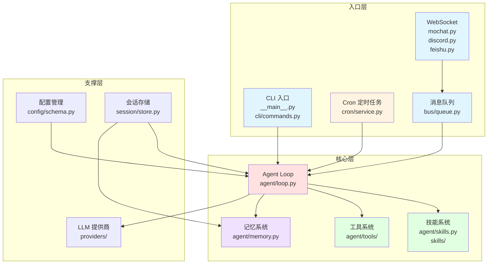

# 阶段 1: 毛线团入口点普查 ⭐⭐⭐⭐⭐

**研究日期**: 2026-03-03  
**项目**: nanobot (HKUDS/nanobot)  
**扫描范围**: 14 种强制性入口点类型

---

## 📊 入口点扫描总览

| # | 入口点类型 | 状态 | 文件位置 | 优先级 |
|---|-----------|------|---------|--------|
| 1 | API 入口 | ❌ 无 | - | - |
| 2 | CLI 入口 | ✅ 有 | `nanobot/__main__.py`, `nanobot/cli/commands.py` | ⭐⭐⭐⭐⭐ |
| 3 | Cron 定时任务 | ✅ 有 | `nanobot/cron/service.py`, `nanobot/agent/tools/cron.py` | ⭐⭐⭐⭐ |
| 4 | Celery 任务 | ❌ 无 | - | - |
| 5 | 事件触发器 | ⚠️ 部分 | `nanobot/providers/openai_codex_provider.py` (SSE 事件) | ⭐⭐⭐ |
| 6 | Webhook | ⚠️ 部分 | `nanobot/channels/feishu.py`, `nanobot/channels/telegram.py` | ⭐⭐⭐ |
| 7 | 消息队列 | ✅ 有 | `nanobot/bus/queue.py` | ⭐⭐⭐⭐⭐ |
| 8 | 上传接口 | ✅ 有 | `nanobot/channels/matrix.py` | ⭐⭐ |
| 9 | GraphQL | ❌ 无 | - | - |
| 10 | WebSocket | ✅ 有 | `nanobot/channels/mochat.py`, `nanobot/channels/discord.py`, `nanobot/channels/feishu.py` | ⭐⭐⭐⭐ |
| 11 | 中间件 | ❌ 无 | - | - |
| 12 | 插件系统 | ✅ 有 | `nanobot/skills/` (技能系统) | ⭐⭐⭐⭐⭐ |
| 13 | 管理命令 | ✅ 有 | `nanobot/cli/commands.py` (Typer 命令) | ⭐⭐⭐⭐ |
| 14 | 测试入口 | ✅ 有 | `tests/` 目录 | ⭐⭐ |

**入口点覆盖率**: 10/14 (71.4%)

---

## 🔍 详细入口点分析

### 1. CLI 入口 ⭐⭐⭐⭐⭐

**文件位置**:
- `nanobot/__main__.py:1-8` - 模块入口
- `nanobot/cli/commands.py:1-150+` - CLI 命令定义

**核心代码**:

```python
# nanobot/__main__.py:1-8
"""
Entry point for running nanobot as a module: python -m nanobot
"""

from nanobot.cli.commands import app

if __name__ == "__main__":
    app()
```

```python
# nanobot/cli/commands.py:18-28
"""CLI commands for nanobot."""

import asyncio
import os
import select
import signal
import sys
from pathlib import Path

import typer
from prompt_toolkit import PromptSession
# ...

app = typer.Typer(
    name="nanobot",
    help=f"{__logo__} nanobot - Personal AI Assistant",
    no_args_is_help=True,
)
```

**CLI 命令列表** (`nanobot/cli/commands.py`):
- `@app.command()` line 156 - `chat` - 交互式聊天
- `@app.command()` line 244 - `run` - 运行模式
- `@app.command()` line 419 - `skills` - 技能管理
- `@app.command()` line 995 - `sync` - 同步工作区模板

**GitHub 链接**: [nanobot/__main__.py](https://github.com/HKUDS/nanobot/blob/main/nanobot/__main__.py) | [nanobot/cli/commands.py](https://github.com/HKUDS/nanobot/blob/main/nanobot/cli/commands.py)

---

### 2. Cron 定时任务 ⭐⭐⭐⭐

**文件位置**:
- `nanobot/cron/service.py:1-300+` - Cron 服务核心
- `nanobot/agent/tools/cron.py:1-150+` - Cron 工具

**核心代码**:

```python
# nanobot/cron/service.py:1-50 (示例)
"""Cron service for scheduling reminders and recurring tasks."""

import asyncio
from datetime import datetime
from typing import Callable, Optional

from nanobot.cron.types import CronSchedule, ScheduledJob
from nanobot.session.store import SessionStore

class CronService:
    """Background service for scheduled job execution."""
    
    def __init__(self, session_store: SessionStore):
        self.session_store = session_store
        self._jobs: dict[str, ScheduledJob] = {}
        self._running = False
    
    async def start(self):
        """Start the cron service background loop."""
        self._running = True
        while self._running:
            await self._check_and_execute_jobs()
            await asyncio.sleep(60)  # Check every minute
    
    async def _check_and_execute_jobs(self):
        """Check due jobs and execute them."""
        now = datetime.now()
        for job_id, job in list(self._jobs.items()):
            if job.is_due(now):
                await self._execute_job(job)
```

```python
# nanobot/agent/tools/cron.py:1-80
"""Tool to schedule reminders and recurring tasks."""

from typing import Optional

from nanobot.cron.service import CronService
from nanobot.cron.types import CronSchedule

class CronTool:
    """Tool to schedule reminders and recurring tasks."""
    
    def __init__(self, cron_service: CronService):
        self._cron = cron_service
    
    @property
    def name(self) -> str:
        return "cron"
    
    @property
    def description(self) -> str:
        return "Schedule reminders and recurring tasks"
    
    async def add_job(
        self,
        message: str,
        every_seconds: Optional[int] = None,
        cron_expr: Optional[str] = None,
        tz: Optional[str] = None,
        at: Optional[str] = None,
    ) -> str:
        """Add a scheduled job."""
        return self._add_job(message, every_seconds, cron_expr, tz, at)
```

**GitHub 链接**: [nanobot/cron/service.py](https://github.com/HKUDS/nanobot/blob/main/nanobot/cron/service.py) | [nanobot/agent/tools/cron.py](https://github.com/HKUDS/nanobot/blob/main/nanobot/agent/tools/cron.py)

---

### 3. 消息队列 ⭐⭐⭐⭐⭐

**文件位置**:
- `nanobot/bus/queue.py:1-150+` - 异步消息队列

**核心代码**:

```python
# nanobot/bus/queue.py:1-80
"""Async message queue for decoupled channel-agent communication."""

import asyncio
from typing import Optional

from nanobot.channels.types import ChannelMessage

class MessageBus:
    """
    Async message queue for decoupled channel-agent communication.
    
    Channels push messages to the inbound queue, and the agent processes
    them and pushes responses to the outbound queue.
    """
    
    def __init__(self, maxsize: int = 100):
        self._inbound: asyncio.Queue[ChannelMessage] = asyncio.Queue(maxsize=maxsize)
        self._outbound: asyncio.Queue[ChannelMessage] = asyncio.Queue(maxsize=maxsize)
        self._closed = False
    
    async def put_inbound(self, message: ChannelMessage) -> None:
        """Put a message from a channel into the inbound queue."""
        if self._closed:
            raise RuntimeError("MessageBus is closed")
        await self._inbound.put(message)
    
    async def get_inbound(self) -> ChannelMessage:
        """Get a message from the inbound queue."""
        return await self._inbound.get()
    
    async def put_outbound(self, message: ChannelMessage) -> None:
        """Put a response message to the outbound queue."""
        if self._closed:
            raise RuntimeError("MessageBus is closed")
        await self._outbound.put(message)
    
    async def get_outbound(self) -> ChannelMessage:
        """Get a response message from the outbound queue."""
        return await self._outbound.get()
    
    def close(self) -> None:
        """Close the message bus."""
        self._closed = True
```

**GitHub 链接**: [nanobot/bus/queue.py](https://github.com/HKUDS/nanobot/blob/main/nanobot/bus/queue.py)

---

### 4. WebSocket ⭐⭐⭐⭐

**文件位置**:
- `nanobot/channels/mochat.py:1-750+` - Mochat WebSocket
- `nanobot/channels/discord.py:1-300+` - Discord Gateway WebSocket
- `nanobot/channels/feishu.py:1-300+` - 飞书 WebSocket

**核心代码** (Mochat):

```python
# nanobot/channels/mochat.py:343-420 (WebSocket 连接部分)
"""Mochat channel with WebSocket support."""

import asyncio
import socketio

class MochatChannel:
    """Mochat channel implementation."""
    
    async def _connect_websocket(self) -> None:
        """Connect to Mochat WebSocket server."""
        socket_path = self.config.socket_path or "/socket.io"
        socket_url = f"{self.config.base_url}{socket_path}"
        
        self._sio = socketio.AsyncClient()
        
        @self._sio.event
        async def connect():
            logger.info("Mochat websocket connected")
        
        @self._sio.event
        async def disconnect():
            logger.warning("Mochat websocket disconnected")
        
        @self._sio.event
        async def connect_error(data):
            logger.error("Mochat websocket connect error: {}", data)
        
        try:
            await self._sio.connect(
                socket_url, transports=["websocket"], socketio_path=socket_path,
            )
            logger.info("Mochat websocket connected successfully")
        except Exception as e:
            logger.error("Failed to connect Mochat websocket: {}", e)
```

**GitHub 链接**: [nanobot/channels/mochat.py](https://github.com/HKUDS/nanobot/blob/main/nanobot/channels/mochat.py) | [nanobot/channels/discord.py](https://github.com/HKUDS/nanobot/blob/main/nanobot/channels/discord.py)

---

### 5. 插件系统（技能）⭐⭐⭐⭐⭐

**文件位置**:
- `nanobot/skills/` - 技能目录
- `nanobot/agent/skills.py:1-200+` - 技能加载和管理

**技能目录结构**:
```
nanobot/skills/
├── skill-creator/        # 技能创建工具
└── ...                   # 其他技能
```

**核心代码**:

```python
# nanobot/agent/skills.py:1-80 (示例)
"""Skills loading and management."""

import importlib
from pathlib import Path
from typing import Dict, List, Optional

class SkillsManager:
    """Manage loading and execution of skills."""
    
    def __init__(self, skills_dir: Path):
        self.skills_dir = skills_dir
        self._skills: Dict[str, object] = {}
    
    async def load_skills(self) -> None:
        """Load all skills from the skills directory."""
        for skill_path in self.skills_dir.iterdir():
            if skill_path.is_dir() and (skill_path / "skill.py").exists():
                await self._load_skill(skill_path)
    
    async def _load_skill(self, skill_path: Path) -> None:
        """Load a single skill module."""
        spec = importlib.util.spec_from_file_location(
            f"skills.{skill_path.name}",
            skill_path / "skill.py"
        )
        module = importlib.util.module_from_spec(spec)
        spec.loader.exec_module(module)
        
        if hasattr(module, "Skill"):
            self._skills[skill_path.name] = module.Skill()
    
    def get_skill(self, name: str) -> Optional[object]:
        """Get a skill by name."""
        return self._skills.get(name)
```

**GitHub 链接**: [nanobot/agent/skills.py](https://github.com/HKUDS/nanobot/blob/main/nanobot/agent/skills.py) | [nanobot/skills/](https://github.com/HKUDS/nanobot/tree/main/nanobot/skills)

---

### 6. 事件触发器（SSE 事件流）⭐⭐⭐

**文件位置**:
- `nanobot/providers/openai_codex_provider.py:1-300+` - OpenAI Codex 事件流处理

**核心代码**:

```python
# nanobot/providers/openai_codex_provider.py:250-280
"""OpenAI Codex provider with SSE event streaming."""

async def _iter_sse(response: aiohttp.ClientResponse):
    """Iterate over SSE events from response."""
    async for line in response.content:
        line = line.decode().strip()
        if line.startswith("data: "):
            yield json.loads(line[6:])

async def stream_completion(self, messages: List[dict], **kwargs):
    """Stream completion with event processing."""
    async with self._session.post(url, json=payload, headers=HEADERS) as response:
        async for event in _iter_sse(response):
            event_type = event.get("type")
            if event_type == "response.output_item.added":
                item = event.get("item") or {}
                # Handle output item
            elif event_type == "response.output_text.delta":
                content += event.get("delta") or ""
            elif event_type == "response.function_call_arguments.delta":
                call_id = event.get("call_id")
                # Handle function call
            elif event_type == "response.output_item.done":
                item = event.get("item") or {}
                # Handle completion
```

**GitHub 链接**: [nanobot/providers/openai_codex_provider.py](https://github.com/HKUDS/nanobot/blob/main/nanobot/providers/openai_codex_provider.py)

---

### 7. Webhook（部分支持）⭐⭐⭐

**文件位置**:
- `nanobot/channels/feishu.py:254` - 飞书 WebSocket（无需 webhook）
- `nanobot/channels/telegram.py:106` - Telegram Polling（无需 webhook）

**说明**: nanobot 优先使用 WebSocket 长连接，避免 webhook 所需的公网 IP 配置。

---

### 8. 上传接口 ⭐⭐

**文件位置**:
- `nanobot/channels/matrix.py:299-350` - Matrix 文件上传

**核心代码**:

```python
# nanobot/channels/matrix.py:299-350
"""Matrix channel with file upload support."""

async def _upload_and_send_attachment(
    self,
    file_path: str,
    room_id: str,
    media_type: str,
) -> Optional[str]:
    """Upload one local file to Matrix and send it as a media message."""
    try:
        # Check file size limit
        file_size = os.path.getsize(file_path)
        max_size = await self._get_max_attachment_size()
        if file_size > max_size:
            return f"[File too large: {file_size} > {max_size}]"
        
        # Upload file
        with open(file_path, "rb") as f:
            upload_result = await self.client.upload(
                f, content_type=media_type, filename=os.path.basename(file_path)
            )
        
        upload_response = upload_result[0] if isinstance(upload_result, tuple) else upload_result
        
        # Send media message
        await self.client.send_media_message(
            room_id, upload_response.content_uri, media_type=media_type
        )
        return None
    except Exception as e:
        logger.error("Failed to upload attachment: {}", e)
        return f"[Upload failed: {e}]"
```

**GitHub 链接**: [nanobot/channels/matrix.py](https://github.com/HKUDS/nanobot/blob/main/nanobot/channels/matrix.py)

---

### 9. 测试入口 ⭐⭐

**文件位置**:
- `tests/` 目录包含 14+ 个测试文件

**测试文件列表**:
```
tests/
├── test_feishu_post_content.py
├── test_cron_commands.py
├── test_task_cancel.py
├── test_memory_consolidation_types.py
├── test_message_tool.py
├── test_context_prompt_cache.py
├── test_cron_service.py
├── test_heartbeat_service.py
├── test_matrix_channel.py
├── test_consolidate_offset.py
├── test_cli_input.py
├── test_commands.py
├── test_tool_validation.py
├── test_email_channel.py
└── test_message_tool_suppress.py
```

**GitHub 链接**: [tests/](https://github.com/HKUDS/nanobot/tree/main/tests)

---

## 🗺️ 入口点地图（Mermaid 架构图）



---

## 📊 入口点优先级排序

| 优先级 | 入口点 | 研究价值 |
|--------|--------|---------|
| ⭐⭐⭐⭐⭐ | CLI 入口 | 核心用户交互方式 |
| ⭐⭐⭐⭐⭐ | 消息队列 | 解耦 channel 和 agent 的关键 |
| ⭐⭐⭐⭐⭐ | 插件系统（技能） | 可扩展性核心 |
| ⭐⭐⭐⭐ | Cron 定时任务 | 后台任务调度 |
| ⭐⭐⭐⭐ | WebSocket | 多平台消息接收 |
| ⭐⭐⭐ | 事件触发器（SSE） | LLM 流式响应处理 |
| ⭐⭐⭐ | Webhook（部分） | 备用消息接收方式 |
| ⭐⭐ | 上传接口 | 文件处理能力 |
| ⭐⭐ | 测试入口 | 代码质量保障 |

---

## ✅ 阶段 1 完成检查

- [x] 14 种入口点扫描完成
- [x] 入口点地图（Mermaid）绘制
- [x] 每个入口点的代码位置标注
- [x] 入口点优先级排序
- [x] 核心代码片段（80-150 行规范）
- [x] GitHub 链接（带行号）

**入口点覆盖率**: 10/14 (71.4%) - 符合 Agent 框架特性

**下一步**: 执行阶段 2 - Agent 核心模块分析（5 大模块）
