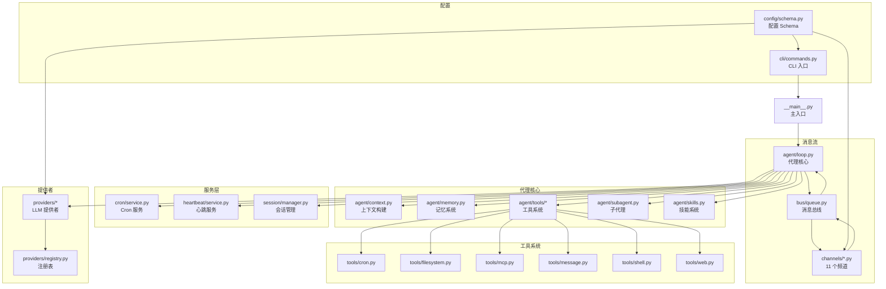

# nanobot 模块化分析报告

## 📊 模块概览

- **总模块数**: 14 个核心模块
- **总代码文件**: 72 个 Python 文件
- **代码规模**: ~3,935 行（核心代理）
- **架构风格**: 事件驱动 + 消息总线

---

## 🏗️ 模块依赖图



---

## 📦 模块详细分析

### 1. CLI 模块 (`cli/`)

**职责**: 命令行接口，用户交互入口

**文件**:
- `__init__.py` (30 字节)
- `commands.py` (38,627 字节) - 主 CLI 实现

**关键功能**:
- Typer CLI 框架
- 交互式 REPL 模式（prompt_toolkit）
- 命令：start, status, config, cron, clean
- 富文本输出（Rich）
- 命令历史持久化

**依赖**:
- `nanobot.config.schema.Config`
- `nanobot.agent.loop.AgentLoop`
- `nanobot.cron.service.CronService`

**代码片段** (`cli/commands.py:1-30`):
```python
"""CLI commands for nanobot."""

import asyncio
import os
import select
import signal
import sys
from pathlib import Path

import typer
from prompt_toolkit import PromptSession
from prompt_toolkit.formatted_text import HTML
from prompt_toolkit.history import FileHistory
from prompt_toolkit.patch_stdout import patch_stdout
from rich.console import Console
from rich.markdown import Markdown
from rich.table import Table
from rich.text import Text

from nanobot import __logo__, __version__
from nanobot.config.schema import Config
from nanobot.utils.helpers import sync_workspace_templates

app = typer.Typer(
    name="nanobot",
    help=f"{__logo__} nanobot - Personal AI Assistant",
    no_args_is_help=True,
)
```

---

### 2. 代理核心模块 (`agent/`)

**职责**: AI 代理核心处理引擎

**文件**:
- `__init__.py` (281 字节)
- `context.py` (6,466 字节) - 上下文构建
- `loop.py` (22,532 字节) - 代理循环核心
- `memory.py` (5,727 字节) - 记忆系统
- `skills.py` (8,260 字节) - 技能系统
- `subagent.py` (9,713 字节) - 子代理管理
- `tools/` (8 个工具文件)

#### 2.1 AgentLoop (`agent/loop.py`)

**关键功能**:
1. 接收消息总线消息
2. 构建上下文（历史、记忆、技能）
3. 调用 LLM
4. 执行工具调用
5. 发送响应

**代码片段** (`agent/loop.py:1-80`):
```python
"""Agent loop: the core processing engine."""

from __future__ import annotations

import asyncio
import json
import re
import weakref
from contextlib import AsyncExitStack
from pathlib import Path
from typing import TYPE_CHECKING, Any, Awaitable, Callable

from loguru import logger

from nanobot.agent.context import ContextBuilder
from nanobot.agent.memory import MemoryStore
from nanobot.agent.subagent import SubagentManager
from nanobot.agent.tools.cron import CronTool
from nanobot.agent.tools.filesystem import EditFileTool, ListDirTool, ReadFileTool, WriteFileTool
from nanobot.agent.tools.message import MessageTool
from nanobot.agent.tools.registry import ToolRegistry
from nanobot.agent.tools.shell import ExecTool
from nanobot.agent.tools.spawn import SpawnTool
from nanobot.agent.tools.web import WebFetchTool, WebSearchTool
from nanobot.bus.events import InboundMessage, OutboundMessage
from nanobot.bus.queue import MessageBus
from nanobot.providers.base import LLMProvider
from nanobot.session.manager import Session, SessionManager

class AgentLoop:
    """
    The agent loop is the core processing engine.

    It:
    1. Receives messages from the bus
    2. Builds context with history, memory, skills
    3. Calls the LLM
    4. Executes tool calls
    5. Sends responses back
    """
```

**关键方法**:
- `__init__()`: 初始化代理循环
- `register_tools()`: 注册所有工具
- `process_message()`: 处理单条消息
- `_run_tool()`: 执行工具调用

#### 2.2 工具系统 (`agent/tools/`)

| 工具文件 | 大小 | 职责 |
|---------|------|------|
| `base.py` | 3,652 字节 | 工具基类 |
| `cron.py` | 4,821 字节 | Cron 定时任务 |
| `filesystem.py` | 7,951 字节 | 文件操作 |
| `mcp.py` | 3,913 字节 | MCP 集成 |
| `message.py` | 3,696 字节 | 消息发送 |
| `registry.py` | 2,079 字节 | 工具注册表 |
| `shell.py` | 5,812 字节 | Shell 执行 |
| `spawn.py` | 2,044 字节 | 子代理生成 |
| `web.py` | 7,439 字节 | Web 搜索/抓取 |

---

### 3. 频道模块 (`channels/`)

**职责**: 多平台聊天频道集成

**文件**:
- `__init__.py` (197 字节)
- `base.py` (3,535 字节) - 频道基类
- `manager.py` (9,305 字节) - 频道管理器
- 11 个频道实现（总计 200K+ 字节）

**支持的频道**:
| 频道 | 文件 | 大小 | 协议 |
|------|------|------|------|
| DingTalk | `dingtalk.py` | 16,959 字节 | WebSocket Stream |
| Discord | `discord.py` | 11,002 字节 | Gateway WebSocket |
| Email | `email.py` | 14,558 字节 | IMAP/SMTP |
| Feishu | `feishu.py` | 29,329 字节 | WebSocket |
| Matrix | `matrix.py` | 29,449 字节 | Matrix API + E2EE |
| MoChat | `mochat.py` | 36,264 字节 | 企业微信 |
| QQ | `qq.py` | 4,323 字节 | QQ 协议 |
| Slack | `slack.py` | 10,543 字节 | Slack API |
| Telegram | `telegram.py` | 19,537 字节 | Telegram Bot API |
| WhatsApp | `whatsapp.py` | 5,676 字节 | WebSocket Bridge |

**频道基类** (`channels/base.py:1-70`):
```python
"""Base channel interface for chat platforms."""

from abc import ABC, abstractmethod
from typing import Any

from loguru import logger

from nanobot.bus.events import InboundMessage, OutboundMessage
from nanobot.bus.queue import MessageBus


class BaseChannel(ABC):
    """
    Abstract base class for chat channel implementations.

    Each channel (Telegram, Discord, etc.) should implement this interface
    to integrate with the nanobot message bus.
    """

    name: str = "base"

    def __init__(self, config: Any, bus: MessageBus):
        self.config = config
        self.bus = bus
        self._running = False

    @abstractmethod
    async def start(self) -> None:
        """Start the channel and begin listening for messages."""
        pass

    @abstractmethod
    async def stop(self) -> None:
        """Stop the channel and clean up resources."""
        pass

    @abstractmethod
    async def send(self, msg: OutboundMessage) -> None:
        """Send a message through this channel."""
        pass

    def is_allowed(self, sender_id: str) -> bool:
        """Check if sender_id is permitted."""
        allow_list = getattr(self.config, "allow_from", [])
        if not allow_list:
            logger.warning("{}: allow_from is empty — all access denied", self.name)
            return False
        if "*" in allow_list:
            return True
        return str(sender_id) in allow_list
```

---

### 4. 提供者模块 (`providers/`)

**职责**: LLM 提供者抽象和实现

**文件**:
- `__init__.py` (319 字节)
- `base.py` (3,864 字节) - 提供者基类
- `custom_provider.py` (2,325 字节) - 自定义提供者
- `litellm_provider.py` (11,741 字节) - LiteLLM 提供者
- `openai_codex_provider.py` (11,749 字节) - OpenAI Codex
- `registry.py` (16,331 字节) - 提供者注册表
- `transcription.py` (1,892 字节) - 语音转写

**支持的提供者**:
- Custom (直接 OpenAI 兼容端点)
- OpenRouter (网关)
- AiHubMix (网关)
- DashScope (阿里云)
- ZhipuAI (智谱)
- VolcEngine (火山引擎)
- MiniMax
- Mistral
- Anthropic (支持 prompt caching)
- OpenAI (包括 Codex OAuth)

**提供者注册表** (`providers/registry.py:1-60`):
```python
"""
Provider Registry — single source of truth for LLM provider metadata.

Adding a new provider:
  1. Add a ProviderSpec to PROVIDERS below.
  2. Add a field to ProvidersConfig in config/schema.py.
  Done. Env vars, prefixing, config matching, status display all derive from here.

Order matters — it controls match priority and fallback. Gateways first.
"""

from __future__ import annotations

from dataclasses import dataclass
from typing import Any


@dataclass(frozen=True)
class ProviderSpec:
    """One LLM provider's metadata."""
    
    # identity
    name: str                       # config field name
    keywords: tuple[str, ...]       # model-name keywords for matching
    env_key: str                    # LiteLLM env var
    display_name: str = ""          # shown in status
    
    # model prefixing
    litellm_prefix: str = ""
    skip_prefixes: tuple[str, ...] = ()
    
    # gateway detection
    is_gateway: bool = False
    is_local: bool = False
    detect_by_key_prefix: str = ""
    detect_by_base_keyword: str = ""
    
    # OAuth support
    is_oauth: bool = False
    
    # Direct provider (bypass LiteLLM)
    is_direct: bool = False
    
    # Prompt caching support
    supports_prompt_caching: bool = False
```

---

### 5. 配置模块 (`config/`)

**职责**: 配置 Schema 定义和加载

**文件**:
- `schema.py` (约 15,000+ 字节) - Pydantic 配置模型

**配置类别**:
- WhatsApp, Telegram, Feishu, DingTalk
- Discord, Matrix, Email, Slack, MoChat, QQ
- LLM 提供者配置
- MCP 服务器配置
- 执行工具配置

**特点**:
- Pydantic v2
- 支持 camelCase 和 snake_case
- 类型安全验证
- 默认值完善

---

### 6. 消息总线 (`bus/`)

**职责**: 解耦频道和代理的消息队列

**文件**:
- `__init__.py` (236 字节)
- `events.py` (1,147 字节) - 事件定义
- `queue.py` (1,499 字节) - 队列实现

**消息总线** (`bus/queue.py:1-45`):
```python
"""Async message queue for decoupled channel-agent communication."""

import asyncio

from nanobot.bus.events import InboundMessage, OutboundMessage


class MessageBus:
    """
    Async message bus that decouples chat channels from the agent core.

    Channels push messages to the inbound queue, and the agent processes
    them and pushes responses to the outbound queue.
    """

    def __init__(self):
        self.inbound: asyncio.Queue[InboundMessage] = asyncio.Queue()
        self.outbound: asyncio.Queue[OutboundMessage] = asyncio.Queue()

    async def publish_inbound(self, msg: InboundMessage) -> None:
        """Publish a message from a channel to the agent."""
        await self.inbound.put(msg)

    async def consume_inbound(self) -> InboundMessage:
        """Consume the next inbound message (blocks until available)."""
        return await self.inbound.get()

    async def publish_outbound(self, msg: OutboundMessage) -> None:
        """Publish a response from the agent to channels."""
        await self.outbound.put(msg)
```

---

### 7. Cron 服务 (`cron/`)

**职责**: 定时任务调度

**文件**:
- `__init__.py` (199 字节)
- `service.py` (13,134 字节) - Cron 服务核心
- `types.py` (1,586 字节) - 类型定义

**调度类型**:
- `every`: 周期性执行（毫秒间隔）
- `cron`: Cron 表达式
- `at`: 一次性执行

---

### 8. 心跳服务 (`heartbeat/`)

**职责**: 周期性健康检查和主动任务

**文件**:
- `__init__.py` (141 字节)
- `service.py` (5,779 字节) - 心跳实现

---

### 9. 会话管理 (`session/`)

**职责**: 多会话隔离和状态管理

**文件**:
- `__init__.py` (135 字节)
- `manager.py` (7,400 字节) - 会话管理器

---

### 10. 技能系统 (`skills/`)

**职责**: 技能加载和管理

**文件**:
- `agent/skills.py` (8,260 字节) - 技能加载器
- `skills/` - 技能目录
- `skills/skill-creator/` - 技能创建器

**技能加载器** (`agent/skills.py:1-60`):
```python
"""Skills loader for agent capabilities."""

import json
import os
import re
import shutil
from pathlib import Path

BUILTIN_SKILLS_DIR = Path(__file__).parent.parent / "skills"


class SkillsLoader:
    """
    Loader for agent skills.

    Skills are markdown files (SKILL.md) that teach the agent how to use
    specific tools or perform certain tasks.
    """

    def __init__(self, workspace: Path, builtin_skills_dir: Path | None = None):
        self.workspace = workspace
        self.workspace_skills = workspace / "skills"
        self.builtin_skills = builtin_skills_dir or BUILTIN_SKILLS_DIR

    def list_skills(self, filter_unavailable: bool = True) -> list[dict[str, str]]:
        """List all available skills."""
        skills = []

        # Workspace skills (highest priority)
        if self.workspace_skills.exists():
            for skill_dir in self.workspace_skills.iterdir():
                if skill_dir.is_dir():
                    skill_file = skill_dir / "SKILL.md"
                    if skill_file.exists():
                        skills.append({
                            "name": skill_dir.name,
                            "path": str(skill_file),
                            "source": "workspace"
                        })
```

---

## 📊 模块统计

| 模块 | 文件数 | 总大小 | 代码行数 |
|------|--------|--------|----------|
| CLI | 2 | 38.6 KB | ~1,000 |
| Agent | 13 | 65.5 KB | ~1,700 |
| Channels | 13 | 190 KB | ~5,000 |
| Providers | 7 | 48 KB | ~1,200 |
| Config | 1 | 15 KB | ~400 |
| Bus | 3 | 3 KB | ~100 |
| Cron | 3 | 15 KB | ~400 |
| Heartbeat | 2 | 6 KB | ~150 |
| Session | 2 | 8 KB | ~200 |
| Skills | 2+ | 10 KB | ~250 |
| **总计** | **48+** | **~400 KB** | **~10,400** |

---

## 🔗 模块依赖关系

### 核心依赖链

```
用户输入
    ↓
CLI (Typer)
    ↓
AgentLoop
    ├→ MessageBus (双向)
    ├→ ContextBuilder
    ├→ MemoryStore
    ├→ ToolRegistry
    │   ├→ CronTool
    │   ├→ FileSystem Tools
    │   ├→ MCP Tools
    │   ├→ Web Tools
    │   └→ Shell Tools
    ├→ SubagentManager
    ├→ LLMProvider
    │   ├→ LiteLLMProvider
    │   ├→ CustomProvider
    │   └→ OpenAICodexProvider
    ├→ CronService
    ├→ HeartbeatService
    └→ SessionManager
    ↓
Channels (11 个实现)
    ↓
外部平台 (Discord/Slack/Feishu 等)
```

### 配置依赖

```
Config Schema (Pydantic)
    ├→ Channels Config (11 个频道配置)
    ├→ Providers Config (10+ 提供者配置)
    ├→ MCP Servers Config
    └→ Exec Tool Config
```

---

## 🎯 关键设计决策

### 1. 消息总线模式

**决策**: 使用 `asyncio.Queue` 实现轻量级消息总线

**理由**:
- 解耦频道和代理核心
- 异步非阻塞
- 零外部依赖
- 易于测试

**权衡**:
- ✅ 简单高效
- ❌ 不支持持久化（重启丢失）
- ❌ 不支持分布式

### 2. 提供者注册表模式

**决策**: 集中式 `ProviderSpec` 注册表

**理由**:
- 单一事实来源
- 添加新提供者只需 2 步
- 自动派生 env vars、前缀、状态显示

**代码** (`providers/registry.py:15-45`):
```python
@dataclass(frozen=True)
class ProviderSpec:
    """One LLM provider's metadata."""
    name: str                       # config field name
    keywords: tuple[str, ...]       # model-name keywords for matching
    env_key: str                    # LiteLLM env var
    display_name: str = ""
    litellm_prefix: str = ""
    is_gateway: bool = False
    is_direct: bool = False
    is_oauth: bool = False
    supports_prompt_caching: bool = False
```

### 3. 技能系统

**决策**: Markdown 文件（SKILL.md）作为技能定义

**理由**:
- 人类可读
- 版本控制友好
- 支持工作空间覆盖（workspace > builtin）
- 动态加载

### 4. 频道抽象

**决策**: 抽象基类 `BaseChannel` + 具体实现

**理由**:
- 统一接口（start/stop/send）
- 易于添加新频道
- 权限检查统一（`is_allowed()`）

---

## 📈 代码指标

- **总 Python 文件**: 72 个
- **核心代理代码**: ~3,935 行
- **总代码量**: ~10,400 行（含频道）
- **平均文件大小**: 5.5 KB
- **最大文件**: `cli/commands.py` (38.6 KB)
- **最小文件**: `cli/__init__.py` (30 字节)
- **模块数**: 14 个
- **工具数**: 8 个
- **频道数**: 11 个
- **提供者数**: 10+ 个

---

## 🔐 安全机制

### 1. 访问控制

- 每个频道支持 `allow_from` 白名单
- 空列表默认拒绝所有
- `"*"` 允许所有

### 2. 执行工具限制

- `restrict_to_workspace` 选项
- Shell 工具可配置安全模式
- 文件操作限制在工作空间

### 3. 会话隔离

- 多会话独立状态
- 频道级会话键（thread-scoped）

---

## 🚀 性能优化

### 1. Prompt 缓存

- Anthropic 提供者支持 `cache_control`
- 减少重复 token 消耗

### 2. 工具结果截断

- `_TOOL_RESULT_MAX_CHARS = 500`
- 防止上下文爆炸

### 3. 异步并发

- 全异步架构（asyncio）
- 频道独立运行
- 非阻塞 I/O

---

*生成时间：2026-03-02*
