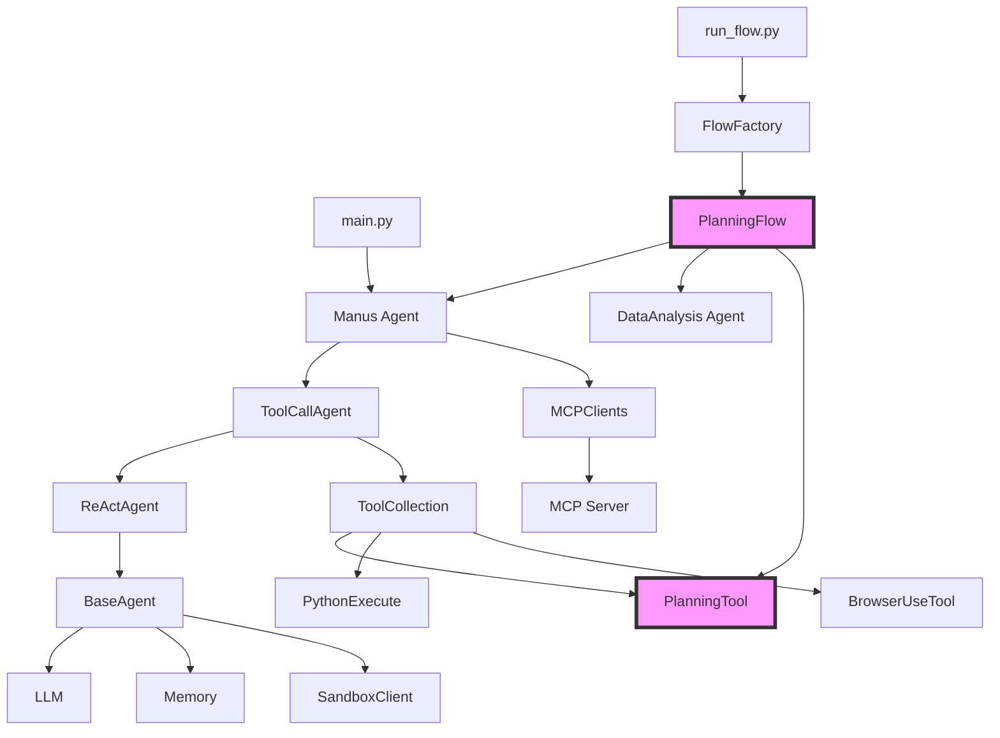

# 阶段 2：模块化分析

**执行日期**: 2026-03-04  
**分析范围**: 完整项目结构

---

## 📦 项目结构概览

```
OpenManus/
├── app/                          # 核心应用代码
│   ├── agent/                    # Agent 实现（12 个文件）
│   │   ├── base.py              # Agent 基类
│   │   ├── manus.py             # Manus 通用 Agent
│   │   ├── toolcall.py          # Tool Calling Agent
│   │   ├── react.py             # ReAct 模式 Agent
│   │   ├── browser.py           # Browser Agent
│   │   ├── data_analysis.py     # DataAnalysis Agent
│   │   ├── sandbox_agent.py     # Sandbox Agent
│   │   ├── mcp.py               # MCP Agent
│   │   └── swe.py               # SWE Agent
│   ├── flow/                     # 工作流编排（TOC 核心）
│   │   ├── base.py              # Flow 基类
│   │   ├── flow_factory.py      # Flow 工厂
│   │   └── planning.py          # PlanningFlow（核心）
│   ├── tool/                     # 工具集合（21+ 工具）
│   │   ├── tool_collection.py   # 工具集合管理
│   │   ├── planning.py          # PlanningTool
│   │   ├── browser_use_tool.py  # BrowserUseTool
│   │   ├── python_execute.py    # PythonExecute
│   │   ├── str_replace_editor.py# StrReplaceEditor
│   │   ├── bash.py              # Bash 工具
│   │   ├── ask_human.py         # AskHuman 工具
│   │   ├── mcp/                 # MCP 工具集成
│   │   └── chart_visualization/ # 数据可视化工具
│   ├── sandbox/                  # 沙箱环境
│   │   ├── core/
│   │   │   ├── sandbox.py       # DockerSandbox 核心
│   │   │   ├── terminal.py      # 终端接口
│   │   │   └── exceptions.py    # 异常定义
│   │   └── client.py            # 沙箱客户端
│   ├── prompt/                   # Prompt 模板
│   │   ├── manus.py             # Manus Prompt
│   │   ├── toolcall.py          # ToolCall Prompt
│   │   ├── browser.py           # Browser Prompt
│   │   ├── planning.py          # Planning Prompt
│   │   └── ...
│   ├── mcp/                      # MCP 服务
│   │   ├── server.py            # MCP Server
│   │   └── client.py            # MCP Client
│   ├── config.py                 # 配置管理
│   ├── llm.py                    # LLM 封装
│   ├── schema.py                 # Schema 定义
│   └── logger.py                 # 日志系统
├── protocol/a2a/                 # A2A 协议
├── tests/                        # 测试代码
├── main.py                       # 主入口（单 Agent）
├── run_flow.py                   # Flow 入口（多 Agent）
├── run_mcp.py                    # MCP 入口
└── sandbox_main.py               # 沙箱入口
```

---

## 🧩 核心模块清单

### 1. Agent 模块（app/agent/）

| 文件 | 职责 | 代码行 | 继承关系 |
|------|------|--------|----------|
| `base.py` | Agent 基类，状态管理，内存管理 | ~180 行 | ABC |
| `react.py` | ReAct 模式实现 | ~30 行 | BaseAgent |
| `toolcall.py` | Tool Calling 实现 | ~280 行 | ReActAgent |
| `manus.py` | Manus 通用 Agent | ~180 行 | ToolCallAgent |
| `browser.py` | Browser Agent | ~150 行 | ToolCallAgent |
| `data_analysis.py` | DataAnalysis Agent | ~50 行 | ToolCallAgent |
| `sandbox_agent.py` | Sandbox Agent | ~220 行 | ToolCallAgent |
| `mcp.py` | MCP Agent | ~180 行 | ToolCallAgent |
| `swe.py` | SWE Agent | ~30 行 | ToolCallAgent |

**总计**: 12 个文件，~1300 行代码

---

### 2. Flow 模块（app/flow/）- TOC 核心 ⭐

| 文件 | 职责 | 代码行 | 关键类 |
|------|------|--------|--------|
| `base.py` | Flow 基类 | ~50 行 | BaseFlow |
| `flow_factory.py` | Flow 工厂 | ~30 行 | FlowFactory |
| `planning.py` | PlanningFlow | ~450 行 | PlanningFlow, PlanStepStatus |

**总计**: 3 个文件，~530 行代码

**核心功能**:
- ✅ 计划创建和管理（PlanningTool）
- ✅ 步骤状态跟踪（not_started/in_progress/completed/blocked）
- ✅ 多 Agent 协同执行
- ✅ 步骤类型识别和 Agent 路由
- ✅ 进度追踪和最终总结

---

### 3. Tool 模块（app/tool/）

**工具分类**:

| 类别 | 工具数量 | 示例 |
|------|---------|------|
| **核心工具** | 5 | PlanningTool, Terminate, CreateChatCompletion |
| **执行工具** | 3 | PythonExecute, Bash, StrReplaceEditor |
| **浏览器工具** | 2 | BrowserUseTool, SandboxBrowserTool |
| **MCP 工具** | N+ | 动态加载（通过 MCP 协议） |
| **可视化工具** | 3 | VisualizationPrepare, DataVisualization, NormalPythonExecute |
| **交互工具** | 1 | AskHuman |

**总计**: 21+ 个工具

---

### 4. Sandbox 模块（app/sandbox/）

| 文件 | 职责 | 代码行 |
|------|------|--------|
| `core/sandbox.py` | DockerSandbox 核心实现 | ~450 行 |
| `core/terminal.py` | AsyncDockerizedTerminal | ~150 行 |
| `core/exceptions.py` | 沙箱异常定义 | ~30 行 |
| `client.py` | 沙箱客户端 | ~100 行 |

**总计**: ~730 行代码

**核心功能**:
- ✅ Docker 容器隔离执行
- ✅ 资源限制（内存/CPU/网络）
- ✅ 文件读写操作
- ✅ 命令执行和超时控制
- ✅ 安全清理机制

---

## 🔄 模块依赖关系



---

## 📊 模块统计

| 模块 | 文件数 | 代码行（估算） | 复杂度 |
|------|--------|---------------|--------|
| Agent | 12 | ~1,300 | 高 |
| Flow | 3 | ~530 | 高 |
| Tool | 21+ | ~2,500+ | 中 |
| Sandbox | 4 | ~730 | 高 |
| Prompt | 10 | ~500 | 低 |
| MCP | 2 | ~300 | 中 |
| **总计** | **52+** | **~5,860+** | - |

---

## 🎯 TOC 核心架构识别

### PlanningFlow 核心职责

1. **计划管理**: 通过 PlanningTool 创建/更新/跟踪计划
2. **步骤调度**: 识别当前步骤，分配合适的 Agent 执行
3. **状态跟踪**: 维护步骤状态（not_started → in_progress → completed）
4. **Agent 路由**: 根据步骤类型选择合适的 Agent（Browser/Coder/Executor）
5. **进度控制**: 超时保护，错误处理，最终总结

### 关键设计模式

- **工厂模式**: FlowFactory 创建不同类型的 Flow
- **策略模式**: PlanningFlow 根据步骤类型选择不同 Agent
- **状态模式**: PlanStepStatus 管理步骤状态
- **工具模式**: ToolCollection 统一管理工具

---

**完整性**: ✅ 所有核心模块已识别  
**下一步**: 阶段 3 - 多入口点追踪（调用链分析）
