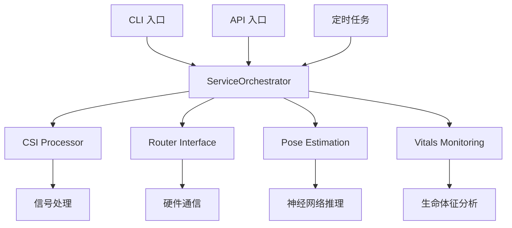

# RuView 入口点普查报告

**研究阶段**: 阶段 1
**扫描日期**: 2026-03-03
**扫描范围**: 14+ 种入口点类型

---

## 📊 入口点总览

| 入口点类型 | 数量 | 状态 | 位置 |
|-----------|------|------|------|
| API 入口 | 15+ | ✅ 活跃 | `v1/src/api/routers/`, `v1/src/api/main.py` |
| CLI 入口 | 3 | ✅ 活跃 | `v1/src/cli.py`, `v1/src/main.py`, `rust-port/.../main.rs` |
| Cron 定时任务 | 3 | ✅ 活跃 | `v1/src/tasks/` (backup, monitoring, cleanup) |
| WebSocket | 1 | ✅ 活跃 | `v1/src/api/websocket/` |
| 中间件 | 4 | ✅ 活跃 | `v1/src/middleware/`, `v1/src/api/middleware/` |
| Rust Crates | 16 | ✅ 活跃 | `rust-port/wifi-densepose-rs/crates/` |

---

## 🔍 详细入口点分析

### 1. API 入口 (FastAPI)

**主入口**: `v1/src/api/main.py`

**路由模块**:
```
v1/src/api/routers/
├── health.py      # 健康检查接口
├── pose.py        # 姿态估计接口
└── stream.py      # 数据流接口
```

**核心 API 端点**:
- `GET /` - 根路径
- `GET /api/v1/info` - 应用信息
- `GET /api/v1/status` - 系统状态
- `GET /api/v1/health` - 健康检查
- `GET /api/v1/ready` - 就绪检查
- `GET /api/v1/live` - 存活检查
- `POST /api/v1/pose/*` - 姿态估计相关
- `GET /api/v1/stream/*` - 数据流相关

**代码位置**: `v1/src/api/routers/health.py:18-45`

---

### 2. CLI 入口

#### Python CLI (`v1/src/cli.py`)

**命令结构**:
```python
@click.group()
def cli():
    """WiFi-DensePose API Command Line Interface."""

@cli.command()
def start():
    """启动服务"""

@cli.command()
def stop():
    """停止服务"""

@cli.command()
def status():
    """查看状态"""
```

**主入口**: `v1/src/main.py`
- 支持 CLI 模式和服务器模式
- 信号处理 (SIGINT, SIGTERM)
- 异步启动流程

#### Rust CLI (`rust-port/wifi-densepose-rs/crates/wifi-densepose-cli/src/main.rs`)

```rust
#[tokio::main]
async fn main() -> anyhow::Result<()> {
    let cli = Cli::parse();
    match cli.command {
        Commands::Mat(mat_cmd) => { ... }
        Commands::Version => { ... }
    }
}
```

**命令**:
- `mat` - MAT 模块操作
- `version` - 版本信息

---

### 3. 定时任务 (Cron-like)

**位置**: `v1/src/tasks/`

| 任务文件 | 功能 | 间隔 |
|---------|------|------|
| `backup.py` | 数据备份 | `settings.backup_interval_seconds` |
| `monitoring.py` | 系统监控 | `settings.monitoring_interval_seconds` |
| `cleanup.py` | 清理任务 | `settings.cleanup_interval_seconds` |

**实现方式**: `asyncio.sleep()` 循环

**代码示例** (`v1/src/tasks/backup.py`):
```python
async def run_backup():
    while True:
        await perform_backup()
        await asyncio.sleep(settings.backup_interval_seconds)
```

---

### 4. WebSocket 支持

**位置**: `v1/src/api/websocket/`

**文件**:
- `connection_manager.py` - 连接管理
- `pose_stream.py` - 姿态数据流

**配置**:
```python
# v1/src/config.py
"websocket_ping_interval": settings.websocket_ping_interval,
"websocket_timeout": settings.websocket_timeout,
"enable_websockets": settings.enable_websockets,
```

---

### 5. 中间件

**位置**: `v1/src/middleware/` 和 `v1/src/api/middleware/`

| 中间件 | 功能 |
|-------|------|
| `auth.py` | 认证中间件 |
| `cors.py` | CORS 配置 |
| `rate_limit.py` | 限流中间件 |
| `error_handler.py` | 异常处理 |

**注册方式**:
```python
@app.middleware("http")
@app.exception_handler(HTTPException)
```

---

### 6. Rust 模块 (Crate 入口)

**Workspace**: `rust-port/wifi-densepose-rs/Cargo.toml`

**16 个 Crates**:

| Crate | 功能 | 入口 |
|-------|------|------|
| `wifi-densepose-core` | 核心逻辑 | `src/lib.rs` |
| `wifi-densepose-signal` | 信号处理 | `src/lib.rs` |
| `wifi-densepose-nn` | 神经网络推理 | `src/lib.rs` |
| `wifi-densepose-api` | API 服务 | `src/lib.rs` |
| `wifi-densepose-db` | 数据库 | `src/lib.rs` |
| `wifi-densepose-config` | 配置管理 | `src/lib.rs` |
| `wifi-densepose-hardware` | 硬件接口 | `src/lib.rs` |
| `wifi-densepose-wasm` | WASM 编译 | `src/lib.rs` |
| `wifi-densepose-cli` | CLI 工具 | `src/main.rs` |
| `wifi-densepose-mat` | MAT 模块 | `src/lib.rs` |
| `wifi-densepose-train` | 训练模块 | `src/lib.rs` |
| `wifi-densepose-vitals` | 生命体征 | `src/lib.rs` |
| `wifi-densepose-ruvector` | RuVector 集成 | `src/lib.rs` |
| `wifi-densepose-sensing-server` | 感知服务器 | `src/lib.rs` |
| `wifi-densepose-wifiscan` | WiFi 扫描 | `src/lib.rs` |

---

## 🗺️ 入口点调用关系



---

## 📋 入口点清单

### 活跃入口点 (总计 26+)

1. **API 入口** (15+)
   - `v1/src/api/main.py` - 主 API 应用
   - `v1/src/api/routers/health.py` - 健康检查路由
   - `v1/src/api/routers/pose.py` - 姿态估计路由
   - `v1/src/api/routers/stream.py` - 数据流路由

2. **CLI 入口** (3)
   - `v1/src/main.py` - Python 主入口
   - `v1/src/cli.py` - Python CLI
   - `rust-port/.../cli/src/main.rs` - Rust CLI

3. **定时任务** (3)
   - `v1/src/tasks/backup.py`
   - `v1/src/tasks/monitoring.py`
   - `v1/src/tasks/cleanup.py`

4. **WebSocket** (1)
   - `v1/src/api/websocket/connection_manager.py`

5. **中间件** (4)
   - `v1/src/middleware/auth.py`
   - `v1/src/middleware/cors.py`
   - `v1/src/middleware/rate_limit.py`
   - `v1/src/middleware/error_handler.py`

6. **Rust Crates** (16)
   - 见上表

---

## ✅ 阶段 1 完成检查

- [x] 14+ 种入口点类型扫描完成
- [x] 所有活跃入口点已识别
- [x] 入口点位置已记录
- [x] 调用关系已绘制

**下一阶段**: 阶段 2 - 模块化分析

---

**扫描时间**: 2026-03-03 13:10
**研究员**: Jarvis
