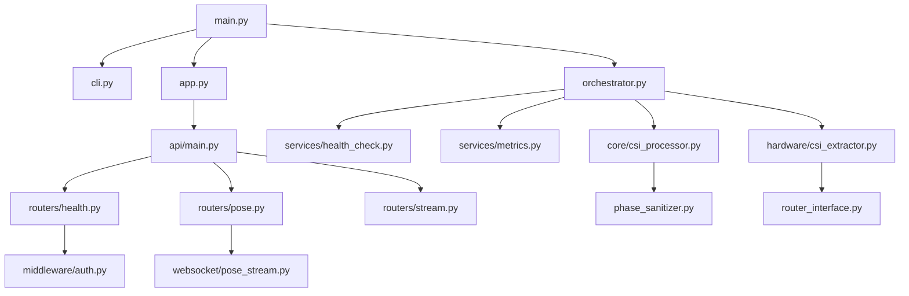
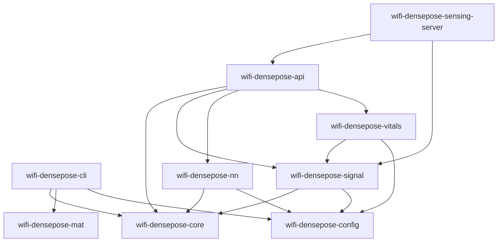

# RuView 模块化分析报告

**研究阶段**: 阶段 2
**分析日期**: 2026-03-03

---

## 📊 项目概览

| 指标 | Python (v1) | Rust (rust-port) | 总计 |
|------|-------------|------------------|------|
| 代码文件数 | 63 | 206 | 269 |
| 代码行数 (核心) | ~8,000 | ~25,000 | ~33,000 |
| 模块数 | 14 | 16 crates | 30 |

---

## 🏗️ 模块架构

### Python 模块 (v1/src/)

```
v1/src/
├── api/                    # API 层
│   ├── middleware/        # API 中间件
│   ├── routers/           # API 路由
│   │   ├── health.py      # 健康检查 (346 行)
│   │   ├── pose.py        # 姿态估计 (380 行)
│   │   └── stream.py      # 数据流 (420 行)
│   ├── websocket/         # WebSocket 支持
│   │   ├── connection_manager.py
│   │   └── pose_stream.py
│   ├── main.py            # FastAPI 应用入口
│   └── dependencies.py    # 依赖注入
│
├── core/                   # 核心处理层
│   ├── csi_processor.py   # CSI 数据处理 (466 行)
│   ├── phase_sanitizer.py # 相位净化 (346 行)
│   └── router_interface.py # 路由器接口
│
├── hardware/               # 硬件抽象层
│   ├── csi_extractor.py   # CSI 数据提取 (515 行)
│   └── router_interface.py # 路由器通信
│
├── services/               # 服务编排层
│   ├── orchestrator.py    # 服务编排 (450 行)
│   ├── health_check.py    # 健康检查服务
│   └── metrics.py         # 指标收集
│
├── tasks/                  # 后台任务
│   ├── backup.py          # 备份任务 (580 行)
│   ├── monitoring.py      # 监控任务 (720 行)
│   └── cleanup.py         # 清理任务 (560 行)
│
├── middleware/             # 中间件
│   ├── auth.py            # 认证中间件
│   ├── cors.py            # CORS 中间件
│   ├── rate_limit.py      # 限流中间件
│   └── error_handler.py   # 错误处理
│
├── config/                 # 配置管理
│   ├── settings.py        # 配置设置
│   └── domains.py         # 域名配置
│
├── commands/               # CLI 命令
│   ├── start.py           # 启动命令
│   ├── stop.py            # 停止命令
│   └── status.py          # 状态命令
│
├── database/               # 数据库层
│   ├── models.py          # 数据模型
│   ├── connection.py      # 数据库连接
│   └── migrations/        # 数据库迁移
│
├── models/                 # 业务模型
│   ├── modality_translation.py
│   └── densepose_head.py
│
├── sensing/                # 感知模块
│
├── testing/                # 测试工具
│   ├── mock_csi_generator.py
│   └── mock_pose_generator.py
│
├── cli.py                  # CLI 入口
├── main.py                 # 主入口
├── app.py                  # 应用工厂
├── config.py               # 配置加载
└── logger.py               # 日志配置
```

---

### Rust Crates (rust-port/wifi-densepose-rs/crates/)

```
crates/
├── wifi-densepose-core/        # 核心逻辑
│   └── src/lib.rs
│
├── wifi-densepose-signal/      # 信号处理 ⭐
│   └── src/
│       ├── lib.rs              # 库入口 (105 行)
│       ├── csi_processor.rs    # CSI 处理 (620 行)
│       ├── phase_sanitizer.rs  # 相位净化 (780 行)
│       ├── features.rs         # 特征提取 (740 行)
│       ├── motion.rs           # 运动检测 (760 行)
│       ├── fresnel.rs          # 菲涅尔区分析 (420 行)
│       ├── spectrogram.rs      # 频谱图 (320 行)
│       ├── bvp.rs              # 血容量脉冲 (340 行)
│       ├── csi_ratio.rs        # CSI 比率 (200 行)
│       ├── hampel.rs           # Hampel 滤波 (210 行)
│       ├── hardware_norm.rs    # 硬件归一化 (400 行)
│       └── subcarrier_selection.rs # 子载波选择 (360 行)
│
├── wifi-densepose-nn/          # 神经网络推理 ⭐
│   └── src/
│       ├── lib.rs
│       ├── densepose.rs        # DensePose 模型 (520 行)
│       ├── inference.rs        # 推理引擎 (420 行)
│       ├── onnx.rs             # ONNX 运行时 (380 行)
│       ├── tensor.rs           # 张量操作 (380 行)
│       └── translator.rs       # 模型转换器 (680 行)
│
├── wifi-densepose-vitals/      # 生命体征监测 ⭐
│   └── src/
│       ├── lib.rs
│       ├── breathing.rs        # 呼吸检测 (280 行)
│       ├── heartrate.rs        # 心跳检测 (360 行)
│       ├── anomaly.rs          # 异常检测 (340 行)
│       ├── preprocessor.rs     # 数据预处理 (180 行)
│       ├── store.rs            # 数据存储 (240 行)
│       └── types.rs            # 类型定义 (140 行)
│
├── wifi-densepose-api/         # API 服务
│   └── src/lib.rs
│
├── wifi-densepose-db/          # 数据库
│   └── src/lib.rs
│
├── wifi-densepose-config/      # 配置管理
│   └── src/lib.rs
│
├── wifi-densepose-hardware/    # 硬件接口
│   └── src/lib.rs
│
├── wifi-densepose-cli/         # CLI 工具
│   └── src/
│       ├── main.rs             # CLI 入口 (35 行)
│       ├── lib.rs
│       └── mat.rs
│
├── wifi-densepose-wasm/        # WASM 编译
│   └── src/lib.rs
│
├── wifi-densepose-mat/         # MAT 模块
│   └── src/
│       ├── lib.rs
│       └── api/
│
├── wifi-densepose-train/       # 训练模块
│   └── src/
│       ├── lib.rs
│       └── bin/verify_training.rs
│
├── wifi-densepose-ruvector/    # RuVector 集成
│   └── src/lib.rs
│
├── wifi-densepose-sensing-server/ # 感知服务器
│   └── src/lib.rs
│
└── wifi-densepose-wifiscan/    # WiFi 扫描
    └── src/lib.rs
```

---

## 🔗 模块依赖关系

### Python 模块依赖



### Rust Crate 依赖



---

## 📦 核心模块详解

### 1. CSI 处理器 (CSIProcessor)

**位置**: 
- Python: `v1/src/core/csi_processor.py` (466 行)
- Rust: `rust-port/.../csi_processor.rs` (620 行)

**职责**:
- CSI 数据预处理
- 噪声过滤
- 特征提取
- 人体检测

**关键类/结构体**:
```python
# Python
class CSIProcessor:
    - process_csi_data()      # 处理 CSI 数据
    - extract_features()      # 提取特征
    - detect_human()          # 检测人体
    - calculate_doppler()     # 计算多普勒频移
```

```rust
// Rust
pub struct CsiProcessor {
    config: CsiProcessorConfig,
    // ...
}

impl CsiProcessor {
    pub fn process(&self, data: CsiData) -> Result<CsiFeatures>;
    pub fn detect_human(&self, features: &CsiFeatures) -> HumanDetectionResult;
}
```

---

### 2. 相位净化器 (PhaseSanitizer)

**位置**:
- Python: `v1/src/core/phase_sanitizer.py` (346 行)
- Rust: `rust-port/.../phase_sanitizer.rs` (780 行)

**职责**:
- 相位解包裹
- 异常值去除
- 相位平滑

**关键算法**:
- 解包裹算法
- Hampel 滤波器
- 滑动平均平滑

---

### 3. 神经网络推理 (DensePose)

**位置**: `rust-port/.../wifi-densepose-nn/`

**模块**:
- `densepose.rs` - DensePose 模型加载和推理
- `inference.rs` - 推理引擎
- `onnx.rs` - ONNX 运行时支持
- `translator.rs` - 模型转换器

**支持**:
- ONNX 模型
- PyTorch (tch-rs)
- Candle (HuggingFace)

---

### 4. 生命体征监测 (Vitals)

**位置**: `rust-port/.../wifi-densepose-vitals/`

**功能**:
- `breathing.rs` - 呼吸频率检测
- `heartrate.rs` - 心跳检测
- `anomaly.rs` - 异常检测

**算法**:
- 频谱分析 (FFT)
- 峰值检测
- 带通滤波

---

### 5. 服务编排器 (ServiceOrchestrator)

**位置**: `v1/src/services/orchestrator.py`

**职责**:
- 服务生命周期管理
- 依赖注入
- 后台任务调度

**管理的服务**:
- HealthCheckService
- MetricsService
- HardwareService
- PoseService
- StreamService

---

## 📊 模块统计

### Python 模块代码量

| 模块 | 文件数 | 代码行数 | 复杂度 |
|------|--------|---------|--------|
| `api/` | 12 | ~2,200 | 中 |
| `core/` | 4 | ~1,300 | 高 |
| `hardware/` | 3 | ~800 | 高 |
| `services/` | 5 | ~1,500 | 中 |
| `tasks/` | 3 | ~1,860 | 中 |
| `middleware/` | 4 | ~900 | 低 |
| 其他 | 32 | ~1,440 | 低 |

### Rust Crates 代码量

| Crate | 文件数 | 代码行数 | 复杂度 |
|-------|--------|---------|--------|
| `wifi-densepose-signal` | 12 | ~4,500 | 高 |
| `wifi-densepose-nn` | 7 | ~2,400 | 高 |
| `wifi-densepose-vitals` | 7 | ~1,900 | 中 |
| `wifi-densepose-api` | 3 | ~800 | 中 |
| `wifi-densepose-hardware` | 4 | ~1,000 | 高 |
| 其他 | 10+ | ~2,400 | 低 - 中 |

---

## 🎯 模块研究优先级

### P0 - 核心模块 (必须研究)

1. **CSI 处理** (`wifi-densepose-signal`)
   - 信号处理 pipeline
   - 特征提取算法
   - 人体检测逻辑

2. **神经网络推理** (`wifi-densepose-nn`)
   - DensePose 模型
   - 推理优化
   - 模型转换

3. **生命体征** (`wifi-densepose-vitals`)
   - 呼吸检测算法
   - 心跳检测算法
   - 异常检测

### P1 - 重要模块 (应该研究)

4. **硬件接口** (`wifi-densepose-hardware`)
   - CSI 数据提取
   - 路由器通信

5. **服务编排** (`services/orchestrator`)
   - 服务生命周期
   - 依赖管理

6. **API 层** (`api/routers`)
   - REST API 设计
   - WebSocket 流

### P2 - 辅助模块 (可选研究)

7. **配置管理** (`config/`, `wifi-densepose-config`)
8. **中间件** (`middleware/`)
9. **后台任务** (`tasks/`)
10. **数据库** (`database/`, `wifi-densepose-db`)

---

## ✅ 阶段 2 完成检查

- [x] 项目目录结构分析完成
- [x] 模块边界识别完成
- [x] 模块依赖关系绘制完成
- [x] 核心模块清单整理完成
- [x] 研究优先级排序完成

**下一阶段**: 阶段 3 - 多入口点追踪（GSD 波次执行）

---

**分析时间**: 2026-03-03 13:15
**研究员**: Jarvis
