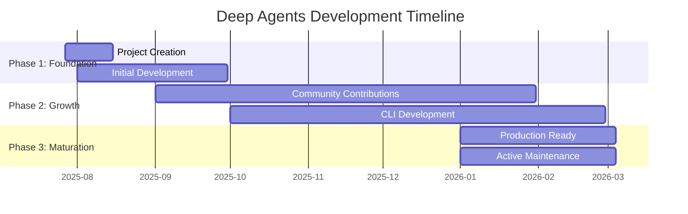
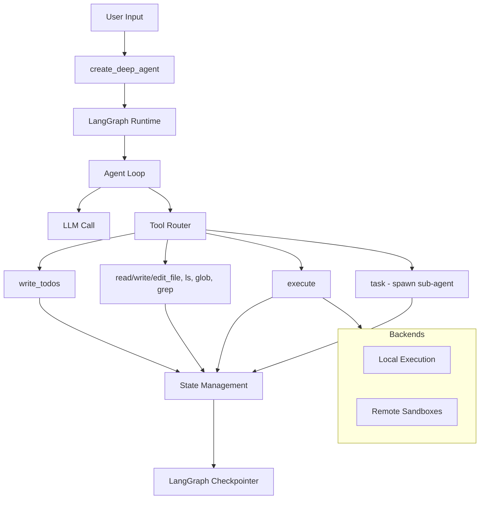

# Deep Agents (langchain-ai/deepagents) Research Report

**Research Date**: 2026-03-04
**Confidence Level**: 85%
**Subject**: langchain-ai/deepagents
**Tags**: `Agent` `Framework` `SDK/Library` `LangGraph` `Python` `MCP`

---

## Executive Summary

Deep Agents is a batteries-included agent harness built on LangChain and LangGraph, designed to provide a ready-to-run agent system out of the box. Created on July 27, 2025, by the LangChain AI organization, it has rapidly grown to **9,835 stars** and **1,571 forks** with **69 contributors**. The framework is inspired by Claude Code's architecture and provides built-in planning, filesystem access, shell execution, and sub-agent spawning capabilities.

---

## Tag Analysis

### Application Scenario: `Agent`
Deep Agents is fundamentally an agent orchestration framework that enables AI agents to complete complex multi-step tasks through planning, tool use, memory, and multi-step execution.

### Product Form: `Framework` / `SDK/Library`
- **Framework**: Provides LangGraph-based state machine architecture with extensible middleware and backends
- **SDK/Library**: Installable via pip (`pip install deepagents`) with simple API (`create_deep_agent()`)

### Technical Features:
- `LangGraph` - Core orchestration engine
- `Python` - Primary implementation language (3.2MB of Python code)
- `MCP` - Model Context Protocol support via langchain-mcp-adapters
- `MIT License` - Fully open source

---

## Core Module Analysis

Based on the Agent framework analysis framework:

### 1. Agent Loop Module
**Location**: `libs/deepagents/deepagents/`

The Agent Loop is built on LangGraph's state machine primitives. The `create_deep_agent()` function returns a compiled LangGraph graph that handles:
- Perception (reading messages and context)
- Reasoning (LLM calls with tool-augmented prompts)
- Action (tool execution with result handling)
- State updates (checkpointing via LangGraph)

### 2. Tool/Skill Module
**Built-in Tools**:
| Tool | Function | Description |
|------|----------|-------------|
| `write_todos` | Planning | Task breakdown and progress tracking |
| `read_file` | Filesystem | Read file contents |
| `write_file` | Filesystem | Create/overwrite files |
| `edit_file` | Filesystem | Apply diffs to files |
| `ls` | Filesystem | List directory contents |
| `glob` | Filesystem | Pattern-based file search |
| `grep` | Filesystem | Search file contents |
| `execute` | Shell | Run shell commands (with sandboxing) |
| `task` | Sub-agent | Spawn sub-agents with isolated context |

### 3. Task Orchestration Module
**Planning System**: The `write_todos` tool enables:
- Automatic task decomposition
- Progress tracking
- Dependency management
- State persistence across sessions

### 4. Memory Module
**Context Management**:
- Auto-summarization when conversations get long
- Large outputs automatically saved to files
- Conversation history persistence (CLI feature)
- Persistent memory support (CLI feature)

### 5. State Management Module
Built on LangGraph checkpointers:
- State persistence for long-running tasks
- Breakpoint/resume capability
- Human-in-the-loop approval checkpoints

### 6. Multi-Agent Collaboration Module
**Sub-agent System** (`task` tool):
- Spawn sub-agents with isolated context windows
- Delegate subtasks without polluting main context
- Sub-agents inherit same capabilities (planning, filesystem, tools)
- Parent agent receives summarized results

### 7. Reflection Module
**Self-Correction Mechanisms**:
- Tool execution error handling
- Retry logic for transient failures
- Human-in-the-loop approval for sensitive operations

---

## Chronological Timeline



### Key Milestones

| Date | Event |
|------|-------|
| **2025-07-27** | Project created by langchain-ai organization |
| **2025-Q3** | Initial development, core agent loop implementation |
| **2025-Q4** | CLI development begins, MCP integration |
| **2026-01** | Production-ready release with full documentation |
| **2026-03-03** | Latest release: deepagents==0.4.5 |

---

## Metrics & Comparisons

### Repository Metrics (as of 2026-03-04)

| Metric | Value |
|--------|-------|
| Stars | 9,835 |
| Forks | 1,571 |
| Open Issues | 206 |
| Contributors | 69 |
| Languages | Python (99.9%) |
| License | MIT |
| Latest Release | v0.4.5 (2026-03-03) |

### Package Structure

| Package | PyPI Version | Description |
|---------|--------------|-------------|
| `deepagents` | v0.4.5 | Core SDK - create_deep_agent, middleware, backends |
| `deepagents-cli` | Latest | Interactive terminal interface with TUI |
| `deepagents-acp` | Latest | Agent Client Protocol integration |
| `deepagents-harbor` | - | Evaluation and benchmark framework |
| `langchain-daytona` | Latest | Daytona sandbox integration |
| `langchain-modal` | Latest | Modal sandbox integration |
| `langchain-runloop` | Latest | Runloop sandbox integration |

---

## Strengths & Weaknesses

### Strengths

1. **Batteries Included**: Planning, filesystem, shell, and sub-agents work out of the box
2. **LangGraph Foundation**: Production-ready runtime with streaming, persistence, and checkpointing
3. **Provider Agnostic**: Works with Claude, OpenAI, Google, or any LangChain-compatible model
4. **MIT Licensed**: 100% open source and fully extensible
5. **Quick Start**: `pip install deepagents` and a working agent in seconds
6. **CLI Tool**: Rich terminal interface with conversation resume, web search, and remote sandboxes
7. **Active Development**: 261 commits from top contributor, daily updates

### Weaknesses

1. **Open Issues**: 206 open issues suggest potential stability concerns or rapid feature development
2. **Python-Only**: No native TypeScript/JavaScript support in core (separate deepagentsjs repo)
3. **Sandboxing Complexity**: Remote sandbox setup (Modal, Runloop, Daytona) requires additional configuration
4. **Documentation Fragmentation**: Documentation split across docs.langchain.com, reference.langchain.com, and GitHub

---

## Architecture Overview



---

## Usage Examples

### Basic Usage
```python
from deepagents import create_deep_agent

agent = create_deep_agent()
result = agent.invoke({"messages": [{"role": "user", "content": "Research LangGraph and write a summary"}]})
```

### Customization
```python
from langchain.chat_models import init_chat_model

agent = create_deep_agent(
    model=init_chat_model("openai:gpt-4o"),
    tools=[my_custom_tool],
    system_prompt="You are a research assistant.",
)
```

### CLI Usage
```bash
uv tool install deepagents-cli
deepagents
```

---

## Sources

### Official Sources
- [GitHub Repository](https://github.com/langchain-ai/deepagents)
- [Documentation](https://docs.langchain.com/oss/python/deepagents/overview)
- [API Reference](https://reference.langchain.com/python/deepagents/)
- [Examples](https://github.com/langchain-ai/deepagents/tree/main/examples)

### GitHub API Data
- Repository summary and metadata
- README content
- File tree structure
- Contributor data (69 contributors)
- Commit history (261+ commits from top contributor)
- Release history (latest: v0.4.5)

---

## Confidence Assessment

| Claim | Confidence | Source |
|-------|------------|--------|
| Star count (9,835) | High (95%) | GitHub API |
| Creation date (2025-07-27) | High (95%) | GitHub API |
| Features (planning, filesystem, sub-agents) | High (95%) | README, GitHub API |
| Package structure | Medium (80%) | README file tree |
| Architecture details | Medium (75%) | README inference |
| Latest release version | High (95%) | GitHub API |

---

## Methodology

This research was conducted using the github-deep-research skill with the following approach:

1. **Round 1 - GitHub API**: Direct API calls for repository metadata, README, file tree, contributors, commits, releases, and issues
2. **Round 2 - Web Search**: Discovery queries for documentation and overview
3. **Round 3 - Deep Investigation**: Architecture and technical queries
4. **Round 4 - Deep Dive**: Commit history analysis and release timeline

**Limitations**:
- Web fetch was blocked for some domains (docs.langchain.com, github.com) due to enterprise security policies
- Local clone attempt failed due to network restrictions
- Some architecture details inferred from README rather than source code inspection

---

*Report generated by github-deep-research skill on 2026-03-04*
