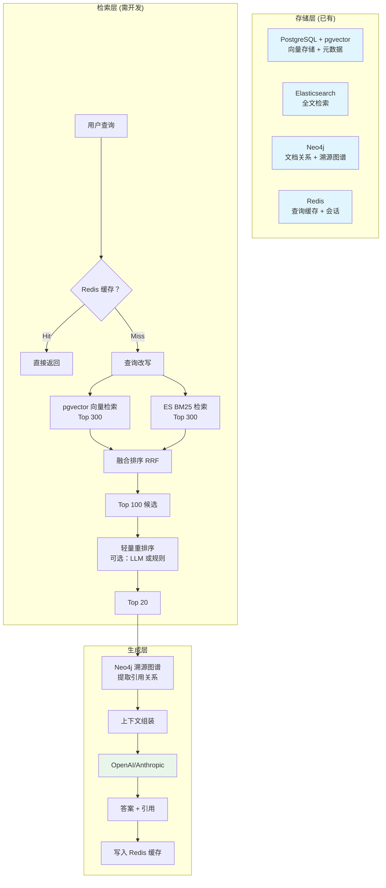

# 混合 RAG 架构设计

## 整体架构图



---

## 存储层设计

### 1. PostgreSQL + pgvector

#### 核心表结构

```sql
-- 启用 pgvector 扩展
CREATE EXTENSION IF NOT EXISTS vector;

-- 文档表
CREATE TABLE documents (
    id UUID PRIMARY KEY DEFAULT gen_random_uuid(),
    title VARCHAR(500) NOT NULL,
    content TEXT NOT NULL,
    source VARCHAR(200),  -- 来源系统/文件路径
    doc_type VARCHAR(50), -- 文档类型：manual/spec/faq/etc
    metadata JSONB DEFAULT '{}',
    created_at TIMESTAMP DEFAULT CURRENT_TIMESTAMP,
    updated_at TIMESTAMP DEFAULT CURRENT_TIMESTAMP,
    is_deleted BOOLEAN DEFAULT FALSE
);

-- 向量嵌入表
CREATE TABLE document_embeddings (
    doc_id UUID PRIMARY KEY REFERENCES documents(id) ON DELETE CASCADE,
    embedding vector(1536),  -- OpenAI text-embedding-3-large
    content_hash VARCHAR(64), -- 用于增量更新检测
    embedded_at TIMESTAMP DEFAULT CURRENT_TIMESTAMP
);

-- 创建 HNSW 索引（关键：支持百万级）
CREATE INDEX ON document_embeddings 
USING hnsw (embedding vector_cosine_ops)
WITH (m = 16, ef_construction = 64);

-- 创建 GIN 索引用于 metadata 查询
CREATE INDEX ON documents USING GIN (metadata);
```

#### pgvector 配置优化

```sql
-- 调整 HNSW 参数（百万级文档）
-- m: 每个节点的邻居数（越大精度越高，构建越慢）
-- ef_construction: 构建时的搜索深度

-- 查询时调整 ef_search
SET hnsw.ef_search = 40;  -- 默认 40，可调高到 64-128 提高精度

-- 向量相似度查询
SELECT 
    d.id,
    d.title,
    d.content,
    1 - (de.embedding <=> $1) AS similarity  -- <=> 是余弦距离
FROM documents d
JOIN document_embeddings de ON d.id = de.doc_id
WHERE d.is_deleted = FALSE
ORDER BY de.embedding <=> $1
LIMIT 300;
```

### 2. Elasticsearch

#### 索引映射

```json
{
  "mappings": {
    "properties": {
      "doc_id": { "type": "keyword" },
      "title": { 
        "type": "text",
        "fields": { "keyword": { "type": "keyword" } },
        "boost": 3
      },
      "content": { "type": "text" },
      "keywords": { "type": "keyword" },
      "doc_type": { "type": "keyword" },
      "created_at": { "type": "date" },
      "updated_at": { "type": "date" }
    }
  }
}
```

#### 查询示例

```json
{
  "query": {
    "multi_match": {
      "query": "用户查询",
      "fields": ["title^3", "content", "keywords"],
      "type": "best_fields",
      "fuzziness": "AUTO"
    }
  },
  "size": 300
}
```

### 3. Neo4j

#### 图谱模型

```cypher
// 文档节点
CREATE (d:Document {
    id: 'uuid-xxx',
    title: '产品手册',
    doc_type: 'manual',
    source: 'confluence/xxx'
})

// 章节节点
CREATE (s:Section {
    id: 'section-yyy',
    title: '安装指南',
    content: '...',
    order: 1
})

// 关系
CREATE (d)-[:CONTAINS]->(s)
CREATE (s)-[:REFERENCES]->(otherSection)
CREATE (s)-[:MENTIONS {entity: '产品 A'}]->(e:Entity {name: '产品 A'})
```

#### 溯源查询

```cypher
// 查询匹配章节及其引用链
MATCH (s:Section {id: $section_id})
OPTIONAL MATCH path = (s)-[:REFERENCES*0..3]->(related:Section)
RETURN 
    s.title AS source_title,
    s.content AS source_content,
    [node IN nodes(path) | {
        title: node.title,
        doc_id: node.doc_id
    }] AS reference_chain
```

### 4. Redis

#### Key 设计

```
# 查询缓存
rag:query:{query_hash} → JSON{answer, references, timestamp}  (TTL 24h)

# 会话历史
rag:session:{user_id} → JSON[{role, content, timestamp}...]  (TTL 1h)

# Embedding 缓存
rag:embedding:{content_hash} → vector[float32]  (永久)

# 热门查询统计
rag:hot_queries → ZSET{query: count}  (TTL 7d)
```

---

## 检索层设计

### 1. 查询改写

```python
async def rewrite_query(query: str) -> list[str]:
    """
    查询改写策略：
    1. 同义词扩展
    2. 缩写展开
    3. 业务术语标准化
    """
    # 规则改写
    rewritten = [query]
    
    # 同义词扩展
    synonyms = await get_synonyms(query)
    rewritten.extend(synonyms)
    
    # LLM 改写（可选）
    llm_expanded = await llm_rewrite(query)
    rewritten.extend(llm_expanded)
    
    return list(set(rewritten))
```

### 2. RRF 融合算法

```python
def reciprocal_rank_fusion(
    vector_results: list[Doc],
    es_results: list[Doc],
    k: int = 60,
    top_k: int = 300
) -> list[Doc]:
    """
    RRF (Reciprocal Rank Fusion) 融合多路检索结果
    
    Score = 1/(k + rank_vector) + 1/(k + rank_es)
    """
    scores = defaultdict(float)
    
    for rank, doc in enumerate(vector_results):
        scores[doc.id] += 1.0 / (k + rank + 1)
    
    for rank, doc in enumerate(es_results):
        scores[doc.id] += 1.0 / (k + rank + 1)
    
    # 合并文档信息
    all_docs = {doc.id: doc for doc in vector_results + es_results}
    
    # 按融合分数排序
    ranked = sorted(scores.items(), key=lambda x: x[1], reverse=True)
    
    return [all_docs[doc_id] for doc_id, _ in ranked[:top_k]]
```

### 3. 规则重排序

```python
def rerank_with_rules(
    results: list[Doc],
    query: str
) -> list[Doc]:
    """
    基于规则的重排序
    """
    query_terms = set(query.lower().split())
    
    for doc in results:
        score = doc.rrf_score
        
        # 官方文档加权
        if doc.metadata.get('is_official'):
            score *= 1.5
        
        # 新文档加权
        if doc.created_at > datetime.now() - timedelta(days=90):
            score *= 1.2
        
        # 标题匹配加权
        if any(term in doc.title.lower() for term in query_terms):
            score *= 1.3
        
        # 完整匹配加权
        if query.lower() in doc.content.lower():
            score *= 1.4
        
        doc.final_score = score
    
    return sorted(results, key=lambda x: x.final_score, reverse=True)
```

---

## 生成层设计

### 1. 上下文组装

```python
async def build_context(
    top_docs: list[Doc],
    max_tokens: int = 4000
) -> tuple[str, list[Reference]]:
    """
    组装上下文，确保不超过 LLM token 限制
    """
    context_parts = []
    references = []
    current_tokens = 0
    
    for i, doc in enumerate(top_docs[:20]):
        # 从 Neo4j 获取引用关系
        ref_chain = await neo4j.get_references(doc.id)
        
        # 截取内容（估算 token）
        content = truncate_to_tokens(doc.content, max_tokens=500)
        
        context_parts.append(f"""
[引用 {i+1}] {doc.title}
来源：{doc.metadata.get('source', 'Unknown')}
内容：{content}
""")
        
        references.append({
            'id': i + 1,
            'title': doc.title,
            'source': doc.metadata.get('source'),
            'relevance_score': doc.final_score,
            'references': ref_chain
        })
        
        current_tokens += estimate_tokens(content)
        if current_tokens > max_tokens:
            break
    
    return "\n---\n".join(context_parts), references
```

### 2. LLM Prompt

```python
PROMPT_TEMPLATE = """
你是一个企业内部知识库的智能助手。基于以下上下文回答问题。

## 上下文
{context}

## 问题
{query}

## 回答要求
1. **优先使用上下文信息** - 不要编造上下文中没有的内容
2. **标注引用来源** - 每个关键信息后标注 [引用 X]
3. **承认信息不足** - 如果上下文不足以回答问题，明确说明
4. **引用格式** - [引用 X: 文档名]
5. **简洁清晰** - 优先给出直接答案，再补充细节

## 回答
"""

async def generate_answer(
    query: str,
    context: str,
    references: list[dict]
) -> tuple[str, list[dict]]:
    prompt = PROMPT_TEMPLATE.format(context=context, query=query)
    
    response = await openai.chat(
        model='gpt-4o',
        messages=[{'role': 'user', 'content': prompt}],
        temperature=0.3,  # 低温度，确保准确性
        max_tokens=1000
    )
    
    answer = response.choices[0].message.content
    
    # 解析引用标注
    cited_refs = parse_citations(answer, references)
    
    return answer, cited_refs
```

### 3. 缓存策略

```python
async def get_or_generate(
    query: str,
    user_id: str
) -> dict:
    # 1. 检查查询缓存
    cache_key = f"rag:query:{hashlib.md5(query.encode()).hexdigest()}"
    cached = await redis.get(cache_key)
    if cached:
        return json.loads(cached)
    
    # 2. 执行检索和生成
    results = await hybrid_search(query)
    context, references = await build_context(results)
    answer, cited_refs = await generate_answer(query, context, references)
    
    # 3. 写入缓存
    result = {
        'answer': answer,
        'references': cited_refs,
        'timestamp': datetime.now().isoformat()
    }
    await redis.setex(cache_key, 86400, json.dumps(result))  # 24h TTL
    
    # 4. 更新会话历史
    await update_session_history(user_id, query, answer)
    
    return result
```

---

## API 设计

### RESTful 接口

```yaml
POST /api/v1/rag/query
  Request:
    query: string
    user_id: string
    top_k: int (default: 10)
    use_cache: boolean (default: true)
  Response:
    answer: string
    references:
      - id: int
        title: string
        source: string
        relevance_score: float
        snippet: string
    latency_ms: int
    cache_hit: boolean

GET /api/v1/rag/history
  Query: user_id, limit
  Response:
    items:
      - query: string
        answer: string
        timestamp: string

POST /api/v1/rag/feedback
  Request:
    query_id: string
    rating: int (1-5)
    comment: string (optional)
```

---

## 监控指标

```python
# 关键指标
metrics = {
    'rag_query_total': Counter,  # 总查询数
    'rag_query_latency': Histogram,  # 查询延迟
    'rag_cache_hit_rate': Gauge,  # 缓存命中率
    'rag_retrieval_recall': Gauge,  # 召回率（通过反馈估算）
    'rag_llm_token_usage': Counter,  # LLM token 消耗
    'rag_error_rate': Gauge,  # 错误率
}
```

---

## 安全考虑

1. **访问控制** - 基于用户角色的文档权限过滤
2. **查询审计** - 记录所有查询用于合规
3. **数据脱敏** - 敏感内容在 embedding 前脱敏
4. **速率限制** - 防止滥用（Redis + 令牌桶）
